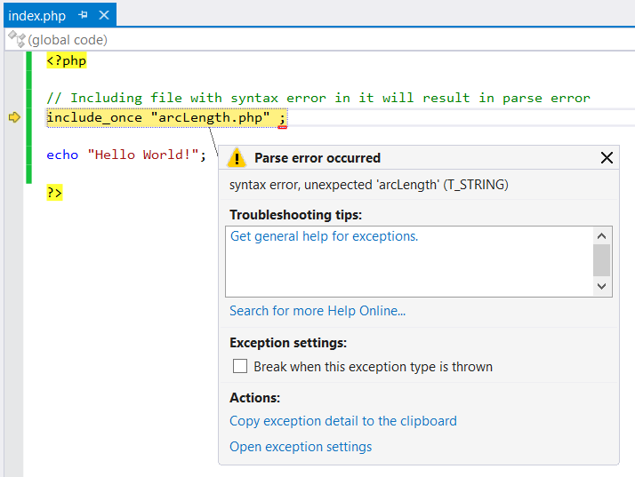

/*
Title: Break on Exceptions
Description: Break on errors and exceptions when they are raised
*/

# Break on Exception

If a fatal error occurs while your program is being debugged, PHP Tools breaks on it by default. A fatal error is an error which prevents the continuation of the script execution, e.g. a parse error or an unhandled exception.

In this case the debugger can be used to [inspect the current program state](inspecting-data). If you continue or step, the exception will continue to be thrown until it is either handled or you exit the program.

Some fatal errors (e.g. user-unhandled exception) are raised outside of the running context after the script has finished. The inspection of the program state, in this case, does not work because the script is not running anymore. 

You can choose to break on any exception immediately when thrown. These settings can be modified in the Exceptions dialog. On the **Debug** menu, click **Exceptions**, and expand the PHP Exceptions entry. Here you can see all the exceptions that are already known and can be configured.

To configure an exception that does not appear in this list, click the `Add button` to add it. The name must match the full name of the exception precisely.

The left-hand checkbox ("Thrown") for each exception controls whether the debugger always breaks when it is raised. You should check this box when you want to break more often for a particular exception.

## Common issues

**Stepping through code works, but PHP exceptions are not thrown in Visual Studio**

Check your `php.ini` for `xdebug.default_enable directive` and make sure it is set to `1` (this is a default value).