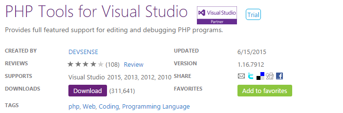

/*
Title: Installation Instructions
Description: How to install PHP Tools for Visual Studio
*/

# Installation Instructions

There are several ways of installing PHP Tools for Visual Studio. You can choose any method you like.

> Since version 1.16, PHP Tools are installed for all users. Administrator access is always required.

> **Note**: you will have to close and restart Visual Studio to finish the installation.

All editions of Visual Studio are supported except the Express ones. Instead of the free Express edition, you can download the free [Visual Studio Community edition](https://www.visualstudio.com/en-us/products/visual-studio-community-vs.aspx).

After installation, access PHP Tools for Visual Studio from within an IDE. Installation does not create any program groups, Start Menu items, or desktop shortcuts.

## Download from the Microsoft Visual Studio Gallery

The .msi from the [Microsoft Visual Studio Gallery](http://visualstudiogallery.msdn.microsoft.com/6eb51f05-ef01-4513-ac83-4c5f50c95fb5) contains the latest stable version. Run the setup package and follow the on-screen instructions. The .msi determines which IDEs are installed on your machine, and gives you the option of installing to a specific one or all IDEs.

## Download from Devsense.com 

As well as the Visual Studio gallery, [Devsense download page]https://www.devsense.com/download contains the latest stable installer, together with the version archive and changelog.

> You can find the preview versions here. These versions are not production ready. They are intended for testing purposes and/or to try upcoming features. Preview versions of the software can be used at your own risk. Any feedback is appreciated.

## Visual Studio Extension Manager 

Open your Visual Studio, navigate to `Tools | Extensions and Updates`, click **Online Gallery** and search for **PHP Tools**. Visual Studio will show you the available products, and you can continue to download and install it in a single operation. 

