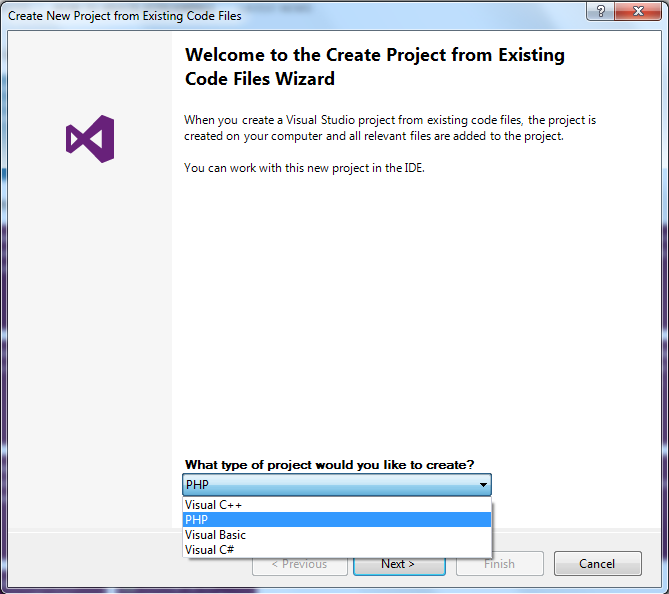

/*
Title: New Project from Existing Code
Description: Create PHP Project from Existing Code
*/

# New Project from Existing Code

If you already have a folder with existing PHP code files, it is easy to create a new PHP Web Project in this folder containing all files. Go to `File | New | Project From Existing Code...` (if available).

Then select **PHP** and click **Next >**

This will display the following wizard. Choose a name for your new project, the root folder containing the existing code, and a filter to ignore specific file types.

Click **Finish**, Visual Studio will create a new project (`.phpproj`) in the folder you specified, containing all the files within this folder.

In case your folder contains `composer.json` file and you are missing the required packages defined in the file, the following dialog will appear, asking for your permission to download the package into your project.
