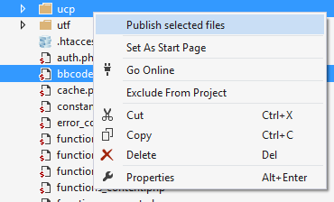
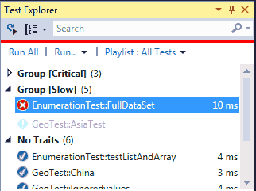

/*
Title: PHP Tools 1.13 News
Description: PHP Tools 1.13 News
Template: blog
Author: Jakub Misek
Date: 2014/07/15
Tags: newsletter, news
*/

** We're happy to announce public availability of PHP Tools for Visual Studio 1.13. **

Our tools are being improved continuously, based on users feedback and suggestions. Latest update brings a lot of new features, improvements and fixes.

## Task List
Task List is now integrated with your PHP project. It collects entries from the source code and gives you overview of tasks, work in progress and notes. This helps with building more reliable code just by noting the comment in the source code.

## Implement interface
To build code faster, PHP Tools now support smart tags over implemented interface name or extended class name. By navigating cursor over the name, Smart Tag appears. Press Ctrl+. or click to see menu with available options. This feature adds functions stub of implemented interface with all parameters, full PHPDoc comments and calls to a base class or TODO comments eventually, nicely wrapped in a region.

## Automatic brace completion
Automatic brace completion introduced in Visual studio 2013 is useful feature completing braces and quotes. It behaves exactly like in C#, tracking what you type, making coding faster.

## Publish
Publish gets several improvements. Since now, it is possible to publish only selected files and folders. The process is significantly faster. Most noticeably when "Skip remote files check" is turned on in your publish profile.

## PHPUnit integration
PHPUnit integration into Visual Studio Test Explorer gets improved. It fetches PHPUnit unit test cases, groups them by given conditions, allowing to run, debug and check failures stack trace. PHPUnit is bundled and does not need any additional configuration.

## Other improvements
* Faster projects opening
* Improved Project From Existing Code allowing to specify file filters

--- 

For more information see our [change log](http://www.devsense.com/products/php-tools/download) or [features page](http://www.devsense.com/products/php-tools/features).
