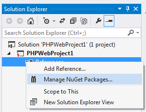

/*
Title: PHP Tools 1.14 News
Description: PHP Tools 1.14 News
Template: blog
Author: Jakub Misek
Date: 2014/09/01
Tags: newsletter, news, nuget
*/

** We're happy to announce public availability of PHP Tools for Visual Studio 1.14. **

Our tools are being improved continuously, based on users feedback and suggestions. Latest update brings a lot of new features, improvements and fixes. Feel free to download from Visual Studio Extensions & Updates or from the [product page](http://www.devsense.com/products/php-tools/download).

## Colored Tool Tips
Improved IntelliSense showing colored tool tips. IntelliSense provides more information and will be upgraded even more in upcoming releases.

## Peek To Definition
Peek To Definition is a new feature introduced in Visual Studio 2013. Pressing <kbd>Alt+F12</kbd> over a PHP symbol brings you small window containing definition of the symbol. In this way, you can lookup for a definition without loosing track of your work.

## Test Explorer improvements
In the PHP Tools update we introduce faster test discovery, support for PHPUnit Configuration file, configuration file editor, support for Test Suites and more. See [Testing Documentation](http://docs.devsense.com/testing/test-explorer) for more information.

## NuGet packages
With the new release, PHP Tools support NuGet packages. You can browse the library of web components, include them within your project and perform their automatic updates.

## Other improvements
* Project-wide Error List
* Code collapsing of lambda functions
* Support for High DPI displays
* Feedback form in Help | PHP Tools for Visual Studio Feedback
* PHP debugger fixes
* Parser fixes, support for declare(), function assert

---

For more information see our [change log](http://www.devsense.com/products/php-tools/download) or [features page](http://www.devsense.com/products/php-tools/features).
