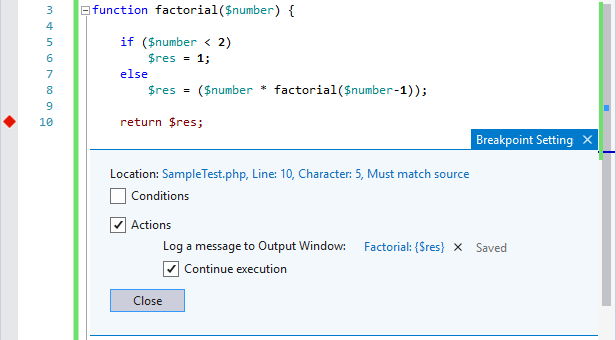
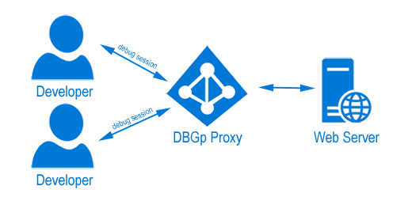
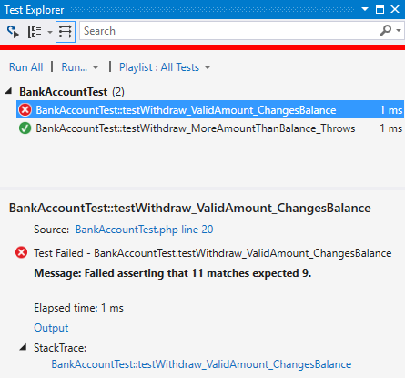

/*
Title: PHP Tools for Visual Studio 1.24
Description: PHP Tools for Visual Studio, 1.24
Template: blog
Author: Jakub Misek
Date: 2017/08/18
Tags: PHP, news, release, VS2017, Debug, DBGp
*/

Check out the latest update of PHP Tools for Visual Studio which brings powerful debugging features and enhancements.

## Advanced Debugging Features

Visual Studio offers incredibly rich debugging environment and knowing these features can save lot of time. We are happy to announce that this release includes debug features which are hard to find in any other PHP IDE, some of them are:

- Tracepoints ("When Hit" breakpoints)
- Conditional breakpoints which can break when value of the expression has changed (not just when it is TRUE)
- HitCount Breakpoints
- Run To Cursor (Ctrl+F10)
- and more 

Find more in our Advanced Debugging Tips article on [https://blog.devsense.com/2017/7/advanced-debug](https://blog.devsense.com/2017/7/advanced-debug).

## DBGp Proxy

We have received request for this feature numerous times and we are happy to announce it is finally here.
Thanks to DBGp proxy support multiple developers can debug simultaneously on one machine.

## Unit Testing Improvements

With the new update you are not only limited to PHPUnit which comes bundled with PHP Tools for Visual Studio. You can use any supported phpunit version you want, including latest versions which are now supported as well.

Find more about PHP unit testing in Visual Studio on [https://blog.devsense.com/2017/6/unit-testing](https://blog.devsense.com/2017/6/unit-testing).