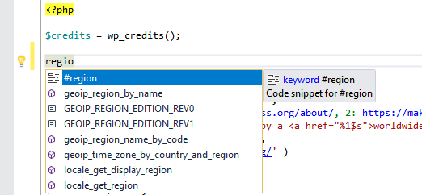
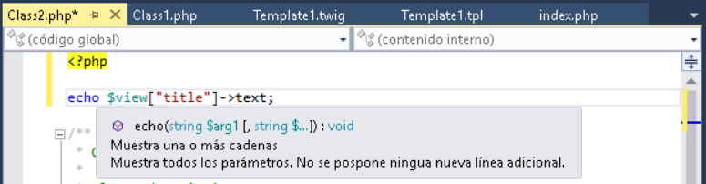

/*
Title: PHP Tools for Visual Studio 1.27
Description: PHP Tools for Visual Studio, 1.27
Template: blog
Author: Jakub Misek
Date: 2018/04/11
Tags: PHP, news, release, VS2017, Smarty, Twig, Localization
*/

We are happy to announce the public availability of our April 2018 release of PHP Tools for Visual Studio. Based on our user's feedback and our extensive road-map, we have improved a lot of stuff, and implemented several useful features and enhancements for you. See the sections below for more information.

## Editor

The editor got several neat improvements in the area of code snippets, occurrences highlighting and support for F1. Now, it is possible to highlight occurrences of the `echo` keyword, so you can easily see where you output a string in your code. Find all references of `echo` (Shift+F12) has been added as well.

User defined snippets are now showed in your code completion together with newly added built-in snippets like `#region`, `forr` and others. The `#region` is our favorite because it allows us to easily organize the code, especially class members into regions.

Finally, now you can get help for your PHPDoc keywords by pressing 'F1'. This helps with proper understanding and use of PHPDoc keywords.

## Localization

We have worked hard to provide localized built-in help for PHP language. Today our integrated help uses settings from your Visual Studio and provides you with a PHP manual in major languages like Spanish, German, French, Russian, Chinese, Portuguese or Japanese. Additionally, most of UI texts are now provided in your current language as well.

## Twig & Smarty

These frequently used templating languages are integrated into PHP Tools as well. The integration is seamless and provides all you need for fluent development including IntelliSense, syntax highlighting, navigation, automatic installation through Composer and also our Twig designer. Today's update improves the editor performance and stability, and adds a few new features for simpler writing of Twig templates. IntelliSense now understands the user's defined Twig filters and allows you to navigate to them.

## Other Improvements

In addition to the areas listed above, we have also improved code validation, general performance, and fixed hundreds of smaller and potential issues. Please, don't hesitate, try the new update and let us know if there is anything you would like us to improve for you.