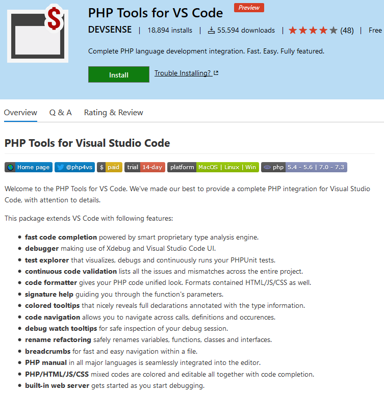
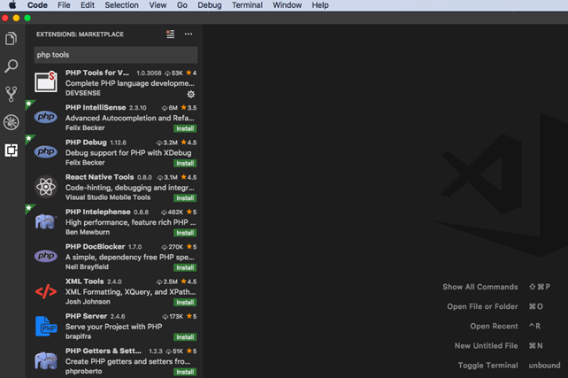
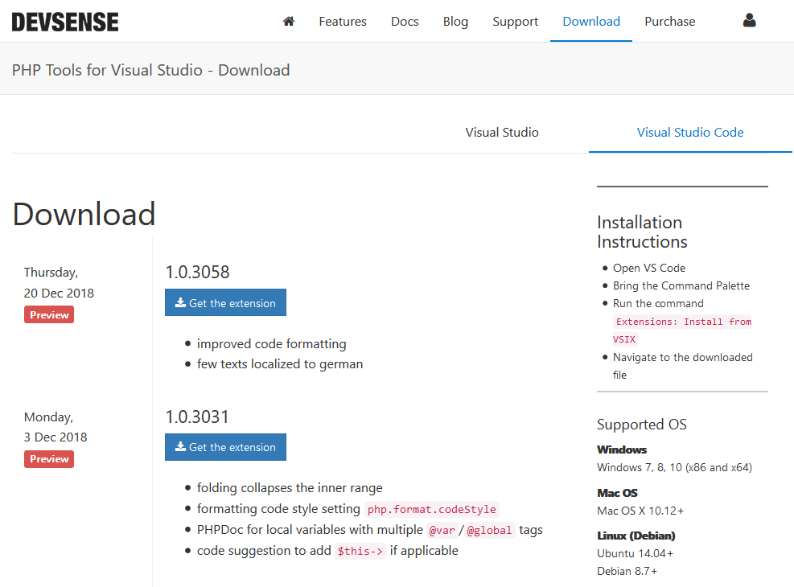
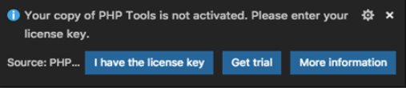
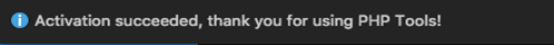

/*
Title: How to Install PHP Tools for VS Code on MacOS
Description: How to Install PHP Tools for VS Code on MacOS
Template: blog
Author: DEVSENSE
Date: 2019/02/05
Tags: PHP
*/

In this article, you will find out how to install PHP Tools for VS Code. Getting it running is fast and simple, and it will take you just a few minutes.

## Step 1 - Install VS Code for macOS.

Visual Studio Code is a free, open-source code editor that works for Windows, Linux and macOS 10.9 or higher. You can download it directly from its [download page](https://code.visualstudio.com/download). If you need a detailed setup guide, click [here](https://code.visualstudio.com/docs/setup/mac). 


## Step 2 - Install PHP Tools for VS Code.

There are three ways to install PHP Tools for VS Code. All of them are quick and simple. You can choose the one that works best for you. 

### a. Online Installation: 

The first way to install the extension is from the Visual Studio Marketplace.

 - Go to PHP Tools for VS Code on the Marketplace.

 - Click the green button "Install" and open VS Code when prompted. 

 - When PHP Tools for VS Code opens, just click "Install".

 

### b. Installation through VS Code:

The extension can also be installed through the VS Code's extension manager.  

 - Open VS Code.

 - Click the Extensions (<kbd>Cmd+Shift+X</kbd>) icon on the `Activity Bar` on the left of the main window. If you cannot see it there, open `View/Extensions` from the menu. 

 - Write "PHP Tools for VS Code" in the search input box. Select it. 

 - Click "Install".

 

### c. Offline Installation:

The last way is to download the extension file and install through the VS Code menu.  

 - Download the `.vsix` installation file from DEVSENSE's [download section](https://www.devsense.com/download#vscode).

 

 - When the download is complete, open VS Code.

 - On the `View` menu, select `Command Palette` (<kbd>Cmd+Shift+P</kbd>) and write the command 

 ```
 Extensions: Install from VSIX
 ```

 in the quick search box.

 - When the Open File Dialog opens, select the file with the `.vsix` extension which you downloaded. 

 Note: Activation of the product requires Internet connection. 

 

 For more detailed information, you can refer to [managing extensions in VS Code](https://code.visualstudio.com/docs/editor/extension-gallery).

## Step 3 - Activation

After the successful installation, you should be prompted to [activate](https://docs.devsense.com/vscode/configuration) your copy of PHP Tools. A pop-up window will show during the extension startup. Activation requires internet connection.



You will have to choose among 3 options:

 - "I have the license key" allows you enter the license key section and activate the extension.
 - "Get trial" sends you an e-mail with 14-day license key.

 

 

 - "More information" will open [this web page](https://www.devsense.com/en/purchase) with purchase options and license information.

 Once you have the license key and close the pop-up window above, you can activate your copy of the extension using the `VSCode's View - Command Palette` (<kbd>Cmd+Shift+P</kbd>), command `PHP Tools: Activate extension`. Enter your license key and confirm pressing `Enter`. 

 

 The activation requires Internet connection. The successful installation is confirmed with the following pop-up window: 

 

## Configuration options

After installing PHP Tools for VS Code, the PHP settings will be as shown in the following table. You can see all the preferences in the `Code > Preferences > Settings` menu.

<table class="table table-bordered table-hover">
	<thead>
		<th>Setting</th>
		<th>Description</th>
		<th>Values</th>
	</thead>
	<tbody>
		<tr>
			<td>"php.executablePath": ""</td>
			<td>Path to the 'php' executable.</td>
			<td>Full path to the php program, or not set.</td>
		</tr>
		<tr>
			<td>"php.problems.exclude": null</td>
			<td>Path patterns to be ignored from reporting problems. Value can be set to 'true' to ignore all problems or a comma separated list of specific problem codes.</td>
			<td>Associative map of paths and whether to exclude them from problems checking.</td>
		</tr>
		<tr>
			<td>"php.format.codeStyle": "PHP Tools"</td>
			<td>Code style standard.</td>
			<td>"PHP Tools", "PSR-2"</td>
		</tr>
		<tr>
			<td>"phpTools.language": null</td>
			<td>Language of PHP Tools IntelliSense.</td>
			<td>"en", "de", "es", "fr", "ja", "pt", "ro", "ru", "tr", "zh", or not set.</td>
		</tr>
		<tr>
			<td>"phpTools.language": null</td>
			<td>Show a CodeLens above each test or suite for running or debugging the tests</td>
			<td>"en", "de", "es", "fr", "ja", "pt", "ro", "ru", "tr", "zh", or not set.</td>
		</tr>
		<tr>
			<td>"phpTools.phpUnit.codeLens": true</td>
			<td>Show a CodeLens above each test or suite for running or debugging the tests</td>
			<td>true or false.</td>
		</tr>
		<tr>
			<td>"phpTools.phpUnit.codeLens": true</td>
			<td>Retire or reset all test states whenever the test tree is reloaded</td>
			<td>Read more on <a href="https://phpunit.de/">PHPUnit</a>.</td>
		</tr>
		<tr>
			<td>"phpTools.phpUnit.onStart": ""</td>
			<td>Retire or reset all test states whenever a test run is started</td>
			<td>Read more on <a href="https://phpunit.de/">PHPUnit</a>.</td>
		</tr>
	</tbody>
</table>

If you have validation problems or in any case of need for linting, extra PHP options are as follows. 

<table class="table table-bordered table-hover">
	<thead>
		<th>Setting</th>
		<th>Description</th>
		<th>Values</th>
	</thead>
	<tbody>
		<tr>
			<td>"php.suggest.basic": true</td>
			<td>Controls whether the built-in PHP language suggestions are enabled. The support suggests PHP globals and variables.</td>
			<td>true or false</td>
		</tr>
		<tr>
			<td>"php.validate.enable": true</td>
			<td>Enable/disable built-in PHP validation.</td>
			<td>true or false</td>
		</tr>
		<tr>
			<td>"php.validate.executablePath": null</td>
			<td>Points to the PHP executable.</td>
			<td>Any path to PHP. for example: |/usr/bin/php|</td>
		</tr>
		<tr>
			<td>"php.validate.run": "onSave"</td>
			<td>Whether the linter is run on save or on type.</td>
			<td>onSave, onType</td>
		</tr>
	</tbody>
</table>

## Debugging

For debugging purposes, PHP has `Xdebug`. You can read about `Xdebug` features [here](https://xdebug.org/docs/).


For macOS users, you can install the `Xdebug` extension for your version of PHP using [Homebrew](https://brew.sh/). They recommend using [PECL](https://xdebug.org/docs/install) to install it. Another option is to compile the [source code](https://github.com/xdebug/xdebug) and then install.

PEAR/PECL is PHP's Package Repository for easy download and installation of `Xdebug` and also other tools. You can download `PEAR` from its [Github page](https://github.com/pear/pearweb_phars/). Installing `PEAR/PECL` is as easy as writing the following on the terminal:

```
pecl install xdebug
```

You still need to add the correct line to your php.ini (change the path and filename to the correct one, and make sure you’re using the full path): 

```
zend_extension="/usr/local/php/modules/xdebug.so"
```

Now you are ready to start your first project! [Getting Started with PHP Tools: First PHP Project](https://docs.devsense.com/vscode).

### Related links
 - [Configuration problems](https://docs.devsense.com/vscode/problems)
 - [Xdebug.org](https://xdebug.org/index.php)
 - [Managing extensions in VS Code](https://code.visualstudio.com/docs/editor/extension-gallery)
 - [VSCode Settings](https://code.visualstudio.com/docs/getstarted/settings)