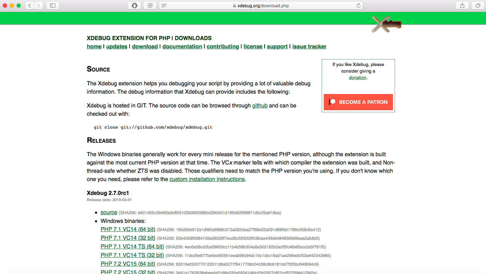
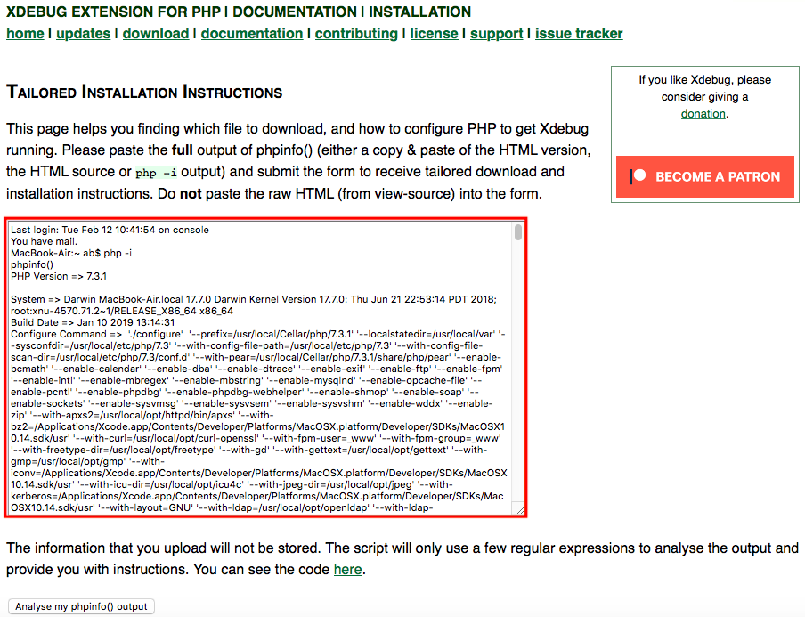

/*
Title: How to install Xdebug for PHP Tools for Visual Studio Code on Mac OS
Description: How to install Xdebug for PHP Tools for Visual Studio Code on Mac OS
Template: blog
Author: DEVSENSE
Date: 2019/03/10
Tags: PHP
*/

Xdebug is an extension used for debugging PHP. One of the most popular IDEs, Visual Studio Code, can also benefit from Xdebug with `PHP Tools`. There are several ways to install Xdebug, but the most secure one is to compile the source code which is compatible with the specifications of your computer.  

In this article, you will find out how to compile the source code to install Xdebug for "`PHP Tools for VS Code`" on macOS. We’ll assume that you have already installed PHP Tools for your macOS, but if you haven’t, you’ll find a tutorial right <a href="https://blog.devsense.com/en/2019/02/install-vscode-mac" target="_blank">here</a>.

## 1) Download the source file

Xdebug  can be found on its <a href="https://xdebug.org/index.php" target="_blank">webpage</a> and it’s also hosted on <a href="https://github.com/xdebug/xdebug" target="_blank">Github</a>. The source code can be downloaded from both locations. For this tutorial, we have downloaded it directly from the Xdebug page <a href="https://xdebug.org/download.php" target="_blank">here</a>.



As explained on their website, Xdebug extensions are released for the PHP versions at the time, so there are releases of Xdebug as PHP versions there are. Some of these versions may not be compatible with your software. To be sure which file you need to download, you can use Xdebug’s <a href="https://xdebug.org/wizard.php" target="_blank">Wizard</a>. 

 - First, get your php information. Open a command prompt, and then write: 

 ```
 $ php –i
 ```

 

 - When your php information is displayed, select it all by pressing `Cmd+A` and then `Cmd+C` to copy it.

 

 - Then, open the wizard <a href="https://xdebug.org/wizard.php" target="_blank">here</a>. On the white input box, paste the php information and press the <kbd>analyse my phpinfo () output</kbd> button. 

 

 - The wizard will display the recommended file to download and also some additional instructions.

 

 - Click on the download link on number 1 and save the source file. 

## 2) Unpack the downloaded source file

The source file will be downloaded with the extension `tgz` or `tar`. Before the installation, you need to unpack it or uncompress it/untar it. For unpacking, you can either use any application like <a href="https://theunarchiver.com/" target="_blank">Unarchiver</a> or just use the command prompt.  

To unpack the tar/tgz file by using the command prompt, first, change the directory where you downloaded the file. By default, it’s downloaded to the “`Downloads`” folder. So, change the folder to “`Downloads`”. 


Write the following command to untar the file. Be sure that the filename is exactly the same as the downloaded file. 

```
$ tar -xzf xdebug-2.6.1.tgz 
```


This command will unpack the source file to a folder with the same name. 

## 3) Prepare the environment

Before building the Xdebug extension, you need to setup the environment and `phpize` is used for this. You can read more about `phpize` <a href="http://us.php.net/manual/en/install.pecl.phpize.php" target="_blank">here</a> and <a href="https://xdebug.org/docs/faq" target="_blank">here</a>. Now, follow these steps: 

 - First, change the directory to the folder which has just being unpacked from the source file. Then, run this in the command prompt: 

 ```
 $ cd xdebug-x.x.xxxx 
 ```

 

 - Then, write: 

  ```
 $ phpize 
 ```

 

 If `phpize` is not in your path, you should use <kbd>/path/to/phpize</kbd>. 

 

 If the phpize command works as expected, the result’s page must look like the picture below:

 

 If there is an `autoconf` error, you can install `autoconf` with <a href="https://brew.sh/" target="_blank">Homebrew</a> and then export it. 

 ```
 $ /usr/bin/ruby -e "$(curl –fsSL https://raw.githubusercontent.com/Homebrew/install/master/install)" 
 $ brew install autoconf 
 $ export PHP_AUTOCONF=/usr/local/bin/autoconf 
 ```

 In case of any missing x-code command line tools, run the following to install: 

 ```
 $ xcode-select --install 
 ```

## 4) Configure the build

To configure the system for Xdebug, you need to get the build ready. Write in the command prompt: 

```
$ ./configure —-enable-xdebug 
```


In case of errors in parameters, just use the command, <kbd>./configure</kbd>: 

```
$ ./configure 
```


And if <kbd>./configure</kbd> is not in your path, write:

```
$ ./configure --enable-xdebug --with-php-config=/path/to/php-config
```


## 5) “Make” the build

Now, it’s time to finish the compilation of the source file. To build the software, just write: 

```
$ make 
```


If you see the sentence “Build complete” in the command prompt, it means that the compiled file “`xdebug.so`” has been created in the “modules” directory. 


## 6) Copy the compiled file

Now that the software is built and ready to run, the compiled file can be copied to its final destination. The `make install` command will copy the built program, its libraries and documentation to the correct locations.


It’s important that you note the location of the destination directory which is displayed in the results to include it in the `php.ini` file. 

You can also prefer not to use `make install` and copy the `Xdebug.so` manually. Then, follow the next set of instructions. 

 - First, create the destination directory. The destination folder is indicated in the Xdebug Wizard’s instructions page from step 1 (the red line on the picture below). 

 

 - Run that command showed on number 8: 

 ```
 $ mkdir /usr/local/lib/php/pecl/xxxxxxxx 
 ```

 

 Then, copy “`xdebug.so`” to the directory you just created.

 ```
 $ cp modules/xdebug.so /usr/local/lib/php/pecl/xxxxxxxx 
 ```
 
 

## 7) Edit your php.ini

By now, the compilation of the file, `xdebug.so`, is completed. But you still need to introduce this file in your `php.ini`. 

First, you need to locate your `php.ini` file then edit it. 

To find out the location of your `php.ini` file, the quickest way is to look it up in the php information which is displayed in the command prompt, like we did on step 1 of this tutorial. Open a command prompt and write: 

```
$ php –i 
```

You will find the exact location of your `php.ini` file in the “`Loaded Configuration File`” section. Select the path of your `php.ini` file and copy it. 


To edit the `php.ini` file, you can use any text editor. For example, in the command prompt you could use the <a href="https://www.nano-editor.org/" target="_blank">Nano editor</a> to edit the file as shown below. 


However, this editor can be confusing and sometimes it’s challenging to use. We recommend to use <a href="https://code.visualstudio.com/download" target="_blank">Visual Studio Code (VS Code)</a>. To edit your php.ini in VS Code, write: 


If you don’t see the word “code” in your path, you need to add it. Open VS Code, click <kbd>View/Command Palette<kbd> menu and select <kbd>“Shell Command: Install ‘code’ command in PATH”</kbd> as shown below: 


After you opened the php.ini file in VS Code, add the following lines in it. Note that the file path will be the exact location in which you copied xdebug.so file. 

```
[Xdebug] 
zend_extension="/usr/local/php/pecl/20180731/xdebug.so"  
Xdebug.remote_enable = 1; 
Xdebug.remote_autostart = 1; 
```


## 8) Check the Xdebug installation

After completing all previous steps, make sure that `Xdebug support` is enabled and write the following code to see if the installation was successful. 

```
$ php –i | grep xdebug 
```


## Congratulations

You have completed the Xdebug installation with its full configuration. Now, you can begin debugging your code.  

### Related links

 - <a href="https://blog.devsense.com/en/2019/02/install-vscode-mac" target="_blank">How to Install PHP Tools for VS Code on MacOS<a>

 - <a href="https://docs.devsense.com/en/vscode/problems" target="_blank">Problem configuration<a>

 - <a href="https://code.visualstudio.com/docs/editor/extension-gallery" target="_blank">Managing extensions in VS Code<a>

 - <a href="https://code.visualstudio.com/docs/getstarted/settings" target="_blank">VS Code Settings<a>