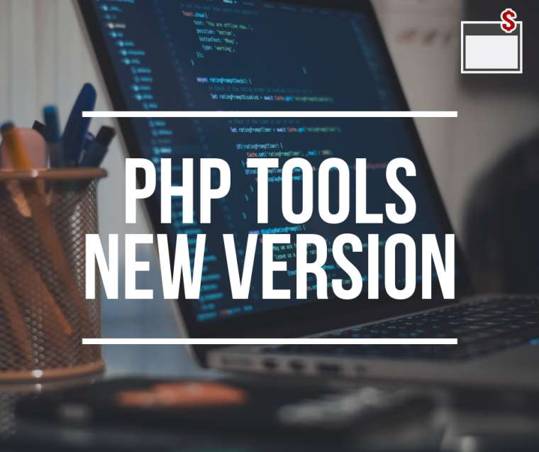

# What's new in PHP Tools for Visual Studio 1.20

In the previous post we mentioned some new features primarily related to our completely new parser, which gives us the ability to [support for PHP 7.0](php7) while maintaining support for PHP 5.4, 5.5, 5.6. Also with PHP 7.1 already being in the release candidate state, we're preparing PHP 7.1 support which will be available in the 1.21 release. You can check what's new in PHP 7.1 in this [migrating guide](http://php.net/manual/en/migration71.php). Of course, we are going to offer compatibility warnings when migrating from one version of PHP to another, as we have been doing since 1.20 - [see the previous post](php7#code-validation-features)

<!-- more -->

The new parser is a big step for us, but 1.20 offers so much more... Let's take a look at some of the things we've addressed in this release.

## Project system

We've been working on improving our project system and therefore added some features we hope you will find useful. The ones immediately visible can be seen when you right click on the project/folder node in the **Solution explorer**.

There are two new commands:
 - Copy Full Path
 - Open Command Prompt Here...
 
**Copy Full Path** copies the path of the currently selected node to the clipboard. **Open Command Prompt Here...** does a little bit more than is visible at first sight. It opens the command prompt with the working directory set to the location of the node you selected and it adds the currently selected php framework from the project properties to the command line `PATH` environment variable (it only affects the runtime environmental variables of the process). This way you are able to execute php scripts/commands with the same php as in the setup of the project.

### Project Home

As you know, PHP Tools are using project files (`.phpproj`) as their project metadata holder. It is MsBuild based and contains information about your project (php version, server settings,...). Until 1.20, it was required to have the project file in the project root directory. Since 1.20, you can move it to another location if needed; just specify it in the **ProjectHome** property. For now, this can only be done by editing the project file (`.phpproj`) directly.

### Edit supported in Compare view

We had the ability to compare php files located in the source control in the previous releases. Now, however, you can also edit the file while having it open in the compare view and immediately see the differences.

## Debugger

One of the most requested features for our debugger was the ability to specify the custom directory mapping manually.

Path has to be used when debugging remotely, using symbolic links, or in other cases when the location of the debugged php file isn't the same as the file opened in Visual Studio running on a local machine. The debugger must thus be able to map the path of the remote file to local paths.

Our automatic path mapping algorithm can determine the mapping in many scenarios, assuming you have the initial script included in your project. For those scenarios that cannot be determined automatically, you can now specify the mapping manually.

## Culture specific manual

If you are running your Visual Studio in Japanese or Portuguese you are going to see an integrated manual translated to your language. 

## Pretty stuff

Besides important features and fixes, we've added some nice-to-have things that should make working with PHP Tools a more pleasant experience.

### High-DPI support improvements

When using High-DPI displays, you usually have to set up a scaling level different from 100%, so that the text on the display can be legible. Up until 1.20, we were scaling all the icons from the bitmap, which didn't provide the best results. Now we have both bitmaps and vectors for most of our icons. When 100% scaling is set up, we use bitmaps, for all the other scaling settings we use vectors. This way, icons should always look pleasant.

### Signature Help gets colors

PHP Tools have colorized tooltips for some time now. Starting with 1.20, the signature help gets colors, too.

This feature is also available for the VS 2010 release, which cannot be found in built-in VS2010 languages (C# or VB).

### Added Relevant Web Development Template Files

We added many file templates that we support. You can check them out by right-clicking on the project/folder node in the Solution Explorer, select Add New Item... 

## Download

[Update now](http://www.devsense.com/download) to the latest release and let us know what you think. We're always happy to receive feedback.

