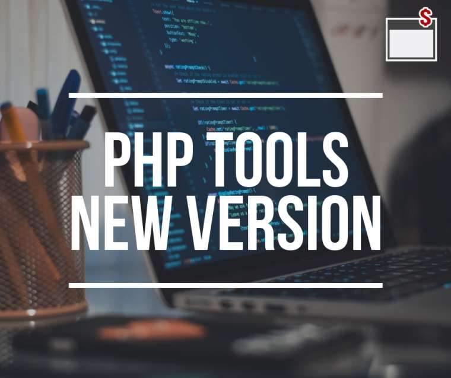

# PHP Tools for Visual Studio 1.23

Checkout the latest update of PHP Tools for Visual Studio which brings several interesting features and enhancements.

<!-- more -->

## Suggestions

Namespaces in PHP and corresponding 'use' declarations have become easier to use with our new suggestions <kbd>Ctrl + .</kbd> . The PHP editor recognizes a class name outside the corresponding namespace. The light bulb menu then contains several options how the problem can be fixed - either by automatically adding the correct 'use' or by expanding the class name to a fully qualified one.
In the future, we plan on extending this platform and adding a plethora of other suggestions for various scenarios.

More at [docs.devsense.com/editor/sugestions](https://docs.devsense.com/editor/suggestions).

## Smarty Templating

We are happy to provide great support for the smarty templating engine. Our editor offers code colorization, HTML integration, snippet completion on TAB, IntelliSense or syntax checking. In addition, we scan your project for variable declarations in order to list them in IntelliSense as well. Moreover, the information in the tooltips is bound to the Smarty package you use. This means that all the smarty modifiers and functions are collected directly from the actual smarty you are using, including its summary and signature.

In case you start a project without installing Smarty first, we've got your back. The editor realizes that Smarty is not defined and asks to install it automatically using Composer.

More at [docs.devsense.com/editor/smarty](https://docs.devsense.com/editor/smarty).

## PHP 7.1

With the new update we fully support PHP 7.1 syntax, IntelliSense, Xdebug and debugging in general, and we also offer project support as well as an automatic installation when you first run your PHP 7.1 project.

## Improvements

There are many small and bigger enhancements to PHP Tools. We have reduced the startup time to almost zero seconds, improved the detection of Unicode and non-Unicode source files and added several smart code validation rules.

## Visual Studio 2017

The update supports Visual Studio 2017 and fully integrates PHP into this industry standard development environment. Please note, the installation package for VS 2017 comes as a separate file.

More at [PHP Tools for Visual Studio Download](https://www.devsense.com/download).
