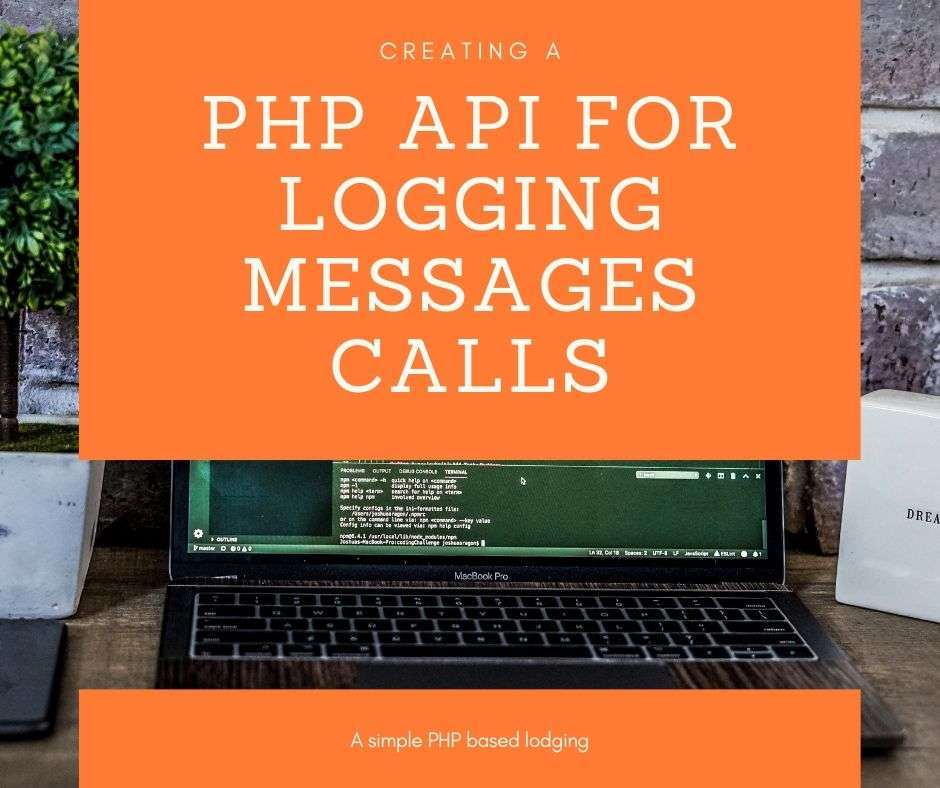
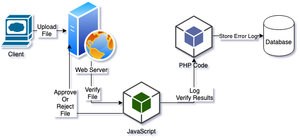
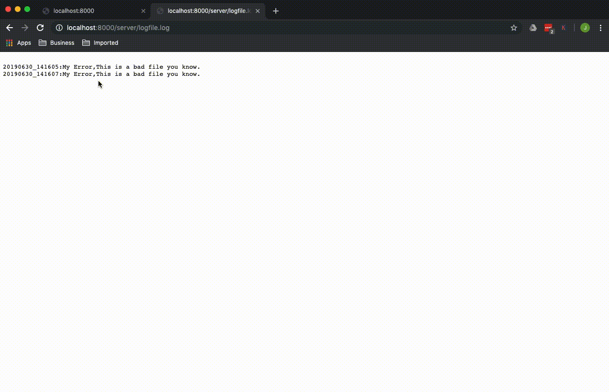

# Creating a PHP API for Logging Messages Calls



## Requirements

<!-- more -->

* IDE such as Visual Studio Code and PHP Tools
* [Jquery](https://jquery.com)

## Tracking the Browser Without Refreshing

Not long ago, I had a client who had an interesting problem. I had created a web site that let their clients upload images.  It had All-the-Things, such as:

* Created a unique web page that lasted only 24 hours for each client.
* Tracked the file uploads.
* Reject files if they didn't match a certain type (aka - they had to be PDFs, jpgs, but not docx, xlsx, etc).
* Provided an administrative page to the internal users so they could track what files were uploaded from which client, reject or grant access, and other little cool bits.

The client came to me with new interesting request:  They wanted to track whenever a client tried to upload a rejected file, and do it without the client actually submitting the file to the server.  The problem was that the rejected or approval of each file was happening at the Javascript level.  This way the client didn't have to refresh the web page all the time.  They would receive instant validation or rejection of the file.  It was a pretty simple rejection - if the file didn't end with .jpg, .pdf, or png, the file was rejected.  

So how to take that error in JavaScript, and log it into the company's database?  I could build up an entire system based on connecting the JavaScript to the database, but that would mean possibly leaving the access credentials in the JavaScript code.  Which, from a security standpoint, is bad.

They already had a PHP based system that I had helped upgrade that connected back to a database.  So rather than recreate all of that in JavaScript and find ways to secure it, I created a simple response system in PHP that just did the following:

1. Accept an error message from JavaScript (or any other language) that includes:
    1. The error code.
    1. A description to go with it
1. Store that error into a database.

Here's a representation of how the system looked from a bird's eye view:



I'm a simple man, and I wanted to keep the system as simple as possible.  In that spirit, this sample code will be extremely simple so you can use it wherever you like.  Simply.

>Developers, please note John's Law:  "It's always something small and simple that gets you."  Meaning - "When things don't work, it's because you forgot a comma.  Or to close a function.  It's never something complex and crazy - it's always something simple that messes up.

## Starting at the JavaScript Level

Let's start where the messages are coming from so we have a good idea of what our messages will look like, and we can generate some sample messages.

First, let's set up our sample file with Jquery.  It's going use AJAX to send out our message to our PHP server, which will process it and return a response.  Here's how to set up the code:

1. First, go to [Jquery](https://jquery.com) and download a copy of the jQuery script.  Nearly any version will work, but for this I'll recommend the uncompressed development version.  As of this article, that's version 3.4.1.
1. In your development environment, place your jQuery script file into the directory js.
1. Create index.php and put in the following:
```html
<html>
  <head>
  <script type="text/javascript" src="./js/jquery-3.4.1.min.js"></script>
  </head>
 
  <p>
    <button onClick="LogStatus('My Error','This is a bad file you know.')">Click to generate a log file.</button>
  </p>

  <script>
  function LogStatus(status, message)
  {
    //Use this for error tracking if needed
    // console.log("The status code: " + status);
    // console.log("The message: " + message);
    
    //The JavaScript the sends a message to the PHP file.
    $.ajax({
      //the payload being sent
      data: {
              'function': 'LogStatus', 
              'status': status,
              'message': message
          },
  		url: 'server/StoreLog.php',
      method: 'POST',
      //If logging the message is a success, display a message
      success: function(message) { 
          let displayMessage = JSON.parse(message);
          alert(displayMessage.message);
        },
      //If logging is a failure, then display a message too.
      failure: function(message) {
        let displayMessage = JSON.parse(message);
        alert(message);
      }
  	});
  }
  </script>
</html>
```

Let's review real quick what this code is doing:

1.  When you click the button, it runs the function LogStatus and submits the following:
    1. subject: My Error
    1. message: This is a bad file you know.
1. The LogStatus function uses jQuery's .ajax function to submit a payload of data with the values function, status, and message.  These will be processed by our PHP script we're going to put together soon.
1. Our PHP script will return a response (hold up, we're getting there!).  The response will contain two options: success or failure.  The two responses can then be used to display a message or make other updates.

Since this isn't a lesson on JavaScript, we'll leave any other functions over to the reader (hello, reader!).  Let's move onto the PHP side of things.

## The PHP Response

Our JavaScript function is sending our PHP script information via POST.  Our PHP script is going to be very simple:

1. Receive the information as POST.
1. Verify the information is proper.
1. If the information is good, return "success", otherwise "failure" and a message.

Let's go over the specific steps.

## Setting Up Variables

To make things easier, let's set up a variable with our possible messages that can be returned.  That way we have all of our errors in one spot:

```php
/**
 * Tracks the different error messages that can be returned in one spot.
 */
$errormessages = array(
    'empty_request' => 'Empty request.',
    'invalid_post' => 'Invalid post request',
    'missing_status' => 'Missing log status.',
    'missing_message' => 'Missing log message.',
    'error_message_submitted' => 'Error Message Delivered'
);
```
You are remembering to use your [PHPDOC support](https://www.devsense.com/en/features) to properly document your functions and variables, right?  Good.  I'm sure you properly document all your code.  Why?  Because you're the best!  No, really,  You're the best.


## Receiving the AJAX POST

All right, now, let's work on receiving those POST messages.  Whenever I receive POST messages, I validate them to make sure they actually exist.  If they don't - I send back an error immediately:

```php
if(!isset($_POST['function']) || empty($_POST['function'])) {
    ReturnMessage('Failure', $errormessages['empty_request']);
}
```

If we have a POST variable called "function" and it's not empty, let's do things with it.  I wanted this to be very flexible, so we can pass multiple "functions" to our PHP script in the future.  In this case, if our function is "LogStatus", then we will - um.  Log the status.  If there's no matching function, we send back an error.

>On a personal note - always return a nice error when things aren't what you expect.  It helps your fellow developers understand what's going on.

```php
else {
    //now go through our request
    switch($_POST['function'])
    {
        case 'LogStatus':
            LogStatus();
            break;
        default:
            ReturnMessage('failure', $errormessages['invalid_post']);
            break;
    }
}
```

### Log Our Status

There's different ways of storing our log message - in my case, I submitted it to a database.  We'll make it easier than that and just put it into a text file through our function LogStatus:

>Make sure your PHP server/script can write to this file.

```php
/**
 * Summary of Processes the submitted log message and updates a text file.
 */
function LogStatus() {
    //Verify that the POST values are present.  If they're not, log it:
    if(!isset($_POST['status']) || empty($_POST['status'])) {
        ReturnMessage('failure', $errormessages['missing_status']);
    }
    else if(!isset($_POST['message']) || empty($_POST['message'])) {
        ReturnMessage('failure', $errormessages['missing_message']);
    }
    else {
        //Save the status and message to a local file.
        $rightnow = date('Ymd_His');
        $status = $_POST['status'];
        $message = $_POST['message'];
        $logmessage = "\n".$rightnow.":".$status.","."$message";
        file_put_contents("logfile.log", $logmessage, FILE_APPEND);
    }
    ReturnMessage("success", "You totally did it!");
}
```

### Returns The Response

Now that we've stored our log message, we'll return our value.  I kept it simple, allowing the developer to specify the status of "success" or "failure" as strings.  The string shown is formatted manually in JSON format, but clever developers can use built in PHP JSON functions to handle this programmatically.  The manual formatting here is just to show an example:

```php
/**
 * Displays an error message that can be processed by JSON accepting systems.
 * @param mixed $status Status of either success or failure.
 * @param mixed $message The message to be returned.
 */
function ReturnMessage($status, $message) 
{
    echo '{ "status": "' . $status . '", "message": "' . $message . '" }';
}
```
## The Code in Action

So with all of that - let's actually see the code working!  If we're in Visual Studio Code, we can run our sample program through the debugger with PHP Tools and show it on our browser, with the log file being updated:



And there you have it!  In a couple of days, we'll include a complete copy of the code in a handy .zip file for you to play with.  Log away, my friends!!

# Related articles

[Tracepoint, logpoint, what's the point?](https://blog.devsense.com/tracepoint-logpoint)

[Advanced debugging tips](https://blog.devsense.com/2017/07/advanced-debug)

[Commenting your PHP Code](https://blog.devsense.com/commenting-your-php-code)


