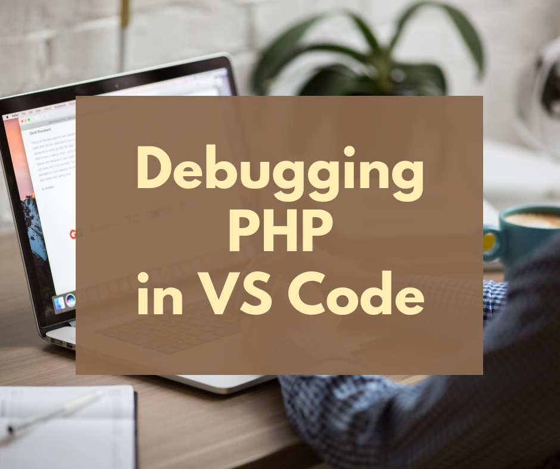
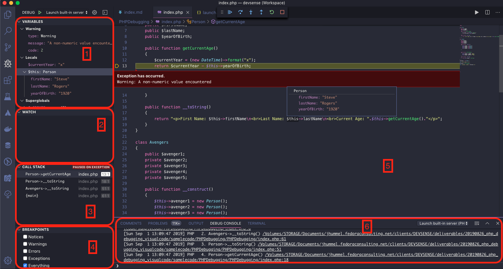

# Debugging PHP in Visual Studio Code



If you read our Award Winning article (well, my Mom liked it) about [how to use PHP Tools with Visual Studio](https://blog.devsense.com/debugging-php-in-visual-studio), you'll understand that we didn't want to make the good people who enjoy using Visual Studio Code with PHP Tools left out, so we want to demonstrate how to debug your code on that platform.

<!-- more -->

## Tracking down what's going on in your code

First, we'll assume that you have Visual Studio Code installed with [PHP Tools](https://www.devsense.com/en/download#vscode). In this environment, we're running PHP 7.2, but PHP Tools is already updated to work with the new PHP 7.4.  

We're also assuming that you have some code to debug.  Maybe some amazingly written code like this:

```
class Person
{
    public $firstName;
    public $lastName;
    public $yearOfBirth;

    public function getCurrentAge()
    {
        $currentYear = (new DateTime)->format("x");
        return $currentYear - $this->yearOfBirth;
    }

    public function __toString()
    {
        return "<p>First Name: $this->firstName\n<br>Last Name: $this->lastName\n<br>Current Age: ".$this->getCurrentAge()."</p>";
    }
}
```

People out there who are really clever can already spot problems with this code.  But we'll use it anyway as a base for showing off how clever PHP Tools is at debugging.

## Starting the Debug Process

The easiest way to run a PHP Project in Visual Studio Code is to import it as a separate folder in your workspace.  This way your debug configuration settings can be contained at the folder level.  Visual Studio Code keeps those in a hidden directory within the folder called `.vscode`.  Like so:

<center><iframe width="640" height="360" src="https://www.youtube.com/embed/EgE179y20eY?rel=0" frameborder="0" allow="accelerometer; autoplay; encrypted-media; gyroscope; picture-in-picture" allowfullscreen></iframe></center>

To start debugging in Visual Studio Code:

1. Select the code to debug - in this case, `index.php`.
2. Select the Debug icon on the left panel.  From the Configuration drop down, select the directory that serves as the project root and select the Configure icon.
3. Now to run the configured debugging session, to run it, just select that configuration from the drop down list, and select the Run icon.

<center><iframe width="640" height="360" src="https://www.youtube.com/embed/bMWtffwCOoc?rel=0" frameborder="0" allow="accelerometer; autoplay; encrypted-media; gyroscope; picture-in-picture" allowfullscreen></iframe></center>

For this example, we'll be using the Built-In Server, which already reports useful debugging information back to Visual Studio Code.  Let's run our code, and watch it blow up before our eyes.

## Debugging by Exception

Code that contains errors that cause exception errors are automatically tracked with the built-in server.  Take this piece of code:

```php
$currentYear = (new DateTime)->format("x");
```

We already know this code will blow up and give you nasty exception errors that usually don't make sense unless you're an expert in PHP already.  And sure enough, when we run it, it does!  Visual Studio Code with PHP Tools is kind enough to tell us just what's wrong with our code in a simple layout where we can explore just what's happening and where.  Look at all of these beautiful errors:



Here's a quick rundown of the different areas:

1. **Variables list**:  The values of variables at this break point.  Users can drill down into objects, arrays, and the like to capture the current values.  By double clicking on them, the values can be changed before the program is continued.
1. **Watch list**:  Specific expressions to watch for.
1. **Call Stack**:  The chain of methods being called.  For example, in this view, `main` calls the function `Avengers->__toString`, which then calls `Person->__toString`, etc.  
1. **Breakpoints**:  What triggers the code to stop so it can be examined.  Breakpoints can be added manually (we'll have more details on that below).
1. **Code**:  The actual code.
1. **Debug Console**:  Messages generated by the debugging system.

Nearly everything a developer needs to understand why their code blew up is right there in front of their eyes.  In this case - oh, we have a non-numeric value where we need a value.  Silly us - we had an "x" in our date format program.

I actually prefer this view of the one in Visual Studio - maybe because everything is laid out right there on the side for review.  

To resume our code, either select the Play icon at the top, or press F5.

## Adding Breakpoints

Support our code doesn't generate a single exception error. Clearly, this means out code runs perfectly without a single problem!  We can see this when we run our program to list the name and ages of the Avengers (not the Disney ones, clearly the um - other guys).  We have Steve Rogers, born in 1919, so when we display their current age and date we get this:

```
First Name: Steve 
Last Name: Rogers 
Current Age: -1911
```

Well, well.  Unless we're going through another Time Heist, that date of birth doesn't make any sense.  But we didn't have any exceptions in our code!  What could be the problem?

Well, we could go through our code line by line to try and figure that out.  Or, set a Breakpoint at the specific line where we know our program calls our "echo" routine.

To set a Breakpoint, select the line of code we care about, and press `F9` or just to the left of the number line:

<center><iframe width="640" height="360" src="https://www.youtube.com/embed/eCCOO5FStT8?rel=0" frameborder="0" allow="accelerometer; autoplay; encrypted-media; gyroscope; picture-in-picture" allowfullscreen></iframe></center>


Now when we run our sample code, it will stop right there where we tell it.  We can trace through our code with the action bar at the top:

* **Step Into**:  Proceed to the next step in the process and show what line we're on, and what the values of items in the Watch list are.
* **Step Out**:  Once you've started stepping through the code, you might decide you're done going line by line, and just want the code to keep going.
* **Step Over**: Skip this line of code entirely.  Useful if you don't need a return value and want to verify that this line is breaking thing as opposed to the rest of the code.
* **Restart**: Start over again!
* **Stop**:  Just end it all.  Just stop right there.

Using our program as an example, let's try to figure out where our beautiful code goes wrong:

<center><iframe width="640" height="360" src="https://www.youtube.com/embed/azfvpaD3b5c?rel=0" frameborder="0" allow="accelerometer; autoplay; encrypted-media; gyroscope; picture-in-picture" allowfullscreen></iframe></center>

Set as many breakpoints as you like, or turn them back off in the Breakpoints view to skip past them.  

This code is a very simple example, but this can help get you into the wonderful world of Debugging.  Those who have been using PHP Tools to solve syntax issues and quickly collect information on functions can also use it to find when the code doesn't work the way you expect.  

For more information, check out the [PHP Tools documentation](https://docs.devsense.com/en/vs) and enjoy coding. Or at least be less frustrated with it.

# Related Articles 


[Debugging PHP in Visual Studio](https://blog.devsense.com/debugging-php-in-visual-studio)


[What does PHP Tools add to you IDE?](https://blog.devsense.com/what-does-php-tools-add-to-your-ide)


[Tracepoint, logpoint, what's the point?](https://blog.devsense.com/tracepoint-logpoint)


