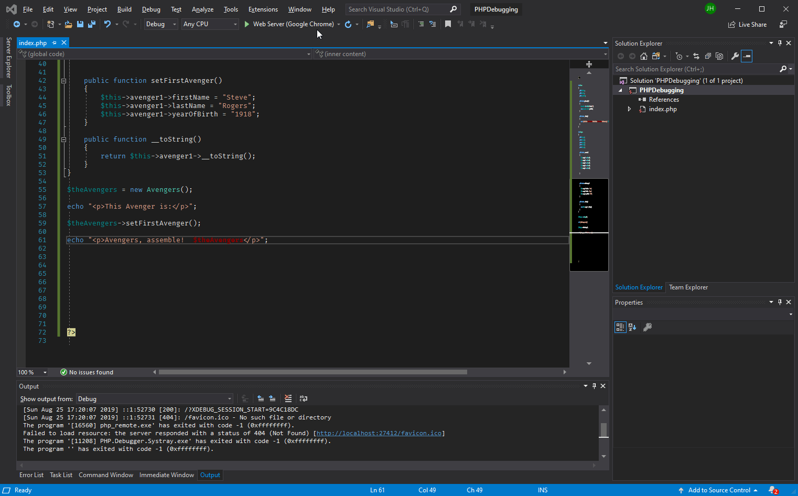

# Debugging PHP in Visual Studio


## Overview

<!-- more -->

Finding the one mistake in your code can be the most frustrating thing in the world. And PHP Tools is great at finding syntax errors, like when there's an extra comma or a variable is referencing an incorrect type ([Download a free, fully-functional version for 30 days](https://www.devsense.com/en/download)).

Then, there are the times when the syntax is perfect, PHP Tools isn't returning any errors, but things just aren't working the way you think they should. 


That's when you need to start debugging, and watching the code is the best way to finding out exactly what's going wrong.

We're going to work through a really simple example on how to use PHP Tools for debugging in Visual Studio, so when you run into those problems that have you connecting head to desk, you can see exactly what to do and how to fix it.

## Debugging Examples

We're going to assume that your code actually runs without blowing up, but executes just doesn't return what you want.  But we'll do it both ways - first by when the code just blows up and you want to see what's wrong, then showing code that runs just fine but gives the wrong result.

Either way, when running your code with PHP Tools, you'll be able to handle the syntax issues before you ever run your code, and be able to follow it through to see what's happening inside.

## Tracking From Exception Errors

Let's start with code that just blows up.  Like this one:

```php
public function getCurrentAge()
{
    $currentYear = (new DateTime)->format("X");
    return $currentYear - $this->yearOfBirth;
}
```

If you're like me, might have forgotten that "X" is not a valid date format.  So when we run this code, Visual Studio and PHP Tools let's us know - "no.  That is not right:"

Once the exception error comes up, we can use the Call Stack and expand the different class instances and related variables to see just what their error is.  This problem is easy enough to solve once we see the error - we're trying to get a person's age by subtracting their year of birth from the current year.  Only - our code isn't working.  When we go to run it, we see some issues:


As you can see in the example, we can use our Watch window to see what's going on.  We can specify by variable name (like we have listed here under the `Watch 1` tab, where we tell PHP Tools and Visual Studio to look for `$this->yearOfBirth`), or we can select the `Autos` to get a look at all of the variables available to us in this call.

On the other side, we have the Call Stack, telling us exactly where in our code we are.  This is really handing in exploring "What line is our code blowing up at?"  It tells us right here:  We're currently on Line 13, and we jumped there from Line 18, which was launched from Line 51, and it all started from line 61.  So we can look at each spot and see where there's an issue.  And sure enough - we look at our variables and see - oh, we're trying to subtract the year "Peggy" from the year "2019".  Somehow, that doesn't sound like proper math:


We can fix this - we set the year of birth to 1918, and everything works like it should.
 
## Tracking from Break Point

Break Points one of the most effective ways to debug your code.  If you're also thinking "Isn't Break Point of the greatest movies of all time?"

Yes.  You would be right.


But tear your attention away from the sights of baby Keanu Reeves and focus on fixing the code.  A Break Point in your code is telling the IDE "When you reach this point - stop and let me see what's going on."  From there, you can look at your Watch list or Call Stack and see what's going on.

To set a Break Point, pick a spot within your code and either press `F9` or select `Debug->Toggle Breakpoint`:



Now when you run your code, it'll stop on that break point.  As you can see in the example, from here you can do several commands such as:

* **Step Into**:  Proceed to the next step in the process and show what line we're on, and what the values of items in the Watch list are.
* **Step Out**:  Once you've started stepping through the code, you might decide you're done going line by line, and just want the code to keep going.
* **Step Over**: Skip this line of code entirely.  Useful if you don't need a return value and want to verify that ths line is breaking thing as opposed to the rest of the code.

With these, you can go from one step to the next to try and see why your code isn't doing what you want.  While doing this, you can even change values to see what happens.  For example, PHP Tools lets you put in really long string values.  For this example, that's not that exciting - but what if you were using a long string like a SQL statement instead?

Here's an example of stepping through the code and making some changes along the way, and along the way we can see ah - we have our Date format set to m, which returns the number of the month and not the year.  Now we can fix that and move on.


### Customizing Break Points

PHP Tools gives you even more to play with.  What I'll do when I start a program is add in all sorts of message statements so I can see when something kicks off.  Like:

```php
echo "<p>I'm starting the DoSomething function here.</p>";
DoSomething();
echo "<p>DoSomething just finished you should have seen a result.</p>";
```

This way as my code runs, I'll see in the web page what's going on.  The problem is, this can lead to a lot of text flying about, and perhaps might not get cleaned up later.  Might be embarrassing for a customer to see "I'm running this code I hope it doesn't blow up" on the web page.

PHP Tools has this feature that makes that easier - customize your break points.  Next to the Break Point is a little gear to change the settings, and when that you can do a couple of things:

1. Set Conditions:  Instead of stopping at every little thing, maybe we just want to track some specific event.  Like "If this variable has this value, then do something."  Conditions can be set by specific value, when values change, filters, and multiple conditions can be set to pick the perfect things you need to resolve.
1. Show a message:  This displays a custom message in the Output tab.  Now instead of cluttering the web page with messages, they can just display in the IDE output.
1. Continue Code Execution:  Maybe you just want to see the messages, or you want the program to stop so you can examine the variables and see what's happening?

Let's use this as an example.  We set up a break point that detects if someone sets the YearOfBirth variable to 1920.  If that happens, it displays a message, and stops the program execution:


Now instead of having your Break Points stop on everything, you can pick and choose what happens, set special messages to yourself so you can find out just what's going on.


## Stop Hurting Yourself

Any developer who gets past "Hello, World" has had those "head meets desk" situations.  When you just can't figure out why your code just isn't delivering the results.

Debugging has been a painful black box in the past, but it doesn't have to be.  Set your break points, and when your code doesn't work the way you want, let us help you walk through each step, see how the values of your variables are changing along the way, and you'll spare your desk.

And your forehead too.


## Related articles

[Debugging PHP in VS Code](https://blog.devsense.com/debugging-in-visual-studio-code)

[Using PHPDoc with PHP-and actually making it work](https://blog.devsense.com/using-phpdoc-with-php7-and-make-it-work)

[6 core factors to consider when choosing your PHP developing tool](https://blog.devsense.com/2019/factors-to-consider-when-choosing-your-php-development-tool)


