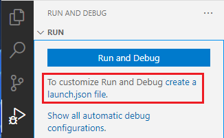

# Debugging PHP on Docker with VS Code


Welcome to the third article of PHP on Docker. In the [previous article](https://blog.devsense.com/2019/php-nginx-docker), we learned how to create two connected containers with **php** and **nginx** with the help of Docker compose, and we also talked about different environments where your software needs to work. 

<!-- more -->

In this article, we'll continue our discussion about development environments - more specifically, we will talk about debugging with the help of [PHP Tools](https://marketplace.visualstudio.com/items?itemName=DEVSENSE.phptools-vscode) inside Visual Studio Code. We will be using our php+nginx setup from the last article and you can find all the source codes for this one at [github](https://github.com/devsense/php-on-docker/tree/master/3%20-%20PHP%20and%20Xdebug)

## Xdebug
[Xdebug](https://xdebug.org/) is a debugging extension for PHP. [Debugging](https://en.wikipedia.org/wiki/Debugging) is a way to pause the execution of codeto see what's going on. On the picture below, you can see a very simplified pipeline of execution: that's what we're going to build in this tutorial. 


After a request to our docker container, Xdebug will initiate a connection with our IDE. In our case, we will be using Visual Studio Code with [PHP Tools](https://marketplace.visualstudio.com/items?itemName=DEVSENSE.phptools-vscode). 

## Dockerfiles
We'll be using PHP with Nginx, just like in our [previous article](https://blog.devsense.com/2019/php-nginx-docker). Let's start by modifying PHP `Dockerfile`:

```dockerfile
FROM php:fpm
RUN pecl install xdebug
RUN docker-php-ext-enable xdebug
```

Instead of using the *Alpine* version of `php-fpm` image, we are using the default php-fpm image with Debian for simplicity. Xdebug depends on some libraries, which would have to be installed manually, if we would use Alpine. In Debian, they are present without any work. The only thing we have to install is **Xdebug**, and then enable it with the `docker-php-ext-enable` helper command. You can find out more about this command [here](https://docs.docker.com/samples/library/php/#how-to-install-more-php-extensions). 

You can also add copying of custom `php.ini` file in the end of `Dockerfile`, but we can setup everything we will need with the use of **Environment variables** in `docker-compose.yml`.

## Nginx
As I said before, we will be using **Nginx**. It's `Dockerfile` and settings did not change. You can see the `Dockerfile` here:

```dockerfile
FROM nginx:alpine
COPY nginx/default.conf /etc/nginx/conf.d
```

and `default.conf` here:

```
server {
    listen 0.0.0.0:80;

    root /var/www/html;

    location / {
        index index.php index.html;
    }

    location ~ \.php$ {
        include fastcgi_params;
        fastcgi_pass php:9000;
        fastcgi_index index.php;
        fastcgi_param SCRIPT_FILENAME $document_root/$fastcgi_script_name;
    }

    error_log /var/log/nginx/error.log;
    access_log /var/log/nginx/access.log;
}
```

## docker-compose.yml
Let's take a look at `php.ini` located in the `php` folder for its use with **Xdebug**. The complete configuration looks like this:

```yaml
version: "3"
services:
  nginx:
    build:
      context: .
      dockerfile: nginx/Dockerfile
    ports: 
      - "8080:80"
    networks:
      - internal
    volumes:
      - ./data/:/var/www/html
  php:
    build:
      context: .
      dockerfile: php/Dockerfile
    networks:
      - internal
    environment:
      XDEBUG_MODE: debug
      XDEBUG_CONFIG: client_host=host.docker.internal client_port=9003
    volumes:
      - ./data/:/var/www/html
networks:
  internal:
    driver: bridge
```

It's basically the same configuration for the development environment with PHP and Nginx from the [previous article](https://blog.devsense.com/2019/php-nginx-docker), but we have added a few environment variables for the Xdebug configuration:

* **XDEBUG_MODE: debug** configures which Xdebug features should be enabled. For our case we will just set `debug`. For more possible values, click [here](https://xdebug.org/docs/step_debug#mode)

* **client_host (remote_host in Xdebug 2):** This is the address which Xdebug will try to contact using DGBP protocol when our php container receives a request to process a php script. We are using a special value `host.docker.internal` which will be automatically replaced with the IP address of Docker Host. You can find more special environment variables for Docker Compose [here](https://docs.docker.com/compose/environment-variables/).

* **client_port (remote_host in Xdebug 2):** This is the port which Xdebug will try to connect to. The port `9003` is default and we specify it here only for completeness.

With  `phpinfo();` in `index.php` inside a data folder, we can try to compose our containers. Right click on `docker-compose.yml` and click **compose up**.


If everything is setup correctly, you should be able to see Xdebug section in phpinfo inside a browser when you access `localhost:8080`.


## Path mappings and launch.json
Debugging will still not work for us yet. We need to configure it with Visual Studio Code. Switch to the Debug section on the left panel in Visual Studio Code and click **create a launch.json file** button.



### PathMappings

The last thing we need are **Path Mappings**. It specifies, where are the files which we want to debug. Add another entry to **Listen for Xdebug** section in `launch.json`, so it looks similar to this:

```json
{
"name": "Listen for Xdebug",
"type": "php",
"request": "launch",
"port": 9003,
"pathMappings": {
"/var/www/html": "${workspaceFolder}\\data"
},
```

We have specified that everything located in `/var/www/html` on our docker container should be looked for in **${workspaceFolder}\data**. Modify it depending on your folder structure if you need.`${workspaceFolder}` is a special variable from Visual Studio Code and it is replaced with a folder you opened by using the **Open folder** menu option. You can find more special variables [here](https://code.visualstudio.com/docs/editor/variables-reference).

## Debugging
Now, you should be able to debug your PHP running on Docker in Visual Studio Code. 

Open `index.php`, add a breakpoint and click the **Listen for Xdebug** button. Visual Studio Code should start listening for the Xdebug connection and it should look like the picture below.


When you make a request with a browser to [http://localhost:8080?XDEBUG_SESSION_START=1](http://localhost:8080?XDEBUG_SESSION_START=1) the execution should be halted. `XDEBUG_SESSION_START` argument instructs Xdebug to start debugging this request.

The line where the code was halted should be highlighted like this:


Now you should be able to see local variables, callstack and other typical debugging features.

## Summary
In this article, we took our multi-container setup with php and nginx from the last article and added debugging capabilities with Xdebug. With PHP Tools we have a complete debugging experience for PHP inside Visual Studio Code.

## Other articles about debugging

* [Tracepoint, logpoint, what’s the point?](https://blog.devsense.com/2019/php-tracepoint-logpoint)

* [Advanced Debugging Tips](https://blog.devsense.com/2017/07/advanced-debug)

* [Debugging Multiple PHP Sites/Projects](https://blog.devsense.com/2015/10/debugging-multiple-projects)

