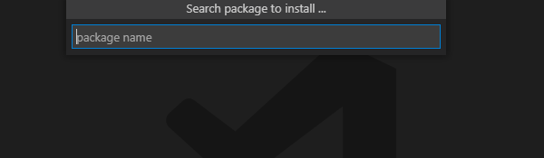
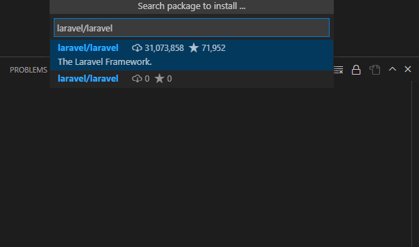
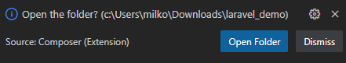
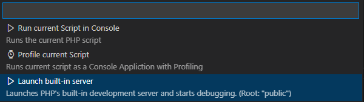
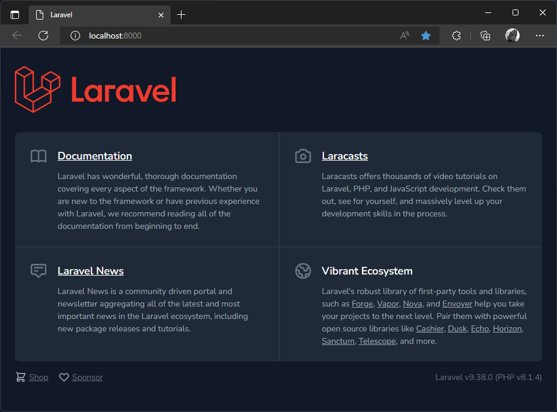
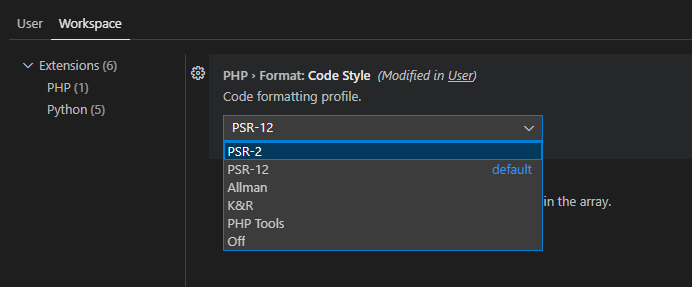
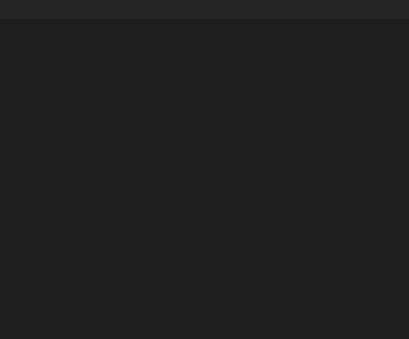

# How to install Laravel for Visual Studio Code

<a href="https://laravel.com/" target="_blank">Laravel</a> is a well-respected and [popular PHP framework](https://blog.devsense.com/en/2019/02/symfony-vs-laravel). As you might have read before, it aims to facilitate many of the common tasks of the majority of projects, while also strengthening security and database migration. That’s why many developers are convinced that Laravel provides one of the most reliable and efficient approaches to building a website. In this tutorial, you will learn how to install Laravel for Visual Studio Code from scratch. 

<!-- more -->

There are more ways how to start with Laravel:
 - [**Quick & Easy**](#heading-4) - Get started quickly - I recommend this one.
 - [**Manual**](#heading-6) - With this approach, you will be doing all the steps by yourself. In the first version of this article, we only offered this one, but a lot has changed and improved which simplified things.
 - [**Using dev containers**](https://blog.devsense.com/2022/laravel-on-docker) - Get started with dockerized Laravel and services like Mysql, Redis. 
 
## Prerequisites

### Get Visual Studio Code
You can download Visual Studio Code (VS Code) directly from its [download page](https://code.visualstudio.com/download). For a detailed setup guide, click [here](https://code.visualstudio.com/docs/setup/windows). If you have it already installed, you can just ignore this step. If you're using Visual Studio (instead of VS Code), [PHP Tools](https://www.devsense.com) will do this step for you. Check this [article](https://blog.devsense.com/2021/how-to-install-laravel-in-visual-studio) instead.

### Get PHP Tools for VS Code

You will need PHP language support for VS Code. If you have VS Code installed already, you can just click this:

<a class="btn btn-primary" href="vscode:extension/DEVSENSE.phptools-vscode">Get PHP Tools</a>

## Quick Installation

- Start a new instance of VS Code. 
- Open **Command Palette** <kbd>F1</kbd> and type `create project`. Hit <kbd>ENTER</kbd>.

  

- Now select the folder where you want your Laravel installation and click `Choose a folder`.

- Then write `laravel/laravel` and confirm.

  

  It might take a moment to get all the required Laravel packages.

  

- Once finished, VS Code will ask you to open the folder. Click `Open Folder`.

  

### Launching the Laravel

- Open a `public/index.php` and press <kbd>Ctrl + F5</kbd> and select `Launch build-in server`.

  

- The new browser windows will open with the Laravel default welcome page.

  

  Pressing <kbd>Ctrl + F5 </kbd> is an alternative to running `php artisan serve` and opening the browser manually with the correct URL, which you can check in the Manual Installation section.

## Manual Instalation 

You can skip this one directly to the [Configuration](#heading-12) section. I'm only leaving this manual approach for a reference.

### 1) Install Composer

Before you install Laravel, you need to get Composer. Composer is a tool that helps with dependency management in PHP. It allows installing and updating different components for the framework, and it manages all libraries and dependencies in one place. So, in order to work on Laravel, it is necessary to have Composer already on your system. You can download it from this page: [https://getcomposer.org/download/](https://getcomposer.org/download/)


You can check whether Composer was installed by typing the word “composer” on the command prompt. You should see something like this: 


### 2) Create a directory for your project.

Now, you need to create a directory for your new Laravel project. This step might take some time, depending on the speed of your internet. You can create a directory anywhere in your system and then use the command prompt to go to that directory with the following command: 

```
composer create-project laravel/laravel ProjectName 
```


### 3) Start Laravel

Laravel comes with [Artisan](https://laravel.com/docs/9.x/artisan). Artisan is a command-line interface (CLI) and one of the most important components of Laravel. When you downloaded the framework on step 2, Laravel’s Artisan CLI was installed automatically. You don’t need to install it separately.

Artisan is a very helpful tool: it provides a series of commands that will assist you in developing your app. Basically, it minimizes the creation of manual tasks, because each command will create them for you. Just by running a command, you can create controllers and modes, database migration files (and then run those migration files), providers, events, jobs, form requests, session commands, and your own custom commands. Artisan will also show the available routes, run [Tinker](https://laravel-news.com/laravel-tinker) (a tool to interact with the database), and more. 

To start Laravel, run this command: 

```
php artisan serve 
```

You should see a screen with the following line: `Laravel development started on` plus a URL. 


### 4) Open the URL on your browser. 

Copy the URL from the previous step and open it on your browser. The following image is what you should see when Laravel has been installed successfully. 


### 5) Open Laravel on Visual Studio Code 

In order to open Laravel and start building your app, you need `Visual Studio Code`. Just follow these simple steps: 

 - Search for `Visual Studio Code` in the start menu. 

 

 - Open `Visual Studio Code`. 

 - Click `File` on the Menu bar and choose `Open Folder`

 - Open Laravel by choosing the folder that you created on Step 3. 

 

 - After opening Laravel, you should see the following folders and files:  

 


## Configuration

After you have successfully installed Laravel on Visual Studio Code, everything should work just fine. But to get the best possible development experience there are couple more things you want to configure.

### Setup correct code style

Laravel uses `PSR-2` code style. To configure PHP Tools formatter to be consistent with it, you need to set that up. 

Open the Settings editor from the Command Palette with Preferences: Open Workspace Settings. Then search for `code style`. You should find it under PHP section.



### Generate IDE helper files

But to get the best possible development experience you should install [barryvdh/laravel-ide-helper](https://github.com/barryvdh/laravel-ide-helper) package. It generates files for the IntelliSense engine to provide accurate auto-completions for Laravel.

But first, open up `composer.json` and update `post-update-cmd` by adding these commands:

```json
    "scripts": {
        "post-update-cmd": [
            "@php artisan ide-helper:generate",
            "@php artisan ide-helper:models",
            "@php artisan ide-helper:meta"
        ],
    },
```

These lines will make sure the tool will re-generate the helper files each time you update your dependencies.

Then open **Command Pallette** <kbd>F1</kbd> and type `require dev`. Hit <kbd>ENTER</kbd>. And find `barryvdh/laravel-ide-helper` package and confirm.



After a moment you should be ready to go.

### Artisan key generate

You always need your unique application key, but it was generated for you in the steps before. So you don't have to worry about it now. But in some special cases, you might need to regenerate the key, e.g when you clone the app which already has the key. 

To have your unique application key, you need to run the command below on the command prompt (before executing this command, make sure you’re in the root directory of the Laravel application): 


As you can see in the above picture, after you run the command for generating your key, there’s a line that tells you that the application key has been set successfully. Save the file and you should be ready to start building your new app. For a more detailed explanation of other Laravel configurations, click [here](https://laravel.com/docs/9.x). 

## Conclusion

In this tutorial, we have learned how to install Laravel for Visual Studio Code. Laravel will help you build more efficient and reliable sites. You’ll see that once you get to know it and have worked with it for a while, Laravel makes PHP fun. It’s a framework that will stick around for years to come. 

You might also want to read:

 - [Symfony vs. Laravel](https://blog.devsense.com/2019/02/symfony-vs-laravel)

 - [Tracepoint, logpoint, what's the point?](https://blog.devsense.com/tracepoint-logpoint)

 - [Introduction to PHP on Docker with Visual Studio Code](https://blog.devsense.com/introduction-to-php-on-docker-with-visual-studio-code)
