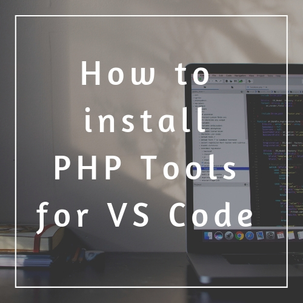
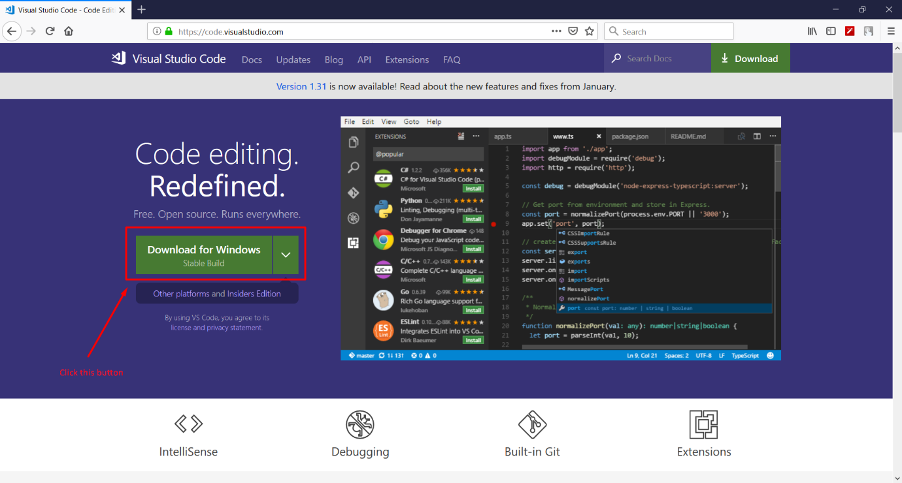
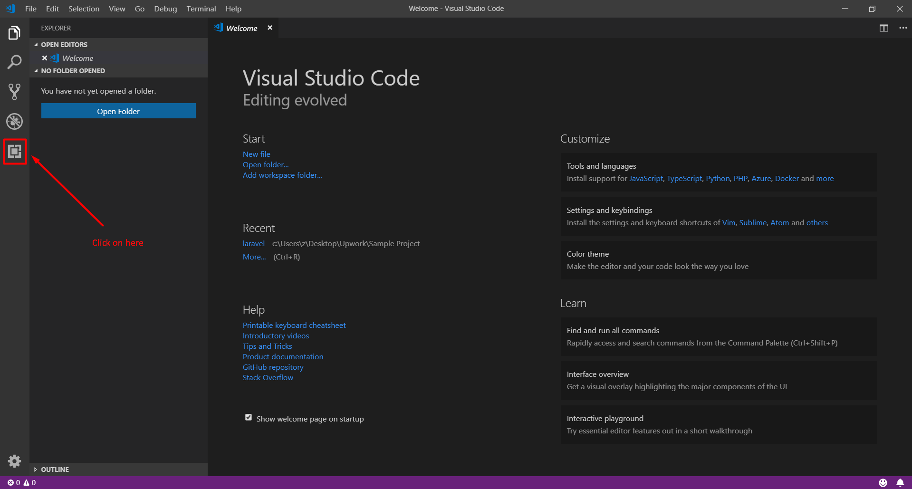
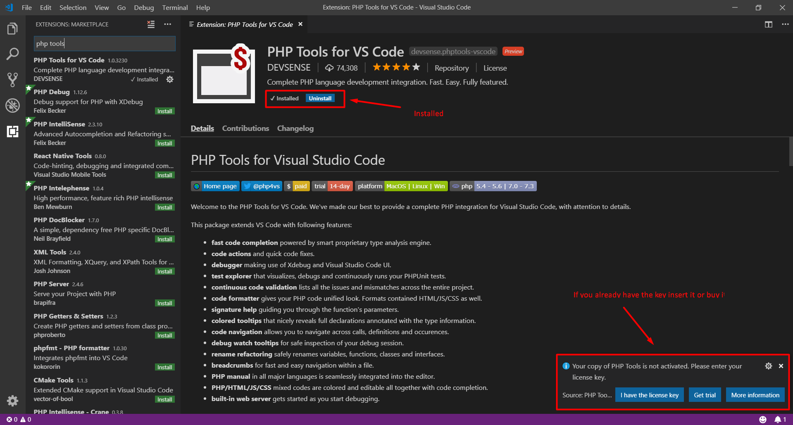
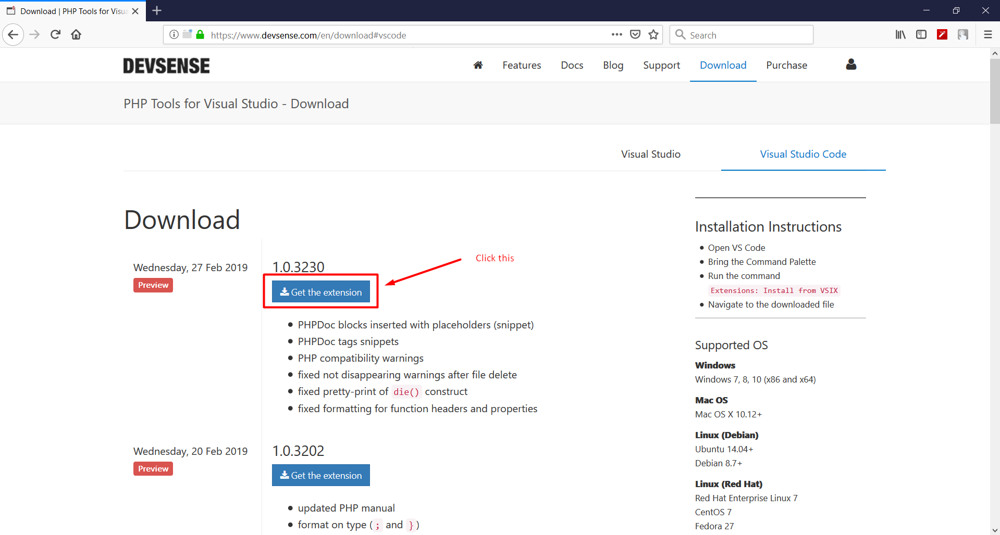
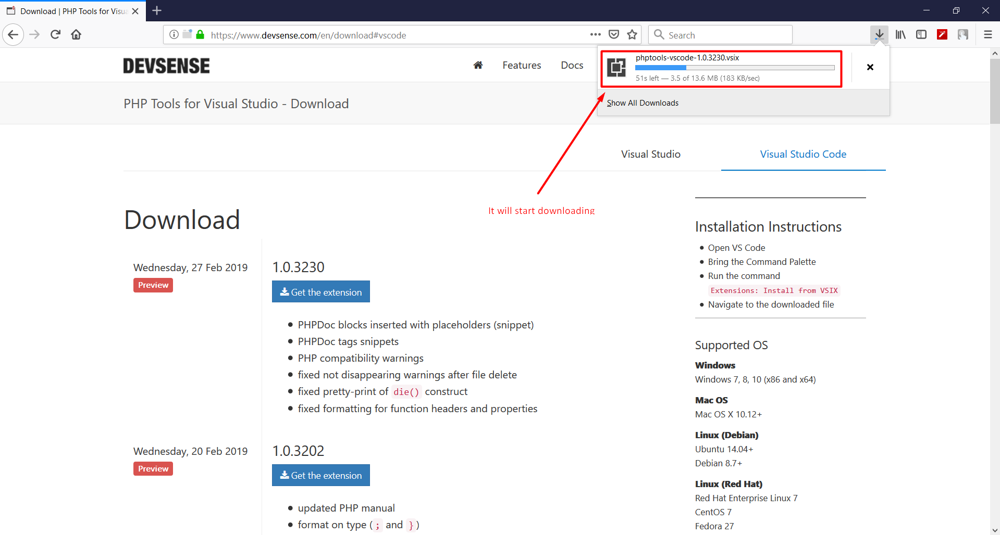
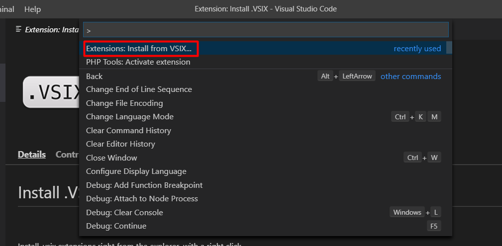
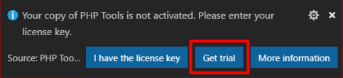
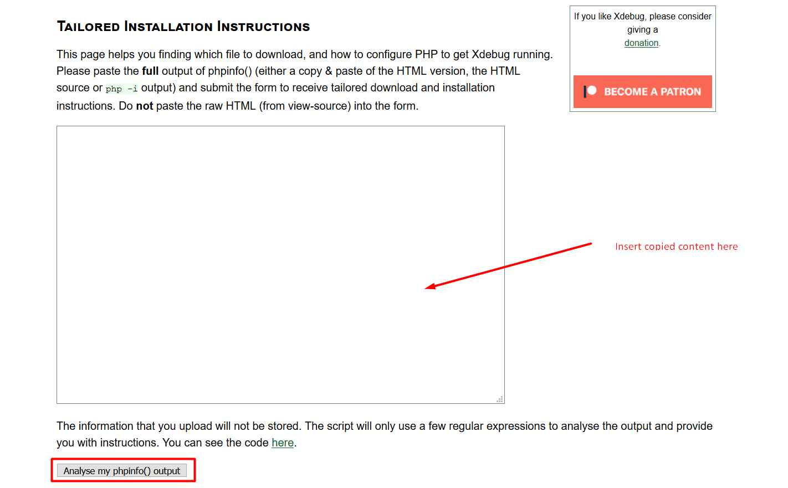
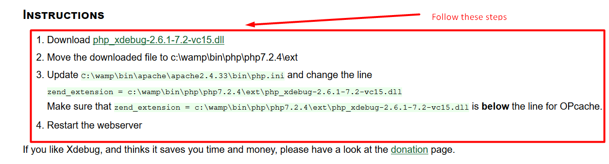

# How to install PHP Tools for Visual Studio Code on Windows



In this article, you will find out how to install PHP Tools for VS Code on Windows. Getting it running is fast and simple and it shouldn’t take you more than a few minutes. 

<!-- more -->

## Install Visual Studio Code for Windows.

To install PHP Tools, you need to have Visual Studio Code (VS Code) already installed on Windows. For those who already have it, just skip this step. For those who don’t, download [VS Code for Windows](https://code.visualstudio.com). If you would like detailed instructions, click [here](https://code.visualstudio.com/docs/setup/windows).



Once you have VS Code installed, you have different ways of installing PHP Tools. In this article, we’ll discuss two ways: The internal installation directly from VS Code, and the external from Devsense’s download page. Both ways are simple, fast and easy. 

## Internal Installation

1. Launch VS Code. 

2. Click the icon for extensions. 



3. Search for “PHP Tools” in the search menu. 

4. Click Install. The tool should be installed automatically. 

5. After the successful installation, a pop-up window will appear on the bottom right of the screen. 

There, you’ll have to choose among entering your license key, choosing to get a trial or receiving more information. Please, refer to the Activation section of this tutorial for detailed instructions. 




## External Installation

1. Go to [Devsense’s download page](https://www.devsense.com/en/download). 

Make sure you have selected the section for VS Code on the right (the letters should be blue). 

2. Download Extension

Click the blue button “Get the extension” under the version you would like to download. 

 

3. The file will start downloading to your PC. 



4. Open VS Code 

5. Install from VSIX

Open the command palette on VS Code (`Ctrl + Shift + P`) and type in “Install from VSIX”. Next, click Install. 





## Activation 

After successfully installing PHP Tools for VS Code, you’ll receive a notification on the bottom right to activate it. Please, bear in mind that the activation of the software requires an Internet connection. You’ll see three buttons: 

a. “I have the license key” 

If you already purchased your license key, click that button and fill in the required information. 

b. “Get a trial”

If you would like to try PHP Tools for VS Code, click this button: 



Fill in the information and you’ll receive an email with a 14-day trial key. Copy and paste the key and you’ll be able to start using the tool. If you think PHP Tools for VS is the right option for you, you can purchase a license after the trial period is over. 

c. “More information” 

This button will take you to the [purchase page](https://www.devsense.com/en/purchase), where you’ll see prices and license information. 

The activation will be confirmed by a pop-up window stating that the process was successful. 

## Debugger and configuration 

Once you have activated your PHP Tools, you need to setup PHP Tools’ debugger. PHP Tools makes use of Xdebug to integrate debugging features into VS Code. 

1. **Make sure you have PHP installed.**

PHP Tools plugin doesn’t require you to have a web server! Only PHP. There are two options to install PHP on your platform. 

* a. You can go to [php.net](https://secure.php.net/) and download the installer of the latest PHP by yourself (preferred).

* b. You can download the whole web server package for PHP – Xampp or Wamp. 

2. Get your phpinfo(). 

* a. On the command line, run

```
php-r phpinfo(); 
```

* b. If you installed Xampp or Wamp, just open `http://localhost` on your browser, and click on the `phpinfo()` tab. 

3. Use Xdebug Wizard

Copy the whole content of `phpinfo()` that shows up and go to the [Xdebug Wizard](https://xdebug.org/wizard.php).  Insert the copied content there and click on the highlighted button below. 



4. Then, follow the steps provided. 



5. Check php.ini

When you’re done with the above-mentioned steps, the last thing to do is ensure php.ini states the following directives: 

```
xdebug.remote_enable = 1 xdebug.remote_autostart = 1 // or append `XDEBUG_SESSION_START=1` parameter to the URL of page you want to debug 
```


Now you are ready to start your first project! 

[Getting started with PHP Tools for VS Code](https://docs.devsense.com/en/vscode)


### You may also want to read: 

 - [Configuration options](https://docs.devsense.com/en/vscode/configuration)

 - [How to install Laravel for VS Code](https://blog.devsense.com/en/2019/03/how-to-install-laravel-for-visual-studio-code)

 - [How to install PHP Tools for VS Code on macOS](https://blog.devsense.com/en/2019/02/install-vscode-mac)
 


