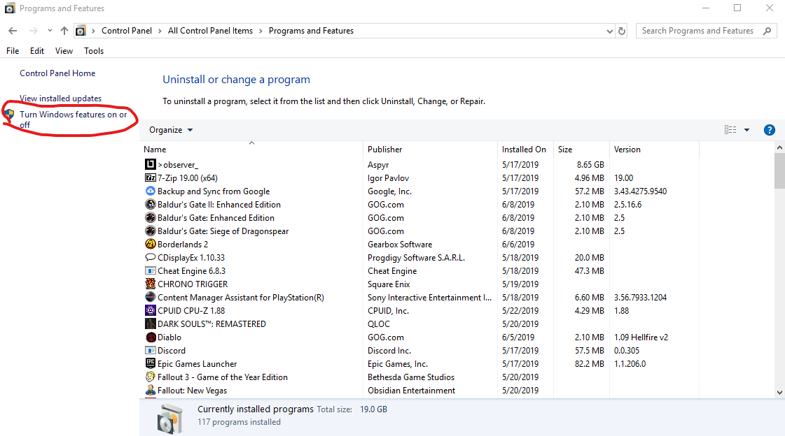
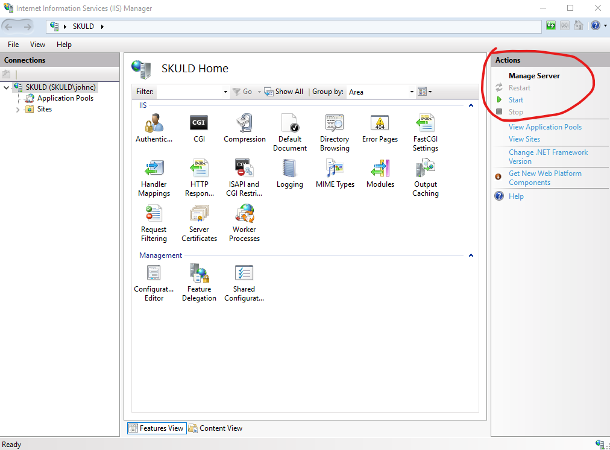
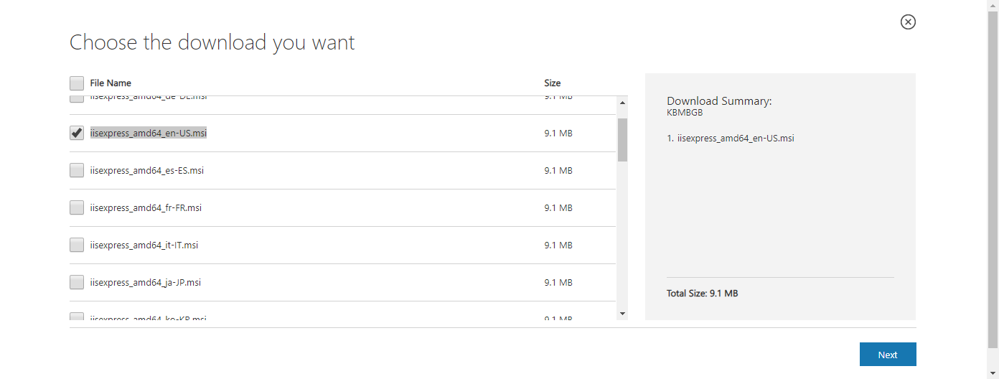
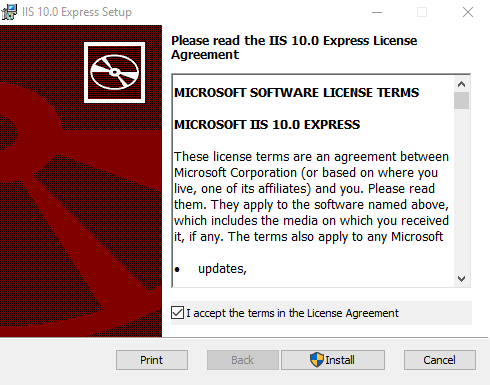
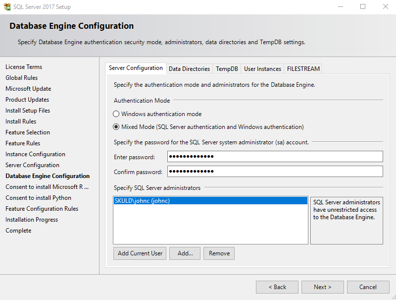
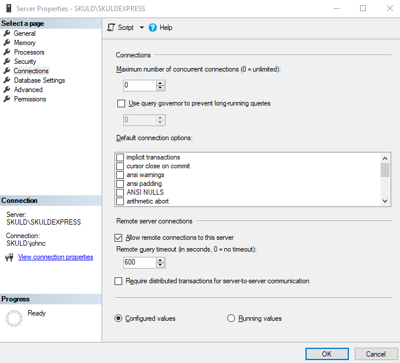
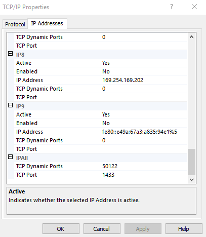
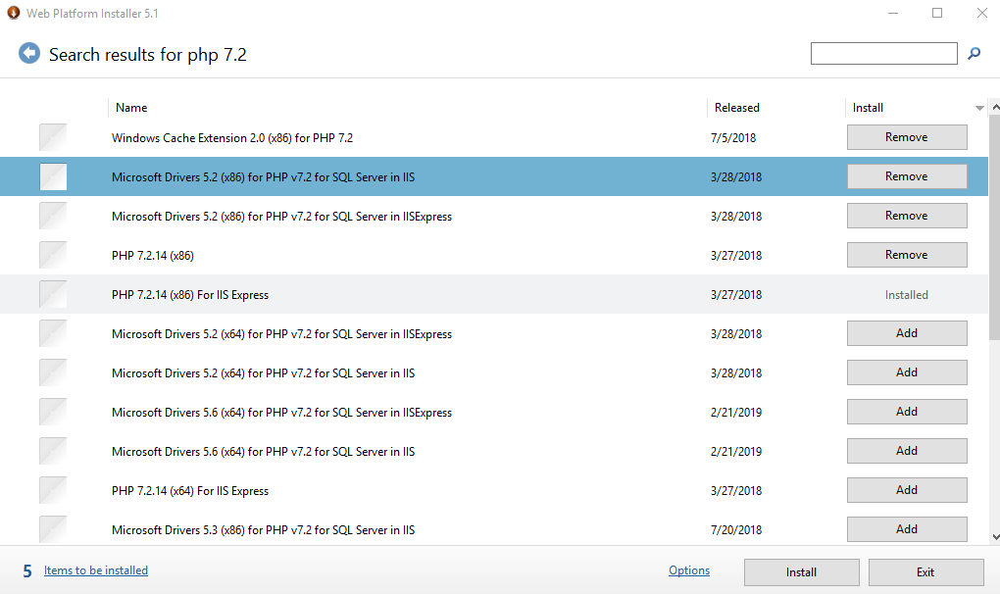
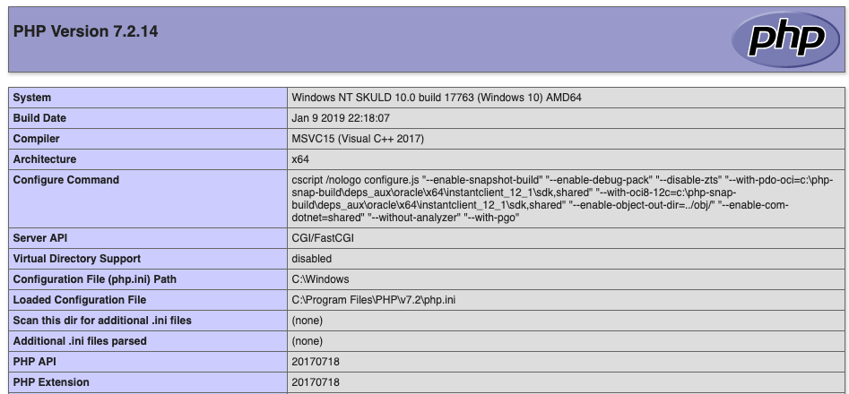

# How to set up a PHP web server environment - Step by step

## Overview

<!-- more -->

There are plenty of instructions available on how to set up a LAMP, WAMP, or MAMP (Linux, Windows or Mac with Apache Web Server, MySQL/MariaDB server, PHP).  But there are also organizations who live and breath the Microsoft based environment, using Windows Server, Microsoft Internet Information Server (IIS), Microsoft SQL - have we repeated the word Microsoft often enough?

For developers who are working in the Microsoft world and want to use PHP, setting up a development environment can actually be a more difficult task than setting up a WAMP through tools like Bitnami or Apache XAMPP. With those, it's one install program, and you're up and running. For a Microsoft based development desktop you can use **PHP Tools for Visual Studio** which will automatically install and setup most of the things for you (IIS Express, PHP, Xdebug). However if you don't have it, follow the instructions in this article step by step. 

We'll run the steps for getting a development web server environment set up and running that can fit right into a Microsoft based shop, using PHP as the primary scripting language.  Please note that this will be a development environment for a desktop system running Windows 10.  The instructions will be similar for a Windows Server environment.

Our sample environment will contain:

* Microsoft IIS - either as a Windows Component or Express
* [Microsoft SQL Server Express](https://www.microsoft.com/en-us/sql-server/sql-server-editions-express)
* [PHP](https://php.net/) Version 7.2

## Installing IIS 

There are two ways of installing IIS on Windows 10 - as a Component Service, and as a separate program IIS Express.

The difference is how much control you want, and how easy to make life on yourself.

* IIS as a Component Service:
  * Easy to configure through application Internet Information Services (IIS) Manager.
  * Runs as a service so you need to turn it on/off manually unless you set it to auto-run
  * Larger storage space taken up on the hard drive
* IIS Express:
  * Very lightweight
  * Only run as required - turn it on, turn it off, and you're done
  * More difficult to configure manually

### Install IIS Via Component Services

If you want IIS to be a more or less permanent of your development system, then we can use Windows Component Services to install the service.

Here's the steps:

1.  Run `Control Panel`, then select `Program and Features`, then `Turn Windows Features On and Off`.



   The other way is just to hit the Windows button and search for "Component Services".
			
			
2. Open up Internet Information Services.  Make sure the following has been checked:
     - Web Management Tools
     - World Wide Web Services
          - CGI
3. Select OK, and let Windows update itself.

How do you know you're up and running? If you go into your Windows Administrative Tools, you'll see Internet Information Services (IIS) Manager.  Launch it, and you'll have a view like this, and you can start/stop your web server by selecting "Manage Server" on the right hand side:





By default, IIS installed through Component Services runs on port 80.

### Installing IIS Express

> **Note:** If you have PHP Tools for Visual Studio, IIS Express will be automatically installed and configured for you.

As of this article, the most current version of IIS Express for Developers is is 10.0, available at [https://www.microsoft.com/en-us/download/details.aspx?id=48264](https://www.microsoft.com/en-us/download/details.aspx?id=48264).  This version has been optimized for developers.

From the web page, select the version that matches your environment - they'll be separated by country code.  For example, developers in the United States should select iisexpress_amd64_en-US.msi:



Once it's downloaded, run the .msi file.  Of course, you'll need to be the administrator of your desktop environment.




Of course, you're reading over the entire license agreement before you install any software?  Of course you do.


And - that's it!  You're probably wondering - ok, how do I manage it?  Well, not through a fancy application like IIS Manager.  All of the configuration files are located under `%WinDir%\System32\Inetsrv\Config`.  For all of the details, please see [IIS Configuration Reference](https://docs.microsoft.com/en-us/iis/configuration/).  The point is - it's installed, and we're ready to go.

## Installing MS SQL

All right, we have IIS up and running.  But we're only started.  Next up, we're going to set up Microsoft SQL.  We could be using a MySQL variant, but we're looking at this from the point of view of a primarily Microsoft shop that's going to using PHP with the other Microsoft tools.  So Microsoft SQL it is.

### Microsoft SQL Express

I'm going to put down money that unless you have a Microsoft developer account or your company really likes you, you aren't running Microsoft SQL Server on your desktop machine. This is why we're going to work with MS SQL Express.  Mainly because - it's free, and that works just fine for us.

Head over to [https://www.microsoft.com/en-us/sql-server/sql-server-editions-express](https://www.microsoft.com/en-us/sql-server/sql-server-editions-express), download and install.  As of this article, that's SQL Server 2017 Express.

The default download should be fine.  For this situation, I called my SQL Server SKULDEXPRESS, but the default will be SQLESPRESS.

One thing to note - because we'll be communicating with our server via PHP, we want the SQL server to allow authentication over Mixed Mode.




#### Quick Configuration

There are some other settings for SQL Express you'll need to set.

* Allow Remote Connections:  From SQL Server Management Studio, go into the properties of your server and under Connections select "Allow Remote Connections to the Server".



* Enable IP: From SQl Server Configuration Manager:  Under SQL Server Network Configuration, set TCP/IP Enabled.


* Double click TCP/IP and make sure that the IP port is Enabled, and that the Port is set (default is 1433).




### Install Microsoft SQL Server Management Studio

Just because you have SQL Server on your system, it doesn't mean you can manage it that easily.  You *could* do that from the command line - but let's not torture ourselves.  Download and install the SQL Server Management Studio (SSMS) at [https://docs.microsoft.com/en-us/sql/ssms/download-sql-server-management-studio-ssms?view=sql-server-2017](https://docs.microsoft.com/en-us/sql/ssms/download-sql-server-management-studio-ssms?view=sql-server-2017).  The default install is just fine.

## Install IIS Web Platform Installer

>**Note:** If you have PHP Tools for Visual Studio, Web Platform will be automatically installed. You can skip this step.

By now, you may be wondering "Where's the PHP"?  Wait up.  We need our installation to work with IIS, and that easiest done by installing the plugins for IIS.  (See how simple that idea is)?

Whether you're using IIS as a component service or IIS Express, the easiest way to install modules and other plugins is through the IIS Web Platform installer, available at [https://www.microsoft.com/web/downloads/platform.aspx](https://www.microsoft.com/web/downloads/platform.aspx).  

## Install ODBC Driver

Before we can set up our connections from PHP to MS SQL Server, we'll also need the ODBC drivers available at [https://docs.microsoft.com/en-us/sql/connect/odbc/download-odbc-driver-for-sql-server?view=sql-server-2017](https://docs.microsoft.com/en-us/sql/connect/odbc/download-odbc-driver-for-sql-server?view=sql-server-2017).

Install that, and we're ready (finally!) to install PHP to use with our IIS system.

## Install PHP 7 For IIS

>**Note:**  If you have PHP Tools for Visual Studio you can skip this step. PHP -any version you want- and Xdebug will be automatically installed by PHP Tools.  

To install PHP 7 that works with our newly installed IIS, follow these steps:

1.  Start IIS Web Platform Installer.  You'll need Administrator access on your local system
2. Select the tab on top marked Products.
3. In the search bar, enter PHP.  For our example, we'll set up PHP 7.2.
4. Select `Add` for each of the following:
     -Select the PHP for your version of IIS - either just IIS, or IIS Express (or both if you've installed both like myself).  This is important:  Stick with the x86 versions, not the x64 versions!  Odds are, almost everything you do will require the x86 version.  Only install x64 if you *really* know that's what you need.
     - Select the Microsoft Drivers for the version of PHP you are installing.  
5. When you're ready, select Install.




You can install multiple versions of PHP if you need to, all the way back to PHP 5 if you like.

### Install PHP Manager for IIS

Almost there!  If we're going to manage our PHP system from within IIS Manager, we need the plugin for it.  Download and install PHP Manager from IIS here [https://www.iis.net/downloads/community/2018/05/php-manager-150-for-iis-10](https://www.iis.net/downloads/community/2018/05/php-manager-150-for-iis-10).

### Setting up PHP for PHP

We have PHP installed - but we need to make sure it's in our IIS configuration.  We'll do this for the standard IIS compiled via Windows Components.

1. Launch your IIS Manager.
2. Open PHP Manager.
3. If this is your first install, it may prompt you with some optimization settings, such as setting the default document to index.php.  Go ahead and do those.

All right - we have a PHP server running!

## Sample Code

So - we think we have PHP running within IIS.  But let's test it out.  We'll assume you're running with IIS installed via component services, but the same code should work wherever you set up your IIS web directory.  

### Basic Test

First test is the easiest.  

1. Launch Visual Studio Code or Visual Studio with PHP Tools installed.  The latter will make resolving libraries an functions a lot easier.
2. Within your web project, create a file called info.php and put the following code into it:

```php
<?php

phpinfo();

?>
```

3. Launch your browser and point it to your running instance of IIS.  If everything worked, you should see:




### MS SQL Test

Now, lets connect to our server.  For this sample, I used the SQL Server Samples available at [https://github.com/microsoft/sql-server-samples](https://github.com/microsoft/sql-server-samples), created the database AdventureWorks 2017 and add a user called phptoolstest in our new MS SQL Server to connect to it.  So let's test it out.

1. Create a file called connecttest.php and put it in your web server.
2. Create the following function with code - PHP Tools will help speed this up a bit so you're not hunting around for the right functions.  Autocomplete - a programmers best gift to themselves - just replace the server name address with your own settings.

This code is pretty simple:
* Connect to the MS SQL Server.
* Retrieve the first name and last name of each Person from the table Person.Person.
* Displays the names as a simple list.

And that's it!  If you've followed this process, you - yes, *you* - can set up an IIS server with PHP that can connect to a Microsoft SQL database.

We've included a copy of the complete code below.  Enjoy.

## Code Sample

```php
<?php
ini_set('display_errors', 1);
ini_set('display_startup_errors', 1);
error_reporting(E_ALL);

GetNames();

/**
 * Summary of GetNames
 * 
 * Retrieves the list of names from the table Person.Person and displays them as "FirstName Lastname".
 */
function GetNames()  
{  
    try  
    {  
        $conn = ConnectSQL();  
        $sql = "SELECT [FirstName], [LastName] FROM Person.Person";  
        $sqlquery = sqlsrv_query($conn, $sql);  
        if ($sqlquery == FALSE)  
            die(ShowSQLErrors(sqlsrv_errors()));  
        $productCount = 0;  
        while($row = sqlsrv_fetch_array($sqlquery, SQLSRV_FETCH_ASSOC))  
        {  
            echo($row['FirstName']);
            echo " ";
            echo($row['LastName']);  
            echo("<br/>");  
            $productCount++;  
        }  
        sqlsrv_free_stmt($sqlquery);  
        sqlsrv_close($conn);  
    }  
    catch(Exception $e)  
    {  
        echo("Error!");  
    }  
}  

/**
 * Summary of ConnectSQL
 * 
 * Connects to the SQL Server Database and returns the connection.
 * 
 * @return resource The server connection.
 */
function ConnectSQL()  
{  
    try  
    {  
        $server = "tcp:YOURSERVER,1433";  
        $options = array("Database"=>"YOURDATABASE",  
            "Uid"=>"YOURUSERNAME", "PWD"=>"YOURPASSWORD");  
        $conn = sqlsrv_connect($server, $options);  
        if($conn == false)  
            die(ShowSQLErrors(sqlsrv_errors()));  
        return $conn;
    }  
    catch(Exception $e)  
    {  
        echo("Error!");  
    }  
}  

/**
 * Summary of ShowSQLErrors
 * @param mixed $errors Shows the errors from a failed MS SQL server connection.
 */
function ShowSQLErrors($errors)
{
    echo "Danger Will Robinson: <br/>";
    
    foreach ($errors as $error) {
        echo "SQLSTATE: ".$error['SQLSTATE']."<br/>";
        echo "Code: ".$error['code']."<br/>";
        echo "Message: ".$error['message']."<br/>";
    }
}

?>
```

## Related articles

- [How to set up a PHP web server - The most popular methods](https://blog.devsense.com/related-articles-how-to-install-xdebug-for-php-tools-for-v)


