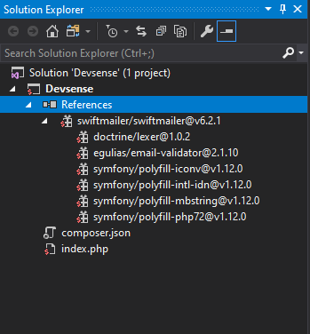
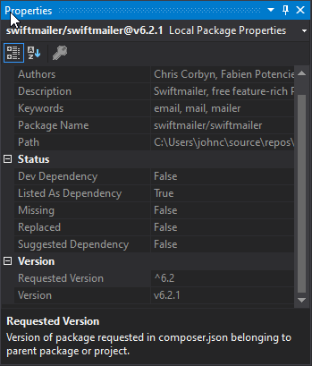

# Installing and using Composer for PHP


## Requirements

<!-- more -->

* PHP (PHP 7 is used for this example)
* Visual Studio IDE (2019 is used in the examples below)
* PHP Tools ([free 30-day trial](https://www.devsense.com/en/download))

At the core of every programmer is someone who is lazy.  This isn't a bad thing - if you recall the Heinlein short story "The Tale of the Man Who Was Too Lazy to Fail", it involved a man who really didn't want to work.  So, he looks over how things are done to make them easier on himself rather than doing it the same laborious method as his counterparts.

This is the heart and soul of every good programmer. We want the computer to do the work for us.  We *could* manually count how many times the word "spam" appears in a document.  Or we can make a function that does that for us.  The history of great programmers is that of someone saying "Yeah, I'd rather not do that myself, I'll just make it easier."

The Composer framework lets you install components rather than inventing everything from scratch.  Not only does it help with installing "packages" (pre-created libraries and components), but they also resolve any dependencies.

For example, suppose that we want to send emails.  Sure, we could:

* Create our own PHP based connection to a SMTP process, figure out the proper commands on how to format our mail message, handle authentication and encryption
* Install an email sending package like Swiftmailer!  First, we download it manually.  Oh - but it also requires email-validator to run.  And polyfill.  And if there's an upgraded version in the future, then we'll have to make sure we don't install the wrong dependencies because then that might break what we have.
* Or we use Composer, specify that we want to install Swiftmailer, and it will download and install the correct dependencies for us.

I'm lazy.  Let's go with the last option.

Installing and using Composer isn't that difficult.  There's three phases:

1. Install Composer.
2. Install the desired packages.
3. Use the Composer packages in your code.

We'll be using Swiftmailer as our example, but check out all of the packages available from sites like [Packagist](https://packagist.org/).  There's ones for handling your log files, for handling files, handling messages - odds are, there's somebody out there who had a problem, solved it, and then published their package for other lazy people to use.

## Installing Composer

Installing Composer into your project is made really easy when you're using Visual Studio with PHP Tools.  The instructions are at [https://docs.devsense.com/en/vs/project/composer](https://docs.devsense.com/en/vs/project/composer), but we'll show them in action.

First, create a project in Visual Studio and make sure it's a PHP project:

1. Start Visual Studio.
2. Select `File`, then `Project`.
3. Specify the project as `PHP Web Project`.
4. Give it a name and location.  For this sample, we're just going to go with an empty web site.

Now we can install our Composer packages.  

1. Right click on References, and select "Install New Composer Package".
2. Type in the package to install.  We're going to use Swiftmailer, so our example has that.
3. And Install!

## Understanding Composer

So we've installed Composer.  That's all well and good, but what is actually going on?

PHP Tools is kind enough to show in our References section the packages installed.  And if you look in the project - there's a file there called `composer.json`.  If we opened it up, we'll see how Composer knows what to install:

```json
{
    "require": {
        "swiftmailer/swiftmailer": "^6.2"
    }
}
```

So - this is telling Composer "Hey, we need swiftmailer, and we want version 6.2".  Now, take a look at the References directory:



So if we only specified Swiftmailer, what's with all of these other directories?  Turns out, this is part of the power of Composer is when it installs a package, it automatically determines the different dependancies that the package needs to run.  Swiftmailer needs polyfill and email-validator and other pieces, so Composer grabs them for us.

The version can also be tweaked.  If you select "swiftmailer/swiftmailer" from the References section, the Properties window will show all sorts of things - like the Version:



There's a chance you work in an organization that specifies what versions of packages and dependencies to use.  Perhaps it's to enforce security standards so only approved versions are allowed.  If we examine the [Swiftmailer package archive](https://docs.devsense.com/en/vs/project/composer), we can see the previous versions.  Here, the `^6.2` means "install everything from version 6.2 and up."

So let's change it - maybe our organization only allows version `6.1.3`.  Update the composer.json package to have that specific version like so:

```json
{
    "require": {
        "swiftmailer/swiftmailer": "6.1.3"
    }
}
```

Then right click on References and select `Update Composer Packages`:

And there we are!  Downgraded, and you'll notice the dependencies have been updated as well.  PHP Tools keeps it all under control.  If you want to go back to the latest version, just update the `composer.json` file and update again.

There are additional ways of managing your Composer packages through PHP Tools and Visual Studio, so be sure to check the [the PHP Tools documentation page](https://docs.devsense.com/en/vs/project/composer) for all of the details.


## Using Composer Packages

Now that our Composer package has been installed, let's use it!  Let's head back to our project file and edit index.php.  We can load up all of the packages with one require command:

```php
require __DIR__ . '/vendor/autoload.php';
```

This example is specifically for Swiftmailer, but most packages will follow the same process:

1. Declare a variable of the class you're using.
2. Feed it the parameters it needs.
3. Use it.

So in the case of Swiftmailer, we have:

```php
require_once `vendor/autoload.php`;

// Start with a transport - set the SMTP parameters
$mytransport = (new Swift_SmtpTransport('localhost', 25))
  ->setUsername('username')
  ->setPassword('password')
;

// swiftmailer uses the transport to send the message
$mymailer = new Swift_Mailer($mytransport);

// Create a message
$message = (new Swift_Message('What a message!'))
  ->setFrom(['myemail@test.com' => 'Javier Bananahammock'])
  ->setTo(['daryl@test.org', 'otherbrotherdaryl@test.com' => 'My brothers Daryl'])
  ->setBody('Hey guys - it\'s Larry! Let\'s do a BBQ!')
  ;

// Send the message
$result = $mailer->send($message);

///do some tests with the results to make sure it worked
```

Since we're using PHP Tools, we'll be able to get a peek at the Swift_Message class by mousing over it when we need to.  

For more information, go check out the [Swiftmail](https://swiftmailer.symfony.com) page.  But - now you have an idea of how to use Composer to save you time and energy.  Don't spend your time rebuilding everything that you need. A good developer is a lazy one, because they know how to use existing systems and do it right the first time.


