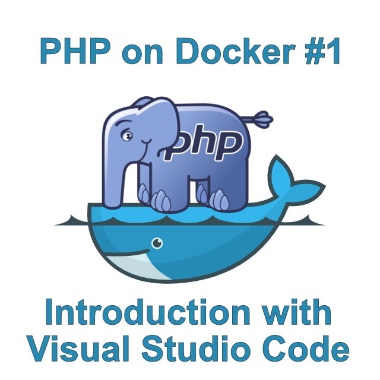

# Introduction to PHP on Docker with Visual Studio Code



I'm sure you have already heard something about it. Docker -the technology that completely took over the software world in the past few years. This article explains what Docker is and how to use it with PHP inside [Visual Studio Code](https://code.visualstudio.com). 

<!-- more -->

The article is mainly targeted for beginners and does not include more advanced topics like docker compose, PHP debugging or PHP testing, which will be covered in future articles. If you are only interested in a quick tutorial, and already know what Docker is, you can go straight to the [tutorial](#heading-5). But, if you want to read briefly about what Docker is and why you should use it, continue reading.

## Before Docker
Before Docker, or any other so called "Containerization" technologies, the era of cloud computing was just beginning. People started hosting huge amounts of software services in these big data centers. If you only had a small website, it was relatively inexpensive and easy to host it, but what if you had some more complicated software, you might need certain versions of libraries or binaries, your software depends on. And those might only work in one Linux distribution.

The only way to satisfy your software needs were *virtual machines*. With virtual machines, you can install whatever operating system you want and setup your environment to your needs. But it came with a cost -you had to manage their updates and they were relatively expensive. They might also take minutes to boot up and take gigabytes of ram and disk space. You can see two applications inside virtual machines running on the same computer in layer by layer diagram below.


But, let's say you have a hundred applications with very specific dependencies on different libraries and binaries located only in certain operating systems. Then, you would need possibly a hundred of these heavy virtual machines. Containerization technology was created to make scenarios like these much more efficient. More specifically, one in particular called Docker. You can see how would have looked the same scenario from a previous image on Docker, on the diagram below.


As you can see from the picture above, applications running in Docker no longer need their own instances of operating systems to run in isolation. They are now compiled into so called Docker images, which define all their operating system, libraries and other dependencies. Docker daemon, which is a service running on basically any operating system (Windows, Linux, Mac) will take care of all these dependencies for us and it will very efficiently distribute system resources. 

Docker images might need only a few megabytes of memory and storage. It is also capable to create hundreds -if not thousands- of Docker Containers in a few milliseconds. You can swap all your services, when updating to a new version, without your users even noticing it. This is a much more efficient way to run isolated applications, with potential of running thousands of them on the same hardware instead of only a few. And possibly the biggest advantage is that if it works on your computer, you can be sure that it will work everywhere the docker daemon is. You no longer have to deal with "but it *works* on my Computer" type of problems.

## Docker terms
Before getting into an example of running PHP in Docker, there are some terms that you have to know first.

- **Docker Image**
This is a template containing all the application files, binaries, libraries and defined dependencies that are needed to run an application.

- **Docker Image Tags**
If you have different versions of Docker Images, for example for different versions of an application, you can differentiate them with tags. If you don't specify any tag for your Docker Image, it becomes a special one called **latest**. It should be used for latest default version of an application.

- **Docker Container**
Docker Containers are instances of Docker Images. In programming terms of Object-Oriented programming, you can think of Docker Images as being Classes and Docker Containers as being instances of those Docker Images.

- **Dockerfile**
These are text documents containing all the instructions, that have to be subsequently called, in order to create your Docker image. You will see  Dockerfile further on in this article.

- **Docker Repository**
This holds all the different versions of some specific Docker Image.

- **Docker Registry**
Docker Registry is a collection of Docker Repositories. These can be public or private. Many people and companies have private Docker Registries holding Docker Images with their software. There are many cloud service providers which are able to host them. ([Microsoft Azure](https://azure.microsoft.com/en-us/services/container-registry/), [Amazon AWS](https://aws.amazon.com/ecr/), [Google Cloud](https://cloud.google.com/container-registry/), [Docker Hub](https://docs.docker.com/docker-hub/repos/) etc.) Or you can even host it yourself on Docker, with this official [Docker Registry Image](https://hub.docker.com/_/registry).

- **Docker Hub**
[Docker Hub](https://hub.docker.com) is the most famous Docker Registry, which is used to host all the public docker images you can think of. This includes PHP Docker Images that will be discussed in the next chapter of these series.

 

This was just a really brief explanation of Docker. There are plenty of articles on the Internet explaining it in much more detail, including some free ebooks. If you want to know more about this technology, I personally recommend reading [Introduction to Windows Containers](https://blogs.msdn.microsoft.com/microsoft_press/2017/08/30/free-ebook-introduction-to-windows-containers/). Don't let the name fool you, it deals much more with Containers in general, than with Windows specific subjects.

## PHP Docker Images
PHP has its own official [Docker Hub Repository](https://hub.docker.com/_/php). There, you can find Docker images with various tags for different use cases. Apart from usual tags for different PHP versions (7.2, 7.3, 7.3.5 etc.), there are also `cli`, `apache`, `stretch`, `alpine` and `fpm` tag variations. They are all described on Docker Hub pretty well, but let's go through them briefly. For the complete description I recommend reading their documentation on Docker Hub.


- **cli**
These are images that contain PHP CLI tool with default modules and basically don't contain anything else. They are primarily designed to be a base from which other (more useful) images are build.

- **zts (Zend Thread Safety)**
These are images with Zend Thread Safety mode, which allow the use of [pthreads](https://www.php.net/manual/en/book.pthreads.php) for working with threads inside PHP.

- **stretch/buster**
These images are based on [Debian Linux](https://www.debian.org/index.html). More specifically Debian 9, which has the codename "Stretch". On July 6th, 2019, new version of Debian 10 with codename "Buster" was released. You can start seeing images with this codename as well.

- **alpine**
These images are based on [Alpine Linux](https://alpinelinux.org/).

- **apache**
These are PHP images that have built-in [Apache web server](https://httpd.apache.org/). Web servers that are usually used in combination with PHP, like Apache or [Nginx](https://www.nginx.com/) have their own docker images. I recommend using a technology called **docker compose** (or other container orchestration technology like [kubernetes](https://kubernetes.io/)), which can define multiple inter-connected docker containers (for example one for PHP, one for nginx etc.), instead of built-in Apache. (We will be talking about this in the next article.)

 You can get the latest web server versions and much more flexibility that way and it's a recommended way of doing this. But for instances where you need a single docker image for the whole solution (I encountered some hosting solutions that don't support docker compose), or if you want a simpler solution and like Apache web server, these PHP images with Apache tag can be useful for you. 

- **fpm (FastCGI Process Manager)**
These contain PHP-FPM, which is a [FastCGI](https://en.wikipedia.org/wiki/FastCGI) implementation for PHP. They are used in combination with some reverse proxy inside of a web server and are basically useless on their own. We will be using this tag in the next article of these series for combining nginx with PHP.


### Debian (stretch/buster) vs. alpine
There are images based on different Linux distributions, but how can you decide which one to use?

If you look at the sizes of images for these Linux distributions, that these PHP tags are based on ([Debian](https://hub.docker.com/_/debian), [Alpine](https://hub.docker.com/_/alpine), you will see that the latest Strech image has currently a size of 45MB. But if you look at the size of latest Alpine image, it has currently a size of 3MB! 

So, why is Debian Linux distribution used as a default base image for PHP images, if no other tag is specified when Alpine is currently 15x smaller? If you start using Alpine images and try to customize them, soon you might find out that those tools or standard libraries you are trying to use are not working and instead you are flooded with errors. It's because they are probably not there. 

Alpine is a very bare-bones Linux distribution, which is designed to be really small and run in RAM, but you really have to test if you have everything you need, or install it manually. Debian images are more fully-featured and everything you need for PHP might already be there without any customizations with many apt-gets (or similar commands) in dockerfiles. The choice is yours. Stretch also started to make "slim" images, which have currently 22 MB, but as far as I know, no PHP images use them.

## How to create a docker container in Visual Studio Code

### Prerequisites
Before getting our hands dirty with your first take on PHP running in Docker, there are some things that we need to install first. Let's start with Docker itself.

##### Docker ID
Before you can download and use Docker, you have to create your Docker ID. I recommend [doing it now](https://hub.docker.com/signup) if you don't have it already. You will also need this account for pulling Docker images from Docker Hub.

##### Windows
If you are on Windows, you will need to install [Docker Desktop for Windows](https://hub.docker.com/editions/community/docker-ce-desktop-windows). You have to be logged in Docker Hub with your Docker ID to be able to download it.  Be warned -it requires Windows 10 64-bit Professional or Enterprise edition.


##### Linux (CentOS, Debian, Fedora, Ubuntu…)
If you use these Linux distributions, see their [step by step installation instructions](https://docs.docker.com/install/linux/docker-ce/ubuntu/). On the left menu, choose the one you are interested in.

##### Mac
These are the [installation instructions for Docker Desktop for Mac](https://docs.docker.com/docker-for-mac/install/).

##### Docker extension for Visual Studio Code
The official extension for [working with Docker in Visual Studio Code from Microsoft](https://marketplace.visualstudio.com/items?itemName=ms-azuretools.vscode-docker).


It adds Dockerfile and docker-compose.yml syntax highlighting, IntelliSense, error checking etc. and also allows you to see and manipulate with locally installed images, containers and even remote registries like docker hub or azure (if you have any private registries there). It will make your work with Docker easier.


### Create a container image in Visual Studio Code

> **Note:** You can get the sample code at [here](https://github.com/marosbeno/php-on-docker/tree/master/1%20-%20Introduction)

For a basic introduction to PHP running on Docker, let's create one really simple container.

1. First, create a folder named `PHP Hello Docker` and open it in Visual Studio Code.

2. Open this folder in Visual Studio Code and create a file named `hello.php`.

 ```php
 <?php
 echo "Hello from Docker!";
 ```

3. Next, create a file called `Dockerfile` (without any extension) and write this code into the file.

 ```dockerfile
 FROM php:cli-alpine

 # Copy project files
 COPY . /usr/src/hellodockerapp
 WORKDIR /usr/src/hellodockerapp

 # Run hello.php
 CMD [ "php", "./hello.php" ]
 ```

 This is a very basic Dockerfile. Dockerfiles describe how to build your Docker image. You can think about Docker images in layers. The top layer always has to be some read-only base image with an operating system. At this time, this can either be some distribution of Linux or Windows. You can see that our base docker image is PHP with `cli-alpine` tag. You can see this in the picture below (For more information on PHP docker image tags, see the section ["PHP Docker images](#heading-3)" above).

 After specifying the base image, copy everything in project folder to `/usr/src/hellodockerapp` inside new docker image and set a workdir there. This is equivalent of calling `cd folder` inside cmd, so you don't have to specify paths in later commands. And last command calls PHP with `./hello.php` as parameter.

4. Build a new Docker image from `Dockerfile`. With Docker extension, you can do this, just by right clicking on `Dockerfile` and clicking **Build Image**.


When you click on **Build Image**, a dialog will appear and ask you for an image name. You can specify both image name and tag. If you don’t specify a tag, "latest" will be used.


After clicking <kbd>Enter</kbd>, a call will be made to build our new docker image from `Dockerfile`.


5. Now, you should be able to see our newly created docker image inside **Docker explorer**.


6. To run it, right click on `latest` under the `phphellodocker` node inside the **Docker explorer** and select **Run Interactive**. If you would click **Run**, the container will be created and run as well, but you would not see the output of echo in the terminal.


After doing that, you can see that your PHP script was run inside a Docker container.


As you can see, the docker image was run with `--rm` parameter, which causes the container to self destruct after it completed running.

## Summary
In this article, we talked a little bit about Docker and created a very basic Docker Image with PHP inside Visual Studio Code. In the next article, we will look at how to use PHP with Nginx. All inside docker, with the help of container orchestration technology called **Docker Compose**. If you have any questions, please, leave them in the comments below.

