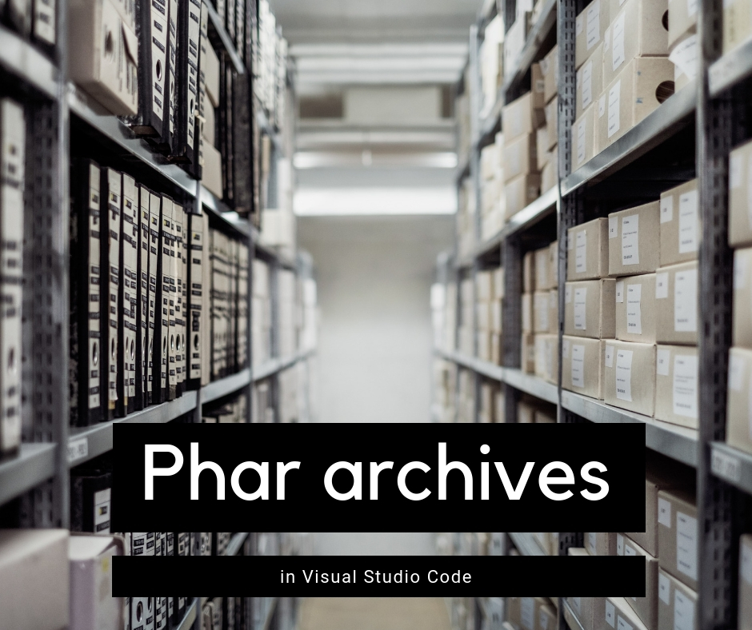
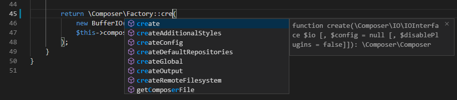

# Phar archives in VS Code

---

<!-- more -->

Have you heard about phar archives? They're an easy and convenient way of distributing and installing a complete PHP application in a single file. Usually, if you're using a phar archive, you don't know what's inside of it, because most PHP editors won't let you look at the source code.

The good news is that  since September 2019, PHP Tools for VS Code comes with this new feature, which allows you to peek into any phar archive and work with the code contained in there. And while you inspect the file, PHP Tools will still continue to analyze the code, allow you to "jump to definition" and work with all its other features.

*Code completion and help for Composer library bundled in a Phar archive*

In this video we'll give a short explanation of the phar archives and how PHP Tools can help working with them in Visual Studio Code.

<iframe width="560" height="315" src="https://www.youtube.com/embed/nA6szowdC2c" frameborder="0" allow="accelerometer; autoplay; encrypted-media; gyroscope; picture-in-picture" allowfullscreen></iframe>

