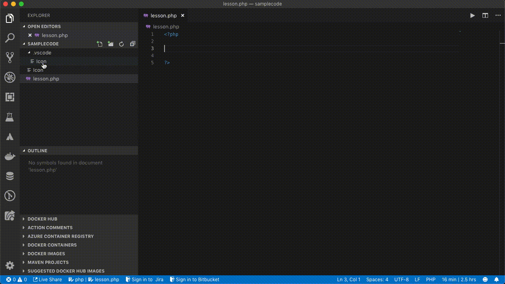
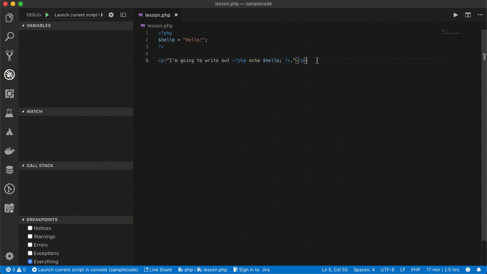
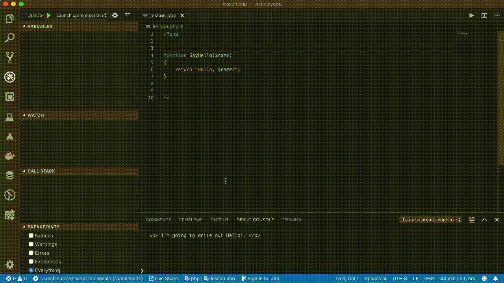
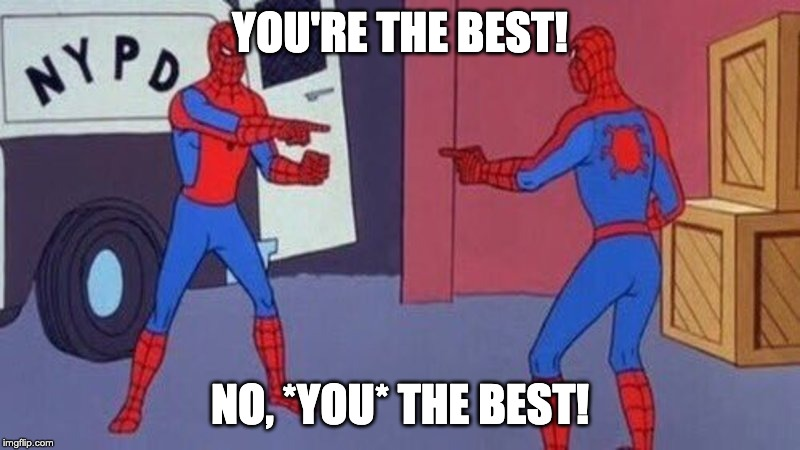

# PHP For Beginners - Part 1: Variables, Functions, Classes

## Overview

<!-- more -->

Not everyone was born a PHP expert.  And if you were born a PHP expert, then we really need to check in with some researchers who want to know just how that knowledge was embedded into your baby brain.

PHP is one of those "learn in minutes, master in a lifetime" kind of things.  The language, the syntax, the concepts behind the PHP language aren't that difficult to grasp, but over the years there have been so many functions, plugins, libraries and frameworks that someone could spend a lifetime and not get to the end of what PHP can do for them.

We're going back to the basics, building up the most basic programs in PHP.  By the end, you'll be able to create a simple program that will impress your cat.

>Disclaimer:  Nothing will ever impress your cat.

The explanations here are at a very, *very* high level.  For more detailed information, I recommend reading through [the entire documentation](https://www.php.net) of PHP.  All of it.  Read every word.

>Disclaimer:  Don't read every word unless you really want to impress your cat.

## Requirements

There are plenty of ways to work in PHP, but we'll be using the following for our examples:

* Development environment with PHP installed [from whatever method you prefer](https://blog.devsense.com/related-articles-how-to-install-xdebug-for-php-tools-for-v)
* [Visual Studio Code](https://code.visualstudio.com/) or [Visual Studio 2019](https://visualstudio.microsoft.com)
* [PHP Tools](https://www.devsense.com/en/download)
* [Xdebug](https://xdebug.org)

For the examples here, we'll be using Visual Studio Code with PHP Tools installed in it.  It'll help us build our basic program by autocompleting functions, looking up definitions so we're not flipping over to the PHP documentation page, and just generally makes life easier.

## PHP Coding Concepts

### Script Start and Stop

Let's start with a very simple PHP script.  Open up your copy of Visual Studio Code, create a new file and let's call it "lesson.php".  Put this in:

```php
<?php 
?>
```

What - that's it?  That's right - nothing is inside.  This first item is just verifying that you set up Visual Studio Code, PHP, and PHP Tools properly.

On the left side of Visual Studio Code is a bug with a line through it - that means "Debug".  Get used to that guy - we're going to be using it a lot.  Click it, and you'll see next to DEBUG a green arrow. 


No.  Not that green arrow.

If this is your first time doing this, you can set up a debug configuration just by selecting `No Configurations`, then select `Add Configuration`.  If you set up PHP Tools, PHP, and Xdebug the right way and created our lesson.php file, then we'll get a nice configuration that will run a little web server and Xdebug for us.  Like so:



Now - click on that green arrow!  Click away!

Did nothing happen?  Well, good.  Because our program has nothing in it.  Every PHP script starts with the `<?php` tag, and ends with `?>`.  This tells our PHP interpreter "Everything between <? php and ?> is code to run."

You can even have multiple segments tied together, with other kinds of scripts or code inside, like HTML.  It's not uncommon to see something like this:

```php
<?php
$hello = "Hello!";
?>

<p>"I'm going to write out <?php echo $hello; ?>."</p>
```

Go ahead and put that code into lesson and run it with the configuration `Launch the Current Script in Console`.  In the Debug Console, you'll see the output like this:




It's not always necessary to have the `?>` at the end of the script, but it's good practice to do so.

If this is your first exposure to PHP, the next question you may have "Wait - what's with that $hello thing?  What is echo?"  We're getting there.  But before we actually do some more coding, let's discuss the most important part of being a software developer that almost no one ever does:

Document your code.

### Comments And Documentation

[Comments](https://blog.devsense.com/commenting-your-php-code), in my opinion, are the most important part of coding.  They tell your fellow humans "This is how I did what I did."  Sure, other developers can read your code and figure it out, but if they can read what you, the original author, told them, it's easier on their human brains.

First, here's how to leave a comment.  Adding to forward slashes will make the PHP script ignore everything until the end of the line.  Like this:

```php
//This is a comment.  Until I hit return, PHP will ignore whatever I type here.

//But if you use two slashes, it's only for that line.
This part will be read by the PHP script, and it will be very angry at you for not commenting it out.
```
The other way is to place all of your comments between `/* */`.  Everything in there is ignored, even with new lines.  Like so:

```php
/*
    This is all going to be ignored.

    And this too.

    Even if I give it a command like this:
    
    echo "<p>Hello.</p>";

//    Even comments within comments are ignored.

*/

```

Now, there's one more way to leave comments that we'll go into more depth in another time, and that's a documentation comment which is PHPDoc compatible.  If you start typing ```/**```, PHP Tools will automatically add in documentation details for your code.  Like this example:




#### Why Comments Are Important

Why the big deal about commenting before we even go over how to code?  Because commenting and explaining how your code works will help not only other developers, but yourself.  Here's an example.

I was working for this company, making code updates so they could track which of their clients were uploading pictures for different projects.  I documented the code with comments and the PHPDoc style comments.

About six months later, the same client contacted me and wanted some enhancements to add additional logging so they could track what their clients clicked on.  As they told me what they needed, I remember thinking "Man, I'm going to add in a whole new set of code to handle this."

When I started reviewing my own documentation, I literally found this in the code:

```php
/*
    John - don't forget you made this function below.  It will let you issue a log based whatever parameters you want, so you don't have to build specific functions later.
*/
```

That message from my past self helped my present self save a lot of time and energy, and I was about to rewrite the very code I had written in the past.  But because I left myself [good comments](https://blog.devsense.com/commenting-your-php-code#heading-4), I just went "Oh- well.  OK then."  And the project was finished weeks ahead of schedule.

So - comment your code.  Explain what your code is doing and why.  You will thank yourself later.



### Statements

Every language has a way of making a statement.  In English, you start a sentence with a capital letter and end it with a period (or a question mark, or exclamation point, but let's keep it simple).  In PHP, you start a statement either with a command, and end it with a semicolon.  This is how you print "Hello" on the console or on your web page:

```php

echo "Hello";
```

`echo` is the command, and the semicolon tells PHP it's finished.  This is also a statement:

```php
$myvariable = "Hello";
```

In this case, the `$` is the command.  It tells php "we're going to make a variable, and assign some value to it."

Then, you can string statements together, just like we string sentences together to form a paragraph:

```
$myvariable = "Hello";

echo $myvariable;
```

If you ran this, you'd see:

```
Hello
```

"But John - what is a variable?"  Well, my young padawan, this is where we discuss variables.

### Variables

It is finally time to talk about one of the most basic elements of PHP:  variables.  Variables are just ways of storing information, and they're declared with a dollar sign in front, and work in the format `$variablename = some value;`.  

For example:

```php

$yoThisVariableRocks = 5;

echo $yoThisVariableRocks;

```

Result: `5`.

Variables can be as short or as long as you like, and named just about with numbers, letters or underscores.  So the following are all valid:

```php

$_oneVariable = 5;

$twovariables = 5;

$antidisestablishmentarianism = 5
```

There are some words you can't use as variables, such as `$this` - the complete list is on the [Predefined Variables](https://www.php.net/manual/en/reserved.variables.php) PHP documentation page.  That just means you can't use them because PHP is greedy that way.

Variables are also case sensitive.  `$MyVariable` is *different* from `$myvariable`, so if you find your code isn't working, make sure you named all of your variables the same.

>As as example, a friend of mine and I were working on a program, and he misspelled a variable as `$socailcall` instead of `$socialcall`.  I used `$socailcall` to make my code match his- until he renamed his variable to `$socialcall` and none of my code worked any more.  Now, if he had been using [PHP Tools with the ability to refactor variables](https://docs.devsense.com/en/vscode/editor/refactoring) that wouldn't have been an issue....

Variables can take on several different values, only a few of which we'll list here.  PHP variables can be:

* Numbers
* Strings (combinations of letters and numbers)
* null (a special value that has no value)
* boolean (true or false)

Assigning a value to a variable doesn't make it stay that way forever (well, it can, but that's another lesson).  Every time you enter the same variable and say it is equal to a value, it will overwrite the previous value and take on the new one.  

Also, variables in PHP aren't set as a type forever.  Some languages, like C# or Java, once you set a variable as a type (number, character, string, etc) it stays that type.  PHP is like honey badger, and does not care.  

Try this example, and change $myvariable to whatever you want.

```php
<?php

//This variable is a number
$myvariable = 5;

echo "\n<p>The value of myvariable is $myvariable";

//Now it is a string.
$myvariable = "Hey there";

echo "\n<p>Now myvariable says $myvariable.";

//It is witchcraft - we shall add letters and numbers together!
$myvariable2 = 5;

echo "\n<p>Adding myvariable and myvariable2 equals:".$myvariable." ".$myvariable2;

?>
```

Here's the result:

```
<p>The value of myvariable is 5
<p>Now myvariable says Hey there.
<p>Adding myvariable and myvariable2 equals:Hey there 5
```

The value of a variable does not have to be set when you use it - it can be set when the code runes.  Here's an example of the variable being set through a function each time it is run:

```php
<?php

/**
 * Takes a name and returns a greeting for it.
 * @param mixed $newName The name of the person being greeted.
 * @return mixed The user being greeted.
 */
function GreetName($newName)
{
    return "Hello, $newName!";
}

$myvariable = Greetname("John");

echo "\n<p>$myvariable</p>";

$myvariable = Greetname("Paul");

echo "\n<p>$myvariable</p>";

$myvariable = Greetname("George");

echo "\n<p>$myvariable</p>";

$myvariable = Greetname("Ringo");

echo "\n<p>$myvariable</p>";
?>
```

And here's the result:

```
<p>Hello, John!</p>
<p>Hello, Paul!</p>
<p>Hello, George!</p>
<p>Hello, Ringo!</p>
```

### Functions

The last lesson for today is about functions.  We're only going to have the barest *hint* about what functions can do, but here's the simple definition:

A function is something that you do over and over again, and want to be lazy and type out the same code every time.

In PHP, a function always begins with the word `function`, then the name of the function.  After that, within parenthesis are the parameters - these are the things you are giving to the function.  And lastly, functions may or may not have a `return` - something they are giving back.

A good example of a function is a blender.  You put things in - berries, ice cream, and banana.  Those are the parameters.  The return is a blended result we call a "milkshake."  Or, you can add hot broth, some steamed vegetables, and run "blend", and you get soup.

The parameters go in (some food product), the blender functions to mix them all together, and the return is a bunch of mixed food.

Let's go back to our example, where we have the function `GreetName`:

```php
function GreetName($newName)
{
    return "Hello, $newName!";
}
```

We have our command `function`, that tells php "I'm going to make a function, and it's name is GreetName."  Our parameter is `$newname` - this is us telling our function GreetName "I'm going to give you some value.  Every time I do, call it $newName and do your thing."

And we return a string, with that value $newName we assigned.  The curley brackets { } declare where the function code starts and finishes.

What if you want to have more parameters?  Add as many as you need!  How about this one:

```php
function Multiply($value1, $value2)
{
    return $value1 * value2;
}
```

Then when we want to use our function, we `call` it by saying it's name, and whatever value we're feeding it.  So if we say:

```php
$myVariable = Multiply(5, 2);
```

Then $myVariable will now have the value of 5.

## About Naming and Code Style

Remember how I said you could name your variables and functions however you want, as long as you followed the rules?  Code format and style is a lot like grammar in a language - there's the right way, and then there's the proper way.  For example:

>Please pass the milk.

>Yo.  Gimme that milk.

The first way is proper and polite, and tells people "I respect you and desire some milk."  The second way is more "I'm looking for a fight and milk is just going to be the excuse."

Coding is the same way.  In coding, there's rules - some written, some unwritten - about the proper way of doing things.

One way is called *camelcase*.  Variables and functions can be almost any length of text.  Camelcase is way to make reading them easier.  For example, which is easier:

>thisisareallycoolvariable

>thisIsAReallyCoolVariable

The second example - where we capitalize the first letter of a word - is easier on the eyes to read.  Each letter is the "hump" on the back of the camel.  The usual rule goes like this:

* Variables have the first letter as lower case, and every word after as upper case:
  * thisVariableOne
  * currentFinancialReport
* Functions and classes (We'll get into classes another time) have the first letter capitalized:
  * RandomDiceRoller
  * EmployeeGreeter

It's also a good idea to make your variables meaningful.  You could name every variable `$a1, $a2, $a3...`, but that's not as readable as `$firstName, $middleName, $lastName...`

The other part of code format is how to handle the way the text is laid out.  PHP Tools will handle a lot of that for you, but the usual convention is to indent every time there's a new code block, and code blocks are represented by the curly brackets.  Like how we defined out functions.  So for example:

```php
function NewFunction($testValue)
{
    //another block within the function, so we indent again
    {
        //we'll put another block here too
        if($testValue == 5)
        {
            echo "High five!";
        }
        else
        {
            echo "You left me hanging.";
        }
    }
}

```

Using indentions make it easier for other people to follow where each segment of code starts and ends.  Many modern development environments will help format it for you, the way PHP Tools will, but it's a good practice to just do it rather than rely on the computer all the time.

## Just the Start

Phew - we have covered a lot of basic stuff.  If this is your first time learning PHP code, there is a long way to go.  We haven't even covered all the really fun stuff, like operators, or classes, or how to put things on the screen.  

But this is a good start.  The best way to learn how to code is just to do it - try things out, break things on purpose - just remember to comment your code.

I'm serious.  Comment your code.  Or your cat will no longer be impressed with you.

>Disclaimer:  You may as well get a dog.  Dogs are impressed by anything.  Walk in the room - and they're happy.


-----


## Related Articles

[PHP Basics 2 - Forms, GET and POST](https://blog.devsense.com/php-basics-forms-get-and-post)

[How to set up a PHP based web server - Overview](https://blog.devsense.com/related-articles-how-to-install-xdebug-for-php-tools-for-v)

[How to set up a PHP web server environment - Step by step](https://blog.devsense.com/how-to-set-up-php-web-server)

[PHP Language for beginners with examples](https://morioh.com/p/328b7f2b6c94)


