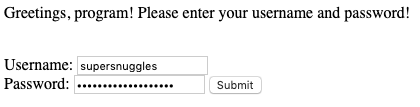
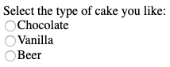
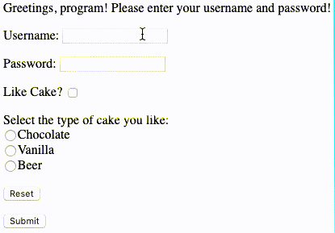

# PHP Basics:  Forms, GET, and POST

## Requirements

<!-- more -->

* Web Server with PHP enabled
* IDE like Visual Studio Code with PHP Tools

## Overview

Web pages, when they first appeared, were in a lovely, static state.  They displayed information to the reader, perhaps if you were lucky, there would be pictures (Woah!  Pictures!).  But sooner or later, someone had to mess it up and ask a simple question:


>Hey, how do we get information out of the reader so we can store it in these big fancy computers running the Internet?  
>If we did that, we could even customize the web pages based on what they entered!  We can do really important and useful things with that!  
>Like - allow people to edit cat videos to put in silly comments and share them with their friends?  
>I was thinking more like "cure cancer" or "create a time machine from a microwave that turns bananas into gelnanas", but we did invent the Internet just for cat videos, so let's go with that.  

So with that - retrieving information from web pages was born through the use of elements called "forms."  Today, we shall explore the wonderful world of forms - how to request information from users, and then how to retrieve what they have written to put it to some use.

No, not for editing cat videos.  We'll leave that to another day.

## Forms Basics

There are all sorts of forms, but let's cover the most simple ones.  Every form requires the same basic elements:

* Declaration:  This is where we specify "Hi - we're starting a form!"
* Action:  Where will this information be going (usually another web page)
* Method: How we're sending this information.  Usually there are two methods, or "verbs":
  * GET:  The information is part of the address field
  * POST:  The information is part of the body of the request
* Inputs:  What information are we trying to get the user to do?  Click a button, enter their name, select from a group of choices
* Submit:  Once we have the information, we need to do something with it.  Submitting it sends the data.

Here's a simple sample form showing each of these elements:

```html
<form action="getme.php" method="get">
    <br />First Name: <input type="text" name="firstName">
    <br />Last Name: <input type="text" name="lastName">
    <input type="submit" value="Submit">
</form>
```

### POST VS GET

Let's take a moment to talk about POST and GET some more.  There are other HTTP "verbs" out there, such as PUT, DELETE, etc, but the most commonly used are POST and GET.

GET puts the information into the address field.  Let's go back to our simple example:

```html
<form action="getme.php" method="get">
    <br />First Name: <input type="text" name="firstName">
    <br />Last Name: <input type="text" name="lastName">
    <input type="submit" value="Submit">
</form>
```

When the user types in "Carl" and "Weathers" selects the "Submit" button, this is the address they are taken to:

`http://localhost:8000/getme.php?firstName=Carl&lastName=Weathers`

With this, our clever web server script will easily be able to find the values for ```firstName``` and ```lastName```.  They're right there in the address bar.  Even better - now we can bookmark that page and be able to return to it whenever we want to.

Sounds great, right?  Well, like everything in the universe, including duct tape, there is a light and dark side binding it together.  GET has some issues.  Mainly: it isn't secure.  For example, suppose that we have this:

```html
<p>Greetings, program!  Please enter your username and password!</p>
<form action="getme.php" method="get">
    <br />Username: <input type="text" name="userName">
    <br />Password: <input type="password" name="password">
    <input type="submit" value="Submit">
</form>
```

What we'd see on the web page is this:



Look - the password is obscured, so it's totally secure!  And when we click "Submit", what appears in our URL?

`http://localhost:8000/getme.php?userName=supersnuggles&password=SuperSecurePassword`

Yikes.  That's not good.  The password is right there in the address bar.  I'm not a security expert, but that's probably "bad."

So - there's the POST method.  POST doesn't put the information into the URL so you can't bookmark it, but into the body of the submission itself.  This means if the connection is being sent over HTTPS, then all of that submitted information is encrypted.  Even if someone knows the address of where you're going - like "totallyloggingintomybank.php", they're not going to get your authentication credentials because the variables aren't in the URL itself.

So what does a POST form look like?  It's totally and completely different from GET requests.  In that - they're exactly the same, only with the word "post" as the method:

```html
<p>Greetings, program!  Please enter your username and password!</p>
<form action="getme.php" method="post">
    <br />Username: <input type="text" name="userName">
    <br />Password: <input type="password" name="password">
    <input type="submit" value="Submit">
</form>
```

And what does the address look like when the user selects "Submit"?

`http://localhost:8000/getme.php`

Do you see the password?  Me either.  This isn't to say this system is super secure yet, but it's a sight better than GET.

So know when to use GET and POST.  By default, HTML forms use GET.  So if you don't want to use GET, better type in POST as the method.

## Input Format

Inputs all have the same format:

* The type of input
* The name of the input
* The value of the input

The value of the input can be treated as a variable name.  It's no different than having:

```php
$firstName = "John";
```

So when we see:

```html
<input type="text" name="userName" value="John">
```

This just displays a text input, with the name `userName`, and the value is `John`.  If the value is declared, then it will show in the web page, but the user can overwrite that with whatever they want:

```html
<form action="getme.php" method="get">
    <br />First Name: <input type="text" name="firstName" value="John">
    <br />Last Name: <input type="text" name="lastName">
    <input type="submit" value="Submit">
</form>
```

Shows:


## Input Types

Now that you know how to create a basic form, what methods to use, let's talk about the different types of inputs.  As I mentioned earlier, there are tons of different inputs, but here's the most common ones:

| Input Type | Description | Example Text | Example Image |
|---|---|---|---|
|Text|Allows the user to input a simple set of strings without carriage return.|`<input type="text" name="firstName">`||
|Password|Accepts strings, but only displays asterisks on the web page.|`<input type="password" name="password">`||
|Checkbox|A box users can check or leave unchecked.  The value of this checked field will only be submitted if the box is checked.|`<input type="checkbox" name="cake" value="yes">`|
|Radio|Has the user select one option from a list of items.|```<br /><input type="radio" name="cakeflavor" value="chocolate">Chocolate <br /><input type="radio" name="cakeflavor" value="vanilla">Vanilla <br /><input type="radio" name="cakeflavor" value="beer">Beer```||
|Reset|Removes the inputted values and starts the process over again.|`<input type="reset">`||

## Processing Forms

After all of this work sending our forms - now we can get to receiving the data and doing something with it!  This is where we're going to use out PHP environment with PHP Tools.

PHP processes posted (say that three times fast) depending on the method used as an array of key pair values:

* $\_GET[valuename:value, valuename2:value2, ...]
* $\_POST[valuename:value, valuename2:value2, ...]

This makes it pretty simple to collect our values from our submitted forms.  If we want to handle the input firstName sent via POST, we just capture it like so:

```php
$firstName = $_POST["firstName"];
```

There are some gotchas.  For example, starting with sender.php, we have the input "firstName".  Suppose we're sitting in our PHP script, and we do something like this:

```php
$middleName = $_POST["middleName"];
```

We never defined `middleName` as an input - so what happens?  Well, PHP gets very mad, and will give you an "Undefined index" error:

>Notice: Undefined index: middleName in receiver.php on line 5

If you attempt to access a POST or GET value that does not exist, PHP tends to get angry.

This is why whenever I access one of these values, I always test for two things:

* isset - this is a PHP function (and with PHP Tools, you can see more details just by hovering over it in your PHP file in Visual Studio or Visual Studio Code) that simply returns true if a value "is set" - aka if it exists.
* isempty - Another built in PHP function that if a variable is either an empty string or null, it returns true.

It's a good idea to test for both of these conditions before messing around with your variables.  You can make a function for this, but here's the simple version:  

```php
if(!isset($_POST['VALUE']) || empty($_POST['VALUE']))
{
    //non-existent value
}
else
{
    //do something useful
}
```

If the POST (or GET value, whichever you are using) is not present, or if its value is empty - then this returns "true", which means that you can't use this value.

### An Important Note about Input Values and Security

There is a lot to go over about inputs, but something important to realize as a developer:  you need to handle bad values.  For example, suppose you ask for a first name, and the user enters "5."  Or they enter `delete table users;` as their first name - and you just take that and throw it at your SQL server, then get angry calls from your database administrator that the User table was just deleted.

Once you have your forms values, check it!  Is it the right type?  Does it have HTML code or other potentially dangerous values?  If you're expecting 10 characters and someone gives you 1024 - does your program freak out?

A good practice:  Always force your inputs to match what you expect.  If you only expect 10 characters in a string, then force it to delete all characters after the 10th one.  If you expect a number, force it to become a number and if an error is returned, then you can gracefully handle that.

Inputs can be dangerous.  Always, always, always check what you're getting is going to work with what you're doing.

### Handling Check Boxes

Check boxes are kind of an odd bird in HTML.  You'd expect the values to be either "true" or "false", but the HTML standards bodies decided that would be too simple.  So check boxes transmit whatever value submitted in the form - but *only if that checkbox is checked*.

For example, the form input:

```html
<input type="checkbox" name="cake" value="yes">
```

If the user checks it, then our code below will get the value `yes` for the input `cake`.  If they **don't** check it, then our initial test case returns true, so we know the user didn't check it:

```php
$cake = '';
if(!isset($_POST['cake']) || empty($_POST['cake']))
{
    //The user did not check this box.
    echo "Don't like cake?  Would you prefer pie?";
    $cake = false;
}
else
{
    //the user picked the box!
    $cake = true;
}
```

### Handling Radio Inputs

Most of your inputs are really simple to handle.  With text or password, you just grab it, like so:

```php
$firstName = '';
if(!isset($_POST['firstName']) || empty($_POST['firstName']))
{
    echo "<p>First name is empty, please try again.</p>";
}
else
{
    $firstName = $_POST['firstName'];
}
```

Now, look at our radio input:

```html
<input type="radio" name="cakeFlavor" value="chocolate">Chocolate
<br /><input type="radio" name="cakeFlavor" value="vanilla">Vanilla
<br /><input type="radio" name="cakeFlavor" value="beer">Beer
```

So - which value actually gets sent in the input?  The simple value is: Whichever is checked.  If no value is checked - then the radio value won't be transmitted.  So our little test routine for "isset" or "empty" will return "true" if nobody checks the radio button.  If they do, then the value will have whatever is checked.  Here's a sample routine:

```php
$cakeFlavor = '';
if(!isset($_POST['firstName']) || empty($_POST['firstName']))
{
    //it has no value.
    echo "I guess you don't like these flavors.  Fair enough.";
}
else
{
    $cakeFlavor = $_POST['cakeFlavor'];
}
```

## Conclusion

This is all just to whet your appetite into the world of forms and how to handle the inputs in PHP.  There's so much more to learn how to do - how to save the information in files or in a database, but once you understand how to gather information from a user and accept it into your PHP code, a whole new world of programming is open to you.

Just promise to use this new power only for good.  And not to create more cat videos.  Well - unless the kitties are *really*, *really* cute.

## Sample Code

### sender.php

We're not doing anything special here - just a rehash of the examples above:

```html
<html>
<body>
    <p>Please enter the following values:</p>
    <form action="receiver.php" method="post">
        <br />First Name: <input type="text" name="firstName" value="John">
        <p>Last Name: <input type="text" name="lastName"></p>
        <p>Like Cake? <input type="checkbox" name="cake" value="yes"></p>
        <p>Select the type of cake you like:
            <br /><input type="radio" name="cakeflavor" value="chocolate">Chocolate
            <br /><input type="radio" name="cakeflavor" value="vanilla">Vanilla
            <br /><input type="radio" name="cakeflavor" value="beer">Beer
        </p>
        <p><input type="reset"></p>
        <input type="submit" value="Submit">
    </form>
</body>
</html>
```


### receiver.php
```php
<?php

//This is the collection of variables we are catching from POST
$firstName = '';
$lastName = '';
$cake = false;
$cakeFlavor = false;
//Tracking if there are any errors that have arrived.
$errors = false;

//The user's entered first name
if(!isset($_POST['firstName']) || empty($_POST['firstName'])) 
{
    echo "<p>First name is missing.</p>";
    $errors = true;
}
else
{
    $firstName = $_POST['firstName'];
}

//The user's entered last name
if(!isset($_POST['lastName']) || empty($_POST['lastName'])) 
{
    echo "<p>Last name is missing.</p>";
    $errors = true;
}
else
{
    $lastName = $_POST['lastName'];
}

//Do they like cake is checked or not
if(!isset($_POST['cake']) || empty($_POST['cake'])) 
{
    $cake = false;
}
else
{
    $cake = true;
}

//What flavor cake did they pick?
if(!isset($_POST['cakeFlavor']) || empty($_POST['cakeFlavor'])) 
{
    $cakeFlavor = false;
}
else
{
    $cakeFlavor = $_POST['cakeFlavor'];
}

if(!$errors)
{
    echo "<p>First Name: $firstName</p>";
    echo "<p>Last Name: $lastName</p>";
    //if they checked cake, and selected a cake flavor:
    if($cake == true && $cakeFlavor != false)
    {
        echo "<p>I shall make you a $cakeFlavor cake!</p>";
    }
    else
    {
        echo "<p>Perhaps you would prefer pie?</p>";
    }

}

?>
```


-----


# Related Articles

[PHP for beginners - Part 1: variables, functions, classes](https://blog.devsense.com/php-for-beginners-part-1-variables-functions-classes)

[How to set up a PHP web server - Overview](https://blog.devsense.com/related-articles-how-to-install-xdebug-for-php-tools-for-v)

[How to set up a PHP web server - Step by step](https://blog.devsense.com/how-to-set-up-php-web-server)


