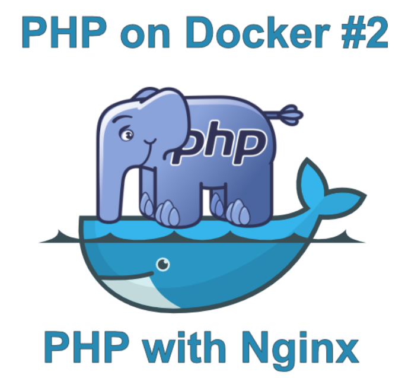
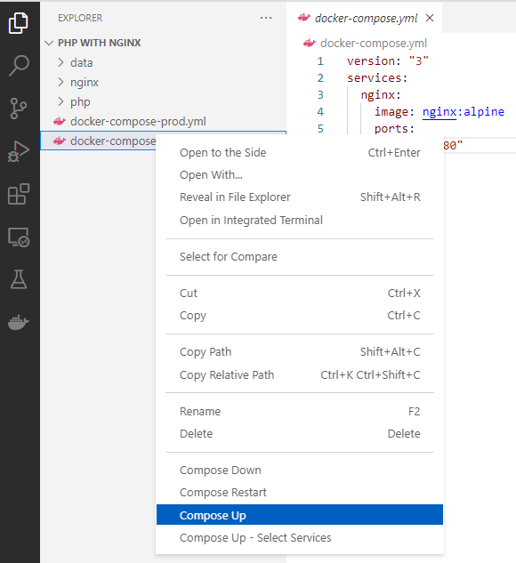

# PHP and Nginx on Docker



In the [previous article](https://blog.devsense.com/2019/introduction-to-php-on-docker-with-visual-studio-code), we talked about Docker and created a simple Docker Image with PHP inside Visual Studio Code. If you did not read it yet, I strongly recommend reading it before, since you'll have more context for this one. In this article, we will create a multi-container application using PHP and Nginx with the help of **Docker Compose**. You can see all the files we will be creating on [github](https://github.com/marosbeno/php-on-docker/tree/master/2%20-%20PHP%20with%20Nginx).

<!-- more -->

## Docker Compose
[Docker Compose](https://docs.docker.com/compose/) is a tool, that allows us to define and run multi-container Docker applications. In case of PHP, you can define your website as a collection of containers, each one serving a different purpose. In this article, we will be using Docker Compose to create 2 connected containers. It will be a container for **PHP-FPM** and **Nginx**.

### Container Orchestration

Docker Compose is example of a so called "*Container Orchestration*" technology. In these, you describe your application as a collection of docker containers in some *Declarative Configuration file*.  Docker Compose is using [YAML](https://en.wikipedia.org/wiki/YAML) files, which are usually named **docker-compose.yml**. We will see examples of them later in the article. The job of these orchestration technologies is to manage individual containers for you. They continuously watch the state of containers and adapt it, so it always matches the desired state described in Declarative Configuration. You can imagine this management as restart some faulty container, scale them based on cpu or other constraints and similar operations. These systems are quite complex and they are outside the scope of this article. Other examples of container orchestration tools are [Docker Swarm](https://docs.docker.com/engine/swarm/), [Service Fabric](https://azure.microsoft.com/en-us/services/service-fabric/) and [Kubernetes](https://kubernetes.io/).

## Nginx
Let's start with a web server. We will be using [Nginx](https://www.nginx.com/). Nginx has Docker images with [many different tags](https://hub.docker.com/_/nginx/?tab=tags), but we are only interested in two core ones.

* **nginx:*version***
This is a default image that is a safe bet, if you do not know which one to use. It's also a base for other images.

* **nginx:*version*-alpine**
Just like with PHP, Nginx has an Alpine variant. You can find more about Alpine in the [previous article](https://blog.devsense.com/2019/introduction-to-php-on-docker-with-visual-studio-code#heading-3). Let's go and use this one.

### Nginx Service
Create a folder named `PHP with Nginx` and open it in Visual Studio Code. Inside it, create a file named `docker-compose.yml` and write this inside it.

```yaml
version: "3"
services:
  nginx:
    image: nginx:alpine
    ports:
      - "8080:80"
```

In Docker Compose, you define the so-called "services", which will be represented by containers running on docker. We defined a service called `nginx`, which will be using the docker image `nginx:latest-alpine`. We also have to define port mapping, because we want this service to be available from outside Docker. In this case, we will map containers port `80` to the port `8080` on Docker host (the computer running the docker).

Right click on this file and select `compose up`.



After that, you can see in the terminal that docker compose was called and a new container was created.


You can now see in the browser, that we have nginx up and running on port `8080`.


### PHP FastCGI
The other container we will be using is **PHP-FPM**. It is a PHP container which is implementing [FastCGI protocol](https://cs.wikipedia.org/wiki/FastCGI). 

Edit `docker-compose.yml` and add another service, so it looks like this:

```yaml
version: "3"
services:
  nginx:
    image: nginx:alpine
    ports:
      - "8080:80"
  php:
    image: php:fpm-alpine
```

This new container is capable of processing PHP scripts, but it needs to be asked for it from a different container and is basically useless on it's own. We will connect it with Nginx container through a **Reverse Proxy**.

## Reverse Proxy
Because we will have two independent containers, each one serving a different purpose, we need to somehow connect them together.  **Nginx** container is a web server, specialized in serving of requests for documents and other files from the network (mostly the internet). **PHP-FPM** is a server for scripting language capable of processing PHP scripts. The way we will connect these two containers together is called a [reverse proxy](https://en.wikipedia.org/wiki/Reverse_proxy) as you can see on the diagram below. 


Because our **PHP-FPM** container is capable of processing any PHP scripts, we want it to be accessible only for Nginx in internal network, which is not visible from the outside. Docker is capable of creating virtual networks between containers -let's add it to our `docker-compose.yml` file.

```yaml
version: "3"
services:
  nginx:
    build:
      context: .
      dockerfile: nginx/Dockerfile
    ports: 
      - "8080:80"
    networks:
      - internal
  php:
    image: php:fpm-alpine
    networks:
      - internal
networks:
  internal:
    driver: bridge
```

We defined new private network, which is only visible for these two containers and is not accessible from the outside. You can see this network in networks section of Docker extension in Visual Studio Code.


Also notice that we have changed our web service. Instead of using a pre-baked image from Docker Hub, we will make our own with `Dockerfile` inside `nginx` folder, because we want to change Nginx settings. Create a folder `nginx` and add `Dockerfile` into it, which will look like this:

```dockerfile
FROM nginx:alpine
ADD nginx/default.conf /etc/nginx/conf.d
```

Then create `default.conf` inside the same directory:

```apache
server {
	listen 0.0.0.0:80;
	root /var/www/html;
	location / {
		index index.php index.html;
	}
	location ~ \.php$ {
		include fastcgi_params;
		fastcgi_pass php:9000;
		fastcgi_index index.php;
		fastcgi_param SCRIPT_FILENAME $document_root/$fastcgi_script_name;
	}
}
```

With this settings, every time nginx wants to process files ending with `.php`, it will send a request to **php-fpm** container with fast-cgi protocol on port `9000`, default port, on which this container should be listening.

Now, we need to provide our containers with some data to process. But before that, let's talk a little bit about deployment environments because it will affect the way we will provide this data to containers.

## Environments
A typical software application has multiple different environments, where it needs to work. These environments have different goals and needs. Traditionally, these are **Development**, **Testing**, **Staging** and **Production**. Each one having a different purpose and needs.

### Testing environment
In testing environment, you want to find the bugs in certain parts of your code and verify their function using automated unit tests (and possibly other types of tests). For this, you can use testing frameworks like **PHPUnit**.

### Staging/Production
In these environments, you don't want to be able to change source code and you don't longer need testing or debugging tools installed. PHP source files could be precompiled as well. All data in this environment should be copied to the containers.

### Development Environment
During development, you need to iterate quickly with code changes and see immediately their results. You might install additional dependencies, debug your code and don't necessarily want caching of data enabled. Tools like **Xdebug**, would usually be installed here. The best way to provide data to containers in this environment, is to somehow map data to containers directly from your computer. This way, you can change your code files in these directories during development and see them changed in containers right away, without the need to compile your containers every time you make a change. And as it turns out, Docker is capable of exactly this. It's called Volumes.

## Development Environment and Volumes
As we said in the previous section, [Volumes](https://docs.docker.com/storage/volumes/) are a way for you to map directory on your Docker host with directory in your containers. (It's actually capable of much more, but we will be using it for this here.) One of the main reasons volumes exist, is because Docker containers are read-only. You can write to files in the containers without them, but nothing you write will be saved once the container is destroyed. With **Volumes**, you can for example save log files from **PHP** or **Nginx** container straight to your Docker host (or some network drive or cloud storage) and read PHP source codes in your containers from the Docker host, as you can see in the picture below.


This setup will be ideal for Development environment, as discussed before, because we don't have to compile our PHP container every-time our code changes.

### Volumes for Development environment

As we discussed before, volumes are very useful for development environment and we will use them now. Edit `docker-compose.yml` again, by adding one global volume for source codes linked to both containers.

```yaml
version: "3"
services:
  nginx:
    build:
      context: .
      dockerfile: nginx/Dockerfile
    ports: 
      - "8080:80"
    networks:
      - internal
    volumes:
      - ./data/:/var/www/html/
      - ./logs/nginx:/var/log/nginx/
  php:
    image: php:fpm-alpine
    networks:
      - internal
    volumes:
      - ./data/:/var/www/html/
			- ./logs/php.log:/var/log/fpm-php.www.log
networks:
  internal:
    driver: bridge
```

Before you call `compose up`, create a folder named `data` and put this inside a file called `index.php`, so we know it's working.

```php
<?php
phpinfo();
```

Now, you should be able to call `compose up` on `docker-compose.yml` again and see standard `phpinfo()` output inside your browser. 


If you receive some errors, try to select `compose down`, before calling `compose up`.

## Production Environment

As we said in the section Different Environments, for production environment, we don't want to be able to change our source code. We also don't want any Volumes present in `docker-compose.yml`. At least the ones connected to our Docker host, you might actually use some cloud storage volumes in the production. For production environment, let's create another docker compose file called `docker-compose-prod.yml`. You can see it's whole content below:

```yaml
version: "3"
services:
  nginx:
    build:
      context: .
      dockerfile: nginx/production/Dockerfile
    ports: 
      - "8080:80"
    networks:
      - internal
  php:
    build:
      context: .
      dockerfile: php/Dockerfile
    networks:
      - internal
networks:
  internal:
    driver: bridge
```

We removed all volumes, changed `Dockerfile` for **nginx** and added `Dockerfile` for **PHP** container. Because we no longer use **Volumes**, we now need to copy source files straight to containers. 

Our production `Dockerfile` for **nginx**:

```dockerfile
FROM nginx:alpine
COPY nginx/default.conf /etc/nginx/conf.d
COPY ./data/ /var/www/html/
```

The only thing changed is copying of all the source files from `/data` to `/var/www/html` folder in the container. And finally newly created `Dockerfile` for php container looks like this:

```dockerfile
FROM php:fpm-alpine
RUN docker-php-ext-install opcache
COPY php/production/opcache.ini /usr/local/etc/php/conf.d/opcache.ini
COPY ./data/ /var/www/html/
```

You can see, that we have added OPCache module.

### OPCache
OPCache is a PHP module that improves performance by storing precompiled script bytecode in shared memory. If enabled, **PHP** does not have to load and parse scripts on each request. Create a file called `opcache.ini` inside `/php/production/` folder, looking like this:

```ini
[opcache]
opcache.enable=1
opcache.revalidate_freq=0
opcache.validate_timestamps=0
opcache.max_accelerated_files=10000
opcache.memory_consumption=192
opcache.max_wasted_percentage=10
opcache.interned_strings_buffer=16
opcache.fast_shutdown=1
```

This module is actually beneficial in all environments, not only in production. It can be setup to check if any of the scripts changed by enabling `validate_timestamps` settings, which we will not be doing here, because we don’t intend to change any scripts in production container. Describing all the settings is outside the scope of this article, you can do a homework of creating another `opcache.ini` file, this time for development production.

Finally you can check that** opcache** is enabled, in the browser after calling compose up on our new `docker-compose-prod.yml`.


# Summary
In this article we have created a demonstrational multi-container application with docker compose by connecting two docker containers, **PHP-FPM** and **Nginx** with the use of reverse proxy virtual network. In the next article we will be talking about debugging php containers on docker. If you have any problems or questions, please leave them in the comments below.
