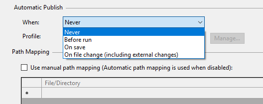
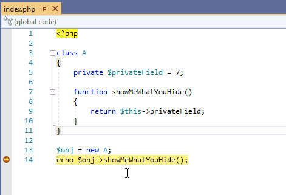
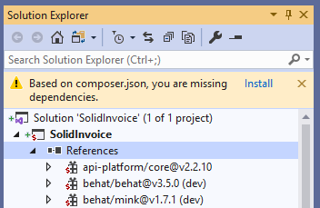
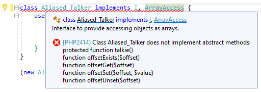
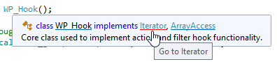

# PHP Tools Updates (October 2019)

We are happy to announce the public availability of our updated PHP Tools for Visual Studio and Visual Studio Code. This recent release brings new enhancements and features for developing in PHP using Microsoft Visual Studio.

<!-- more -->

## Publish files when changed
In some scenarios, it is useful to upload your local changes immediately to the cloud. Now it's possible to enable this behavior in your project properties. Create a publish profile and choose when your changes will be published. This feature is only available in Visual Studio, from 2010 up to 2019.

---
## The debugger allows you to edit private object properties
Due to the internals of the PHP debugger, it was not possible to change the private property value in Watch, Locals or Watch Tooltips. The recent update of PHP Tools works around this limitation so you can freely edit values as you expected to do. This is not yet enabled for Visual Studio Code - but stay tuned!

---
## New composer integration
Visual Studio 2019 got a new composer engine underneath. The tree with all the composer dependencies in your solution explorer has been highly optimized. Also, you'll be notified if any of the composer packages are missing. PHP Tools allows you to install them on the background with a single click, while you keep on working.

---

## Check for not implemented abstract functions
In addition to hundreds of various diagnostics, PHP Tools now checks that every non-abstract class implements all the abstract functions. The editor allows you to know all the details and warns you before having to debug. This feature is enabled in Visual Studio Code and also in Visual Studio 2019. Older editions will be supported in our next update.

---

## Rich tooltip experience

This one goes for all Visual Studio 2019 users - tooltips are now clickable allowing you to jump directly to classes, traits and interfaces. Also, now there are clickable @link annotations and links to the online documentation if available. This greatly enhances productivity letting you navigate through your code even more intuitively.

