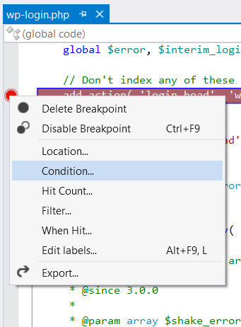

# Tracepoint, logpoint, what’s the point?

You are probably well acquainted with breakpoints. You place them in your IDE (<kbd>F9</kbd>) and whenever the program reaches this location in the source code during the execution, the program stops and you can explore the state of the application. Very useful, right?

<!-- more -->

What if you don’t want to stop the program from executing, and you’d just prefer to log the message with the values you are interested in each time the execution goes through the location you want?

Quite often you’d just write `echo $variable` (or some kind of expression) and be done with it. In general, I wouldn’t recommend it. Modifying the source code for the purpose of debugging -assuming you could even modify the code at all, e.g. you are on a production server- might actually alter the program behavior or you can forget to remove these log snippets when you are done debugging. Both scenarios are not desirable.

Instead you could place a tracepoint in VS, or a logpoint in VS Code. They are named differently, but they are actually the same thing. They behave like breakpoints, but instead of breaking the execution of the program, the debugger outputs the log message to **Output Pane** (VS) or to **Debug Console** (VS Code).

To place them you have to:

* **Tracepoint** 
	* in VS 2015 and up: place the breakpoint (<kbd>F9</kbd>), hover over the breakpoint sign and select the settings' symbol. Then fill the log message.
	* In VS 2013 an lower: place the breakpoint (<kbd>F9</kbd>), right click on the breakpoint (in the editor left margin), choose ‘When Hit…’ and fill the log message

 

* **Logpoint** in VS Code: press <kbd>F9</kbd>, right click on the breakpoint, choose `Edit Breakpoint`, click `Log Message` and fill the message.

The syntax of the log message is similar in both VS and VS Code. The message is in plain text, but you can include expressions which will be evaluated within curly braces (`{`).

In the image bellow I have placed a *logpoint* to a factorial function. When the code executes, you can see the output of each recursive call of the function in the Debug Console. I've used simple expressions as direct variable use, but feel free to use any complex expression as you'd like, e.g. `1+1`

So, next time you will be tempted to write `echo $variable` just to find out how the variable changes during the execution of the program, try placing a tracepoint or a *logpoint* instead! and let us know how it works!
