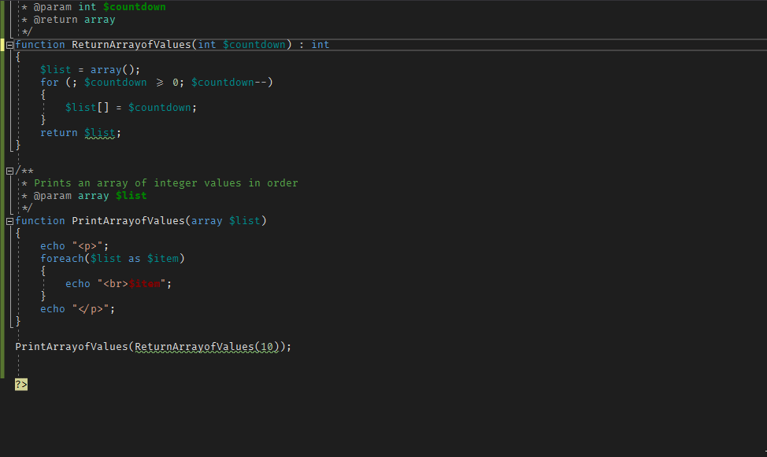
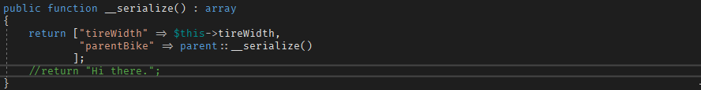
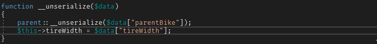
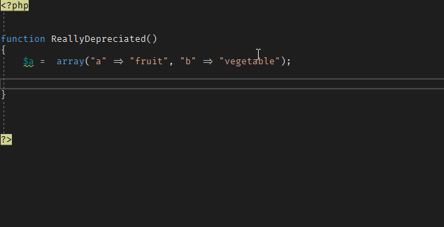

#  PHP 7.4 Support for Visual Studio


# PHP Tools for Visual Studio

<!-- more -->

PHP Tools includes support for the new PHP 7.4, including:

* Installation with Visual Studio
* Editor support for all PHP 7.4 syntax such as:
  * Arrow Functions
  * PHP 7.4 Array support updates:
			- Spread arrays
			- Array returns
			- PHPDoc updates including array commenting
* Intellisense updates that include Serialization support
* Notifying users on depreciated functions

## Install with Visual Studio

PHP Tools supports installing PHP 7.4 right from within Visual Studio.  From within a Visual Studio PHP project:

1. Select the project properties (Right click the project, select `Properties`).
2. Under Application, select "Language Level" and set it to 7.4.
3. Save the settings.
4. Select `Debug -> Run` or select `F5` and PHP Tools detects if PHP 7.4 and Xdebug for PHP 7.4 is installed.  If not, it prompts the user to install it.


<center><iframe width="640" height="360" src="https://www.youtube.com/embed/h9MXcHUjgPc?rel=0" frameborder="0" allow="accelerometer; autoplay; encrypted-media; gyroscope; picture-in-picture" allowfullscreen></iframe></center>


## Intellisense Updates

To keep up with the PHP 7.4 syntax, PHP Tools has been updated to handle all syntax updates.  Some of these updates:

* Arrow functions (using the `fn` command)
* Typed Properties
* Array references
* Serialized objects.

### Arrow Functions

Arrow functions, otherwise known as anonymous functions, allow developers to quickly define a function, the parameters, and the return value in one line.  For example:

```php
$squarethis = 9;

$squared = fn($square) => $square * $square;

echo "<p>Number to be squared: $squarethis.</p>";

echo "<p>Squared number: ." $squared($squarethis).".</p>";
```


<center><iframe width="640" height="360" src="https://www.youtube.com/embed/ng7yE0Zbpcw?rel=0" frameborder="0" allow="accelerometer; autoplay; encrypted-media; gyroscope; picture-in-picture" allowfullscreen></iframe></center>


### Typed Properties

PHP, like other scripted languages, has supported the ability to have variables which its data type (integer, string, etc) was derived based on the context.  So setting a variable from `$i = 5;` and then `$i = "5Bob";` are equally valid.

PHP 7.4 allows more control with scalar types and return values, allowing the user to specify exactly what kind of data they are receiving and sending back.  PHP Tools is able to parse this syntax, and even return errors when detected.  For example:

```php
$squarethis = 9;

$squarebad = "Test";

function SquareValue(int $newNumber) : int
{
    return $newNumber * $newNumber;    
}

echo "<p>Using SquareValue function: " . SquareValue($squarebad) . ".</p>";
```


<center><iframe width="640" height="360" src="https://www.youtube.com/embed/YNXvwecPN_U?rel=0" frameborder="0" allow="accelerometer; autoplay; encrypted-media; gyroscope; picture-in-picture" allowfullscreen></iframe></center>


### Arrays

#### Array Functions and Array Commenting

PHP Tools ability to resolve typed properties for variables and functions extends to arrays as well, and will issue warnings when arrays are expected and a different typed value is submitted:

```php
/**
 * Returns an array from $countdown down to 0.
 * @param int $countdown
 * @return array
 */
function ReturnArrayofValues(int $countdown) : array
{
    $list = array();
    for (; $countdown >= 0; $countdown--)
    {
        $list[] = $countdown;
    }
    return $list;
}

/**
 * Prints an array of integer values in order
 * @param array $list
 */
function PrintArrayofValues(array $list)
{
    echo "<p>";
    foreach($list as $item)
    {
        echo "<br>$item";
    }
    echo "</p>";
}

PrintArrayofValues(ReturnArrayofValues(10));
```



#### Spread Arrays

A new feature in PHP 7.4 is spread arrays, similar to how they work in JavaScript.  For example, previously arrays would have to be copied and expanded like so:

```php
    $a = array(1, 2, 3);
    $b = $a;
    $b[] = 4;
    $b[] = 5;
    $b[] = 6;
    print_r($b);
    //output:
    //Array ( [0] => 1 [1] => 2 [2] => 3 [3] => 4 [4] => 5 [5] => 6 )
```

The new spread method allows users to easily copy arrays into other arrays, or reference entire array elements at once:

```php
    $c = array(1, 2, 3);
    $d = [...$c, 4, 5, 6];
    print_r($d);
    //output:
    //Array ( [0] => 1 [1] => 2 [2] => 3 [3] => 4 [4] => 5 [5] => 6 )
```

### Serialize signatures

With PHP 7.4, the new standard for serialization is based on two new magic functions that developers can define within their class:

* `__serialize`:  Returns an array value that can then be parsed into a text string.
* `__unserialize`: Takes the serialized array object and assigns the class members value from that array.

With PHP Tools, developers are provided with helpful information processing these new magic functions.  For example:








### Depreciated Function Reporting

PHP 7.4 has [depreciated a number of functions](https://wiki.php.net/rfc/deprecations_php_7_4).  Rather than guess what functions have been depreciated, PHP Tools lets you know which are still valid, and which need to go from your code:.  Items that have been tagged with `@depreciated` will have an error display in the IDE, and will show that status on on a mouse-over:




# Related Articles

[PHP 7.4 support for VS Code](https://blog.devsense.com/php-7.4-support-for-vs-code)

[Debugging PHP in Visual Studio](https://blog.devsense.com/debugging-php-in-visual-studio)

[Phar archives in VS Code (and also in Visual Studio)](https://blog.devsense.com/phar-archives-in-visual-studio-code)