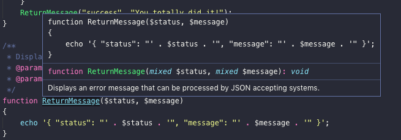
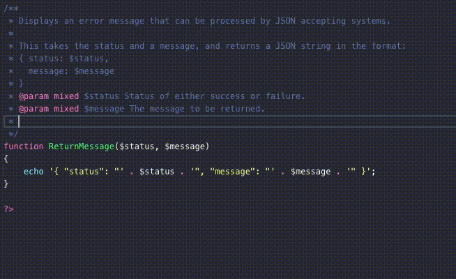
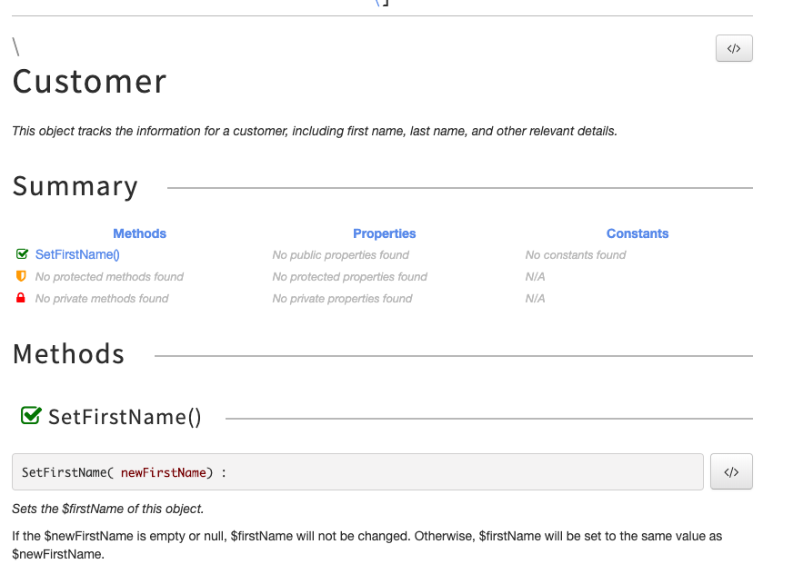

# Using PHPDoc With PHP 7 - And Actually Making it Work

## Requirements

<!-- more -->

* PHP7
* IDE such as Visual Studio/Visual Studio Code
* PHPTools
* PHPDocumentor2

## Overview

If you've been developing for any length longer than about 5 minutes, there's a good chance that someone has told you about [the importance of properly documenting your code](https://blog.devsense.com/commenting-your-php-code).  And like a good person who doesn't want to make babies cry, I know you want to make all of the comments in your code that it needs, so the world will understand your masterpiece.

||
|---|
|Seriously - why would you want to make this baby cry?  Document your code.  Please.|

But commenting code isn't enough.  With PHPTools they can hover over function calls and see a synopsis of the function call. Like so:




But - it's a little annoying making people crawl all over your code to find the functions being used, and then go back to coding.  What if there was a tool that could take all of the documented comments in the code, collect them into HTML pages with links between the methods and detailed explanations of what each class, method, and variable does?  Could such a tool exist?

Well.  Yes, it does.  It's called PHPDocumentor, or PHPDoc for short.

## PHPDocumentor - The Rundown

[PHPDocumentor](https://www.phpdoc.org/) - known as PHPDoc for short - has become the "de facto" documentation system for PHP.  It's really a PHP based program - using the concept of "eat your own dog food"<sup>*</sup> school of software development.

>\* "Eating your own dog food" does not mean a bad thing.  It means using your own software to achieve your goals.  Developers should eat their own dog food when possible, so they have the same experiences as their users.

What PHPDocumentor does is read through a directory of PHP code, looks for PHP files, and extracts comments with special formatting.  Here's a typical example:

```php
/**
 * Displays an error message that can be processed by JSON accepting systems.
 * @param mixed $status Status of either success or failure.
 * @param mixed $message The message to be returned.
 */
```

These PHPDoc formatted comments are translated into HTML, creating documentation that explains what each class, function, or variable does without people having to read through the entire code. They can use the PHPDoc HTML pages to quickly see how the software works, what the functions use for variables, what the function returns, or other useful bits of information that the developer decided was important.

PHPDoc does *not* generate comments and documentation for you -you still have to type in the details.  But it can collect those comments for you, and PHPTools makes it even easier.

## PHPDocumentor 2 - Installation

[PHPDocumentor](https://docs.phpdoc.org/getting-started/installing.html) can be installed either through PEAR, PHAR, or composer.  But - the default PHPDocumentor is geared for PHP5.  If you're running PHP7, you'll run into problems such as differences in how arrays work or other little issues if you use the standard PEAR method.  So, first rule - if you're going to use PHP7, *don't* install PHPDocumentor with PEAR.

Instead, check out PHPDocumentor2 available at [https://github.com/phpDocumentor/phpDocumentor2](https://github.com/phpDocumentor/phpDocumentor2/) - this is made to be PHP7 compliant.  There are some gotchas on how to set it up, so this is one that works well for UNIX and Mac based systems through this process:

1. Copy the most recent PHAR and the public key files at [https://github.com/phpDocumentor/phpDocumentor2/releases](https://github.com/phpDocumentor/phpDocumentor2/releases).
2. Copy these files to a directory that can be easily accessed from anywhere.  For Unix/Mac systems, that can be `/usr/local/bin/`.


Once it's installed, you run it through the command `php PATHTOFILE/phpDocumentor.phar`.  In the example above, that would be `php /usr/local/bin/phpDocumentor.phar`.

Don't go running it right now if you don't have PHP files to document - you'll have a disappointing experience because nothing will happen.  If you want to *use* PHPDoc, first you'll have to create some PHPDoc documentation in your PHP files.

### Optional Additions

PHPDoc can do most everything by itself, but if you want to have some pretty pictures to go with it, having [https://www.graphviz.org/](https://www.graphviz.org/) installed it a plus.  It's not *required*, but if PHPDoc can't find it, it'll give you a warning that it would be really, really helpful.  Notice that it has to be available to PHPDoc, so it should be in your path statement.  For those running Mac, it can be installed via [Homebrew](https://brew.sh/) with:

`brew install graphviz`

## PHPDoc Documentation Format

PHPDoc comments always proceed what they are describing.  This can be a function, a class, constant - the complete list is here:

- Function
- Constant
- Class
- Interface
- Trait
- Class constant
- Property
- Method

Take our previous example,  It comes right before a function, like so:

```
/**
 * Displays an error message that can be processed by JSON accepting systems.
 * @param mixed $status Status of either success or failure.
 * @param mixed $message The message to be returned.
 */
function ReturnMessage($status, $message) 
```

A PHPDoc formatted comment followed this pattern:

* Summary: What the comment is describing.  Should be very short, about one line.
* Description: The meat of the comment.  This is where you might describe how the following code works, why it's there, any "gotchas" that the user should know about.
* Tags: One or more PHPDoc formatted tags that defines the author, a function parameter or return, versions, and so on.  There's a complete list of tags [on the PHPDocumentor website](https://docs.phpdoc.org/guides/docblocks.html#list-of-tags).

Let's go back to our example, and elaborate on it a little.  It's describing a function called `ReturnMessage` that takes two parameters - `$status` and `$message`.  But we want the user to know some more, like what the function returns, who write it, and the version.  If you're using PHPTools, just typing the `@` symbol within a PHPDoc comment brings up a list of tags.  Like so:



One of the cool things is if you're using PHPTools and enter a tag, you can just press `Tab` to go through the various options.  Saves some time.

Here's an updated version:

```php
/**
 * Displays an error message that can be processed by JSON accepting systems.
 * 
 * This takes the status and a message, and returns a JSON string in the format: 
 * { status: $status,
 *   message: $message
 * }
 * @param mixed $status Status of either success or failure.
 * @param mixed $message The message to be returned.
 * @author John Hummel <jhummel@fedoraconsulting.net>
 * @version ${1:1.0.0
 * @return String
 */
```

Remember that the PHPDoc comments must be directly before the item they are describing.  For example, if we have a PHP Class `Bicycle`, we'd want the PHPDoc comments to be before the class, and each method within:

```php
/**
 * This object tracks the information for a customer, including first name, last name, and other relevant details.
 * 
 * @author John Hummel <jhummel@fedoraconsulting.net>
 * @version ${1:1.0.0
 */
class Customer
{
    private $firstName;
    private $firstName;

    /**
     * Sets the $firstName of this object.
     * 
     * If the $newFirstName is empty or null, $firstName will not be changed.  Otherwise, $firstName will be set to the same value as $newFirstName.
     * @param mixed $newFirstname The submitted first name to update this object to.
     * @return boolean true if the $newFirstName is accepted, otherwise false.
     */
    public function SetFirstName($newFirstName)
    {
        if(empty($newFirstName))
        {
            return false;
        }
        else
        {
            $firstName = $newFirstname;
            return true;
        }
        

    }
}
```

Now we have our PHPDoc comments, let's make our document.

## Generating PHPDoc Documents

Now that your developers have added in all of the PHPDoc based comments (perhaps assisted with a talented and may we even say - good looking technical writer to assist), let's actually generate our PHPDoc.

From the command line, we navigate to the directory with all of our PHP files and run:

`phpdoc`

Depending on what operating system you're running, this is usually enough.  I've found it's better to at least run:

`phpdoc -d .`

The `-d .` parameter means "use the current directory to scan for PHP files to create the documentation."  Here's some other useful options:

* `-t (target)` - specifies the output directory
* `-f (files)` - specifies what files to run PHPDoc on
* `--ignore (files or directories)` - Tells PHPDoc "Ignore these files or directories" - this is useful if you have a library or framework in that directory, and you want to document *your* files and not everything.

If we're running just the generic version, the PHPDoc files will be placed in the build directory.  Here's a breakdown of the files PHPDoc creates based on our example:

```zsh
└── build
    ├── api-cache
    │   ├── 0fea6a13c52b4d47
    │   │   └── 25368f24b045ca84
    │   │       └── 38a865804f8fdcb6
    │   │           └── 57cd99682e939275
    │   │               └── ed16c38ee25ae267
    │   │                   └── e4a7fb4bf8c9c269.php
    │   └── 1952a01898073d1e
    │       └── 561b9b4f2e42cbd7
    │           └── 38a865804f8fdcb6
    │               └── 57cd99682e939275
    │                   └── ed16c38ee25ae267
    └── docs
        ├── classes
        │   └── Customer.html
        ├── css
        │   ├── bootstrap-combined.no-icons.min.css
        │   ├── font-awesome.min.css
        │   ├── jquery.iviewer.css
        │   ├── phpdocumentor-clean-icons
        │   │   ├── Read\ Me.txt
        │   │   ├── fonts
        │   │   │   ├── phpdocumentor-clean-icons.dev.svg
        │   │   │   ├── phpdocumentor-clean-icons.eot
        │   │   │   ├── phpdocumentor-clean-icons.svg
        │   │   │   ├── phpdocumentor-clean-icons.ttf
        │   │   │   └── phpdocumentor-clean-icons.woff
        │   │   ├── lte-ie7.js
        │   │   └── style.css
        │   ├── prism.css
        │   └── template.css
        ├── files
        │   ├── PHPDocSample.html
        │   └── PHPDocSample.php.txt
        ├── font
        │   ├── FontAwesome.otf
        │   ├── fontawesome-webfont.eot
        │   ├── fontawesome-webfont.svg
        │   ├── fontawesome-webfont.ttf
        │   └── fontawesome-webfont.woff
        ├── graphs
        │   ├── class.html
        │   └── classes.svg
        ├── images
        │   ├── apple-touch-icon-114x114.png
        │   ├── apple-touch-icon-72x72.png
        │   ├── apple-touch-icon.png
        │   ├── custom-icons.svg
        │   ├── favicon.ico
        │   ├── hierarchy-item.png
        │   ├── icon-class-13x13.png
        │   ├── icon-class.svg
        │   ├── icon-interface-13x13.png
        │   ├── icon-interface.svg
        │   ├── icon-trait-13x13.png
        │   ├── icon-trait.svg
        │   └── iviewer
        │       ├── grab.cur
        │       ├── hand.cur
        │       ├── iviewer.rotate_left.png
        │       ├── iviewer.rotate_right.png
        │       ├── iviewer.zoom_fit.png
        │       ├── iviewer.zoom_in.png
        │       ├── iviewer.zoom_out.png
        │       └── iviewer.zoom_zero.png
        ├── index.html
        ├── js
        │   ├── bootstrap.min.js
        │   ├── html5.js
        │   ├── jquery-1.11.0.min.js
        │   ├── jquery.dotdotdot-1.5.9.js
        │   ├── jquery.dotdotdot-1.5.9.min.js
        │   ├── jquery.iviewer.js
        │   ├── jquery.iviewer.min.js
        │   ├── jquery.mousewheel.js
        │   ├── jquery.smooth-scroll.js
        │   ├── prism.min.js
        │   └── ui
        │       └── 1.10.4
        │           └── jquery-ui.min.js
        ├── namespaces
        │   └── default.html
        └── reports
            ├── deprecated.html
            ├── errors.html
            └── markers.html
```

Phew - that's a lot of stuff, and most of it is default.  The most important thing to note would be the file `docs/index.html`.  Open that up with any standard browser and you'll see all of that lovely documentation.  Here's what we see if we go into our class `Customer`:



## Conclusion

I cannot stress how important good documentation is for your projects.  It helps not only other people, but yourself so when you start pouring through your code to find errors, you can find the path of your logic.  PHPDoc can help you, your clients, or your fellow developers quickly see how the code works so they can get *back* to work.  


# Related articles
[PHPDoc Completion](https://docs.devsense.com/en/vscode/editor/phpdoc)

[PHP with Nginx on Docker](https://blog.devsense.com/php-and-nginx-on-docker)

[How to setup Windows Subsystem for Linux for a PHP Development on Visual Studio](https://blog.devsense.com/2018/04/wsl)


