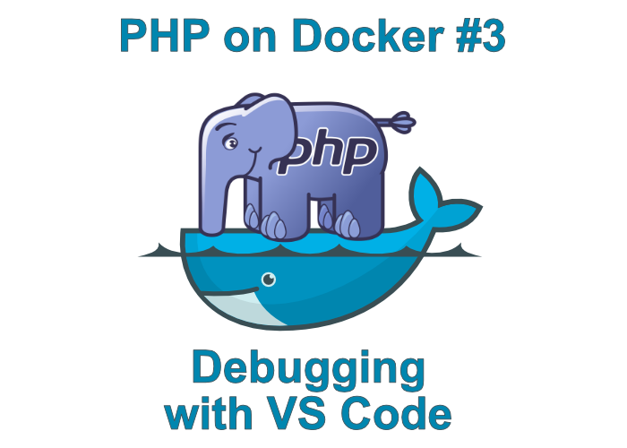

# July Summary

Here is what you missed out on our blog this month:

<!-- more -->

Create a multi-container application using PHP and Nging with the help of Docker Compose. 

### [PHP on Docker #2](https://blog.devsense.com/php-and-nginx-on-docker)

----

And also debug with Docker inside Visual Studio Code

### [PHP on Docker #3](https://blog.devsense.com/debugging-php-on-docker-with-visual-studio-code)

-----

Following our series of PHP for beginners, here's part II: Forms, GET and POST - how to request information from users, and then how to retrieve what they have written.

### [PHP Basics: forms, GET and POST](https://blog.devsense.com/php-basics-forms-get-and-post)

-----

Learn to create a simple response system in PHP that accepts an error message from JavaScript (or any other language) with the error code and its description and also store it into a database.

### [Creating a PHP API for logging messages calls](https://blog.devsense.com/creating-a-php-api-for-logging-messages-calls)

-----

It's shocking that PHPDocumentor is the default standard for documentation in PHP. How difficult is it to actually get it running properly in a modern PHP 7 environment? Well, you can finally make it work by following this tutorial.

### [Using PHPDoc with PHP 7](https://blog.devsense.com/using-phpdoc-with-php7-and-make-it-work)

