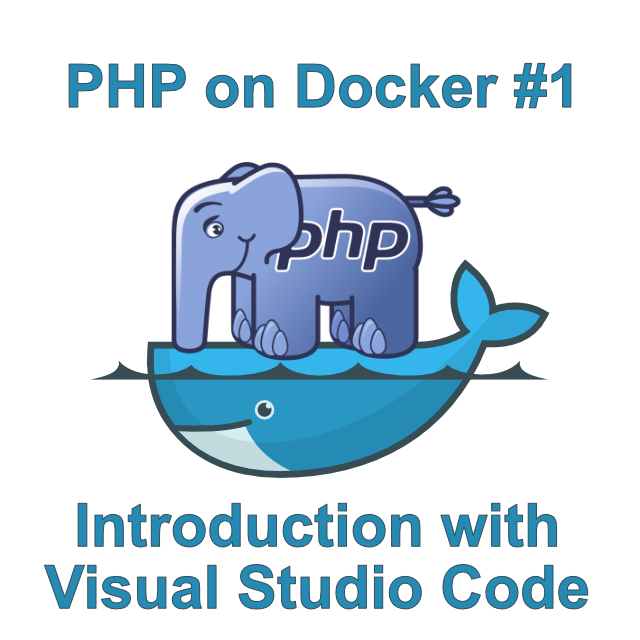
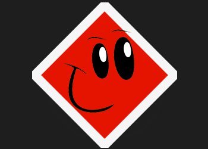
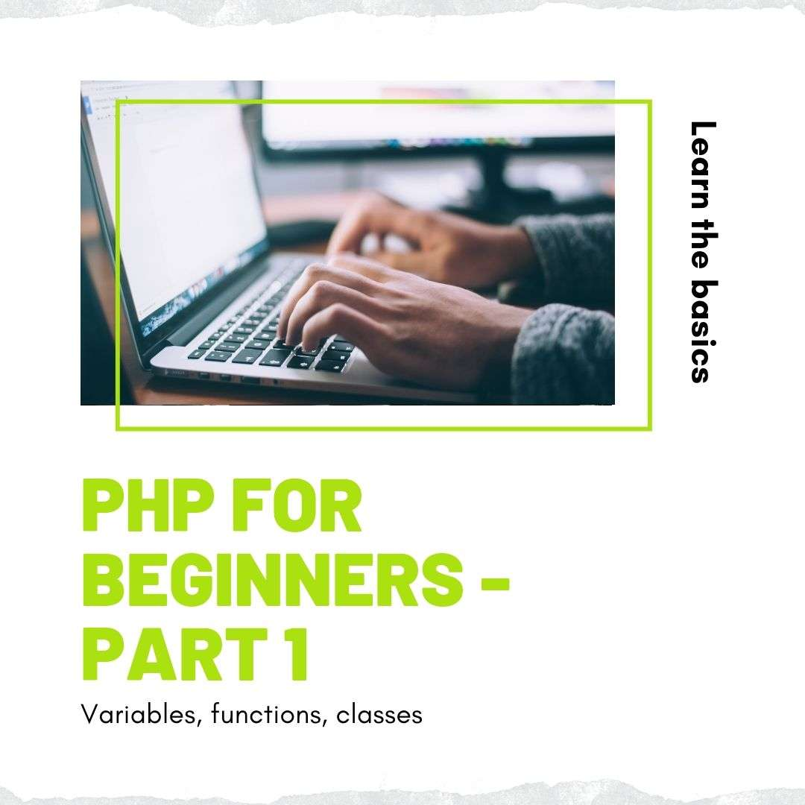

# June Summary

Here is what you missed out on our blog this month:

<!-- more -->

What is Docker? Why should you use it? 
If you are interested in containerization technologies, don’t miss this quick tutorial about Docker in VS Code explained step-by-step. 

### [Introduction to PHP on Docker in VS Code](https://blog.devsense.com/introduction-to-php-on-docker-with-visual-studio-code)

-----

Breakpoints -place them in your IDE and whenever the program reaches them during execution, it will stop to let you explore the state of the application. 
But what if you don’t want to stop the program from executing? 

### [Tracepoint, logpoint, what’s the point?](https://blog.devsense.com/tracepoint-logpoint)

-----

.jpg)

For developers working in the Microsoft world and want to use PHP, setting up a development environment can actually be a more difficult task than setting up a WAMP through tools like Bitnami or Apache XAMPP. 
We'll run the steps for getting a development web server environment set up and running that can fit right into a Microsoft based shop, using PHP as the primary scripting language.

### [How to sep up a PHP Web server environment – Step by step](https://blog.devsense.com/how-to-set-up-php-web-server)

-----

Tell your little brother, your cousin, your mom or anybody discovering the PHP world, that we're going back to basics with this series, building up the most simple programs in PHP.

### [PHP For beginners -Part 1: Variables, Functions, Classes](https://blog.devsense.com/php-for-beginners-part-1-variables-functions-classes)

