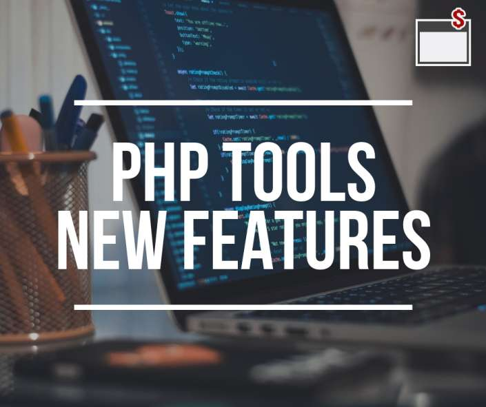
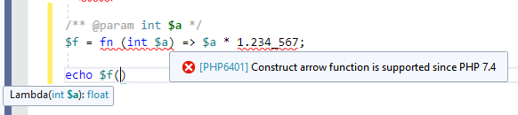
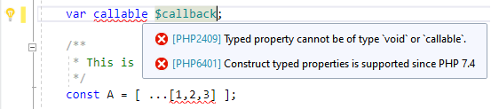
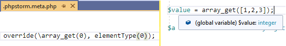
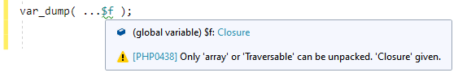

# PHP Tools Updates (July 2019)

New features are available to PHP Tools - for both Visual Studio and Visual Studio Code!

<!-- more -->

Improved code analysis and code completion, advanced metadata, and if you like to use frameworks, or eager to try the new PHP 7.4, keep reading because we have great news for you!

[Download PHP Tools for Visual Studio](https://www.devsense.com/en/download)

[Download PHP Tools for VS Code](https://www.devsense.com/en/download#vscode)

# What's new from PHP 7.4?

PHP Tools has full support for PHP 7.4 now. Even though PHP 7.4 was released just like as an alpha version, the PHP Tools' editor supports the full range of the new PHP's flagship syntax, features, and deprecations.
Even if you don't have the newest version of PHP yet, all the new constructs will be handled and reported and you'll still get full type analysis and help from the editor.

A new feature of PHP 7.4 is the **arrow function** declaration - the simplified anonymous function declaration. You'll find that the PHP Tools' editor supports PHPDoc above the arrow function, analyses types and warns you about the available features if you're still using PHP 7.3 or older.

Additionally, there are **underscore separators** in numbers,** typed properties**, **array spreading** operator, `??=` operator and **new magic methods** - \_\_serialize() and \_\_unserialize(). Try the new features and get warned when you misuse them - for example, did you know that you cannot use `callable` as a property type?

 

If you don't have PHP 7.4 yet, with PHP Tools you can choose to comfortably install it right from Visual Studio with a single click. Go to your project properties and click the version you want to use.

 
# PhpStorm Advanced Metadata

Many projects deal with dependency injection, containers, and factory methods. It's a common approach in PHP but very unfriendly to PHP editors. For that reason, projects usually have a "special" file or a set of files - `.phpstorm.meta.php` - which contain additional metadata that helps the editor with type analysis and code validation.

Starting with this update, PHP Tools supports the advanced metadata feature, as well as improving the overall experience, allowing future enhancements, and many other interesting features.

# More Code Analysis

The code analysis has new features as well. The analysis of numbers and conditions and certain built-in PHP functions have been improved. Newly magic methods are checked for their correct signature and you won't have to deal with unexpected runtime errors. Analysis of lambda functions has also been improved - it now supports PHPDoc anywhere above the function and its return type is resolved properly and as precisely as possible.

There are new diagnostics - unpack operator and its operand, and checking for parameters duplicity. Also, the inspection of unused variables has been improved and now PHP Tools reports a few more deprecations that you shouldn't use in PHP 7.1, 7.2, 7.3 and 7.4 (specifically) anymore.

# Improved Code Completion

Since the type analysis has been improved, the code completion gets better as well. You'll get better handling of PHPDoc above lambda functions and more. Also, a small improvement has been made to the completion after the use keyword, so you can list the fully qualified names, including namespaces.

Overall improvements have been made to support the Laravel and Oxid frameworks, primarily when using the advanced metadata file as described in the section above.

# Click to go to the definition

Last, but not least, a neat feature - mouse click to go to the definition. This is getting popular in Visual Studio 2019 and Visual Studio Code, and now you can use it when working with your PHP code (older editions of Visual Studio do not support it).

Happy coding!

[Download PHP Tools for Visual Studio](https://www.devsense.com/en/download)

[Download PHP Tools for VS Code](https://www.devsense.com/en/download#vscode)

