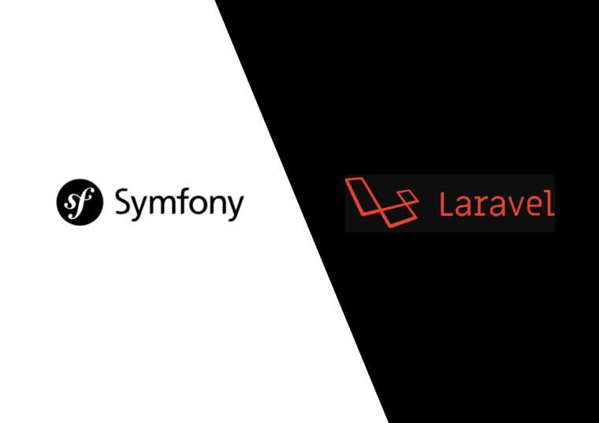

# Symfony vs. Laravel

One of the challenges when you're starting to learn PHP- or you're deciding about the technology stacks for a new project- is choosing the right PHP framework. A framework is simply a skeleton that will help you build your application without having to do everything from scratch. It will provide standard functionality that can be changed and adapted to a specific project. 

<!-- more -->

There are many PHP frameworks- Laravel, Symfony, CodeIgniter, Zend, CakePHP, Yii, etc.- and some developers believe that choosing the right one could be critical for your project success or for your PHP learning journey.

Two of the most popular nowadays seem to be Symfony and Laravel. Apparently, in the past years, Symfony was the most used one; however, since 2015, Laravel has been gaining a lot of popularity, probably because its tutorials are widely available. 

Both frameworks have important features in common, but they also have their key advantages. Thus, before arguing which framework is the best, let's get to know them better. 

## What is Symfony?

[Symfony](https://symfony.com/what-is-symfony) is a free framework for web applications and websites. It has been developed to build any type of a web application, from blogs to high traffic sites, or large-scale projects. It allows developers to build an upgradable, well-maintained and high-standard application with PHP. Here are some of its pros and cons: 

### Pros:
 
 - Easy to debug with their built-in tool 

 - It has an active community, and it's well [documented](https://symfony.com/doc/current/index.html). 

 - You can learn the best practices of coding 

 - Powerful and flexible 

 - Great plugin ecosystem 

### Cons:

 - Too many configurations 

 - The security mechanism can be hard 

 - Mainly used for large-scale applications. 

Here's a list of more [good reasons](https://symfony.com/six-good-reasons) for using Symfony framework.

## What is Laravel?

[Laravel](https://laravel.com/) is a free PHP framework based on Symfony. Its philosophy is to make development easier without sacrificing functionality by facilitating tasks that are commonly used in web applications. It's intended for building applications that follow the [MVC pattern](https://whatis.techtarget.com/definition/model-view-controller-MVC).  

Let's take a look at its pros and cons: 

### Pros:  

 - Easy to learn and easy to use

 - [Documentation](https://laravel.com/docs/5.7/installation) and many tutorials available

 - High security 

 - Easy to build REST API 

 - You can use components of Symfony 

 - Easy to handle event queuing 

### Cons:

 - It's still under development, so it can still have some bugs 

 - Uses too many magic methods 

 - Difficult to use model properties 

Here's a detailed [list of advantages](https://belitsoft.com/laravel-development-services/10-benefits-using-laravel-php-framework) of using Laravel. 

## A fair comparison between both frameworks 

<table class="table table-bordered table-striped table-hover">
	<thead>
		<th>Symfony</th>
		<th>Laravel</th>
	</thead>
	<tbody>
		<tr>
			<td>Free to use</td>
			<td>Free to use</td>
		</tr>
		<tr>
			<td>Doesn't follow MVC pattern strictly</td>
			<td>Follows MVC pattern strictly</td>
		</tr>
		<tr>
			<td>Reusable components, libraries and packages are available</td>
			<td>Reusable components, libraries and packages are available</td>
		</tr>
		<tr>
			<td>For templating, the twig is used</td>
			<td>For the templating, the blade is used</td>
		</tr>
		<tr>
			<td>Default ORM Doctrine is used</td>
			<td>Default ORM Eloquent is used</td>
		</tr>
		<tr>
			<td>Has no micro-frameworks</td>
			<td>Has many micro-frameworks</td>
		</tr>
	</tbody>
</table>

## It might depend on the type of project, it might depend on the developer 

In my opinion, Symfony is a better framework to work with enterprise applications, thanks to its debugger and libraries that make it easier to build large-scale applications. Laravel might be perfect to work with any small project with less complexity. 

Nevertheless, there are developers who just use one framework for everything. They are used to building any kind of application with the same framework. This doesn’t stop them from being productive; they configure everything to adapt their needs and end up executing any small, medium or large-scale application the way they intended. 

## So, which framework should I go for? 

After reading a couple of reviews and a lot of Internet comments about both frameworks, you might realize that at the end of the day, it’s better to try each framework by yourself and see which one suits you better. What matters is not the framework, but what you do with it, what works for you, what doesn’t work, and which one feels more comfortable for you. So, why not spend a little time evaluating them, and then choosing the one that you like the most? 

You might also want to read: 

[How to install Laravel for Visual Studio Code](https://blog.devsense.com/2019/03/how-to-install-laravel-for-visual-studio-code)

 [12 reasons you should learn PHP in 2019](https://blog.devsense.com/en/2019/01/why-php)

 [Top PHP Interview Questions in 2019](https://blog.devsense.com/en/2019/02/php-interview-questions-2019)
