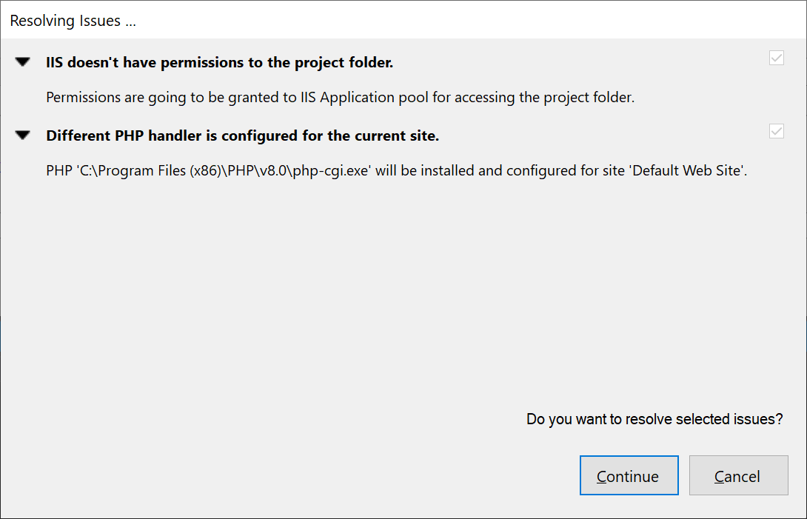

# How to setup IIS for PHP Development with PHP Tools for Visual Studio

When **IIS Express** isn’t sufficient for your development needs and you need to get an full-fledged **IIS** web server for your **PHP** project, you can now configure it in matter of few clicks.

<!-- more -->

## Introduction

If you’ve ever wanted to set **IIS** up for **PHP** project, you will know that it’s not exactly piece a cake.  **PHP Tools for Visual Studio** will do all of this for you, so feel free to skip to the next paragraph.

There is a bunch of resources out there on how to get this going manually ( e.g. https://docs.microsoft.com/en-us/iis/application-frameworks/scenario-build-a-php-website-on-iis/overview-build-a-php-website-on-iis ), but here is the list of actions in short:

-	Install **IIS**
-	Install **CGI** module
-	Install **PHP**
-	Install **Xdebug** (optional if you want to debug)
-	Setup handler for `*.php`
-	Set default document to `index.php`
-	Create application, site and virtual directory
-	Make sure **IIS** (or Application Pool Identity account) has permissions to access the project folder
-	If you have anonymous authentication allowed, make sure that NT user representing the anonymous user has also access to the project folder

Each of those can be broken down into more detailed paragraphs, but I would rather watch funny cats videos on youtube.

## Setting it up

When you have **PHP** project in **Visual Studio**. Go to project properties (right click on project node in **Solution Explorer**, choose **Properties**). Select **Server** tab, choose **IIS** decide what **PHP** runtime you want to run.
 

Then click on the **Issues found...** link (or press <kbd>F5</kbd> to run the project). The dialog will show issues that need to be solved in order for the project with given settings to run.  You can see that in my case it basically outlines first few points from the previous paragraph.

 
Click **Continue** and give **UAC** blessing to each of those. After that there will be probably more stuff to configure, since your environment has changed now.  Pressing <kbd>F5</kbd> again gave me the following set of issues:

I'm missing permissions on the project folder and I have a different **PHP** handler set up (I've selected I want **PHP 8.0**). Clicking **Continue** again seemed to resolved everything and I can debug the project on **IIS**.

## Summary

We’ve tried to simplify necessary steps that are required to configure your project to run on **IIS** server (**IIS Express** has been supported for a long time already). You should just setup the requirements you want and **PHP Tools** will configure your environment automatically in a way that will fulfill those.