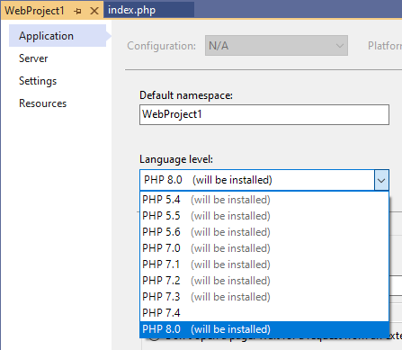
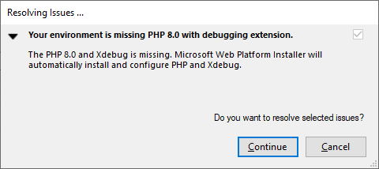
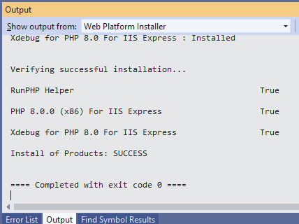
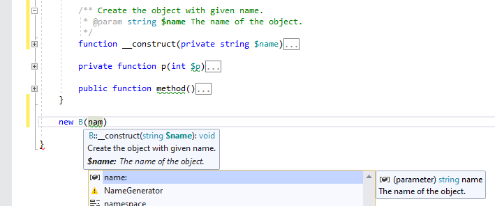
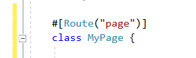
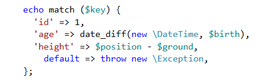

# Installing PHP 8, One Click

Even tho **PHP 8** was officially released on November 26, 2020, you could already use its new syntax with *PHP Tools* before that date, and install PHP from sources. Now the release is available for the **Windows platform** and it can be installed on your development machine in an easy way.

<!-- more -->

## Installing PHP 8 from Visual Studio

PHP project in Visual Studio gets configured on the project properties page where you select the project server and the project language version.



After selecting PHP 8, the code editor, code validation, and the entire IntelliSense will treat your code as PHP 8 compatible. Moreover, upon running the project (press `F5` to run and debug), PHP Tools will ask you if you'd like to install the new PHP 8 including the corresponding debugging support (Xdebug 3).



Click **Continue** and let the automatic installation to download and configure the necessary software for you.



**That's it.** The application is now running on PHP 8, you can put breakpoints, inspect variables, step through the code, and get full PHP 8 experience inside Visual Studio.

## What's new in PHP 8?



The new major version of PHP introduces performance improvements, consolidated error handling, new language features, and functions. Maybe most importantly, well known frameworks such as Laravel are upgrading and taking advantage of it. Let's list the most significant new features:

- **Attributes**: this new features allows developers to annotate their classes, functions, properties, and parameters in a declarative way. No more parsing PHPDoc comments. In the result, the code will get cleaner, avoiding errors in the annotation syntax, and also faster.



- **Union types**: it is a common practice to allow more than one type of a parameter in PHP, to return several possible types, or to keep so called type-juggling in mind. Now it is possible to hint the value type with union of more types.

```php
  function juggle(int|float $number)
```

- **Other syntactic enhancements**: then you may appreciate the new `match` expression which is a `switch` but as an expression. Or `throw` as an expression, so you can write it as a part of conditional expressions. And more.



There is many more changes, see the official changelog for the complete information including the corresponding RFCs: https://www.php.net/releases/8.0/en.php

---

The installation, debugging, and editor features are available to all Microsoft Visual Studio versions since 2010 up to the newest 2019.