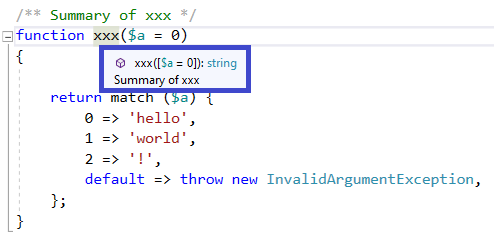

# PHP 8 Editor in Visual Studio

PHP 8 introduces a new syntax, more functions, and new standards. Let's have a look at how the editor in Visual Studio helps with those features. It will provide a detailed completion for named arguments, validates their use, checks the new syntax, warns about deprecations, and more.

<!-- more -->

---

## Syntax Checking

With PHP 8, developers will start using the new syntax options. It might be the trailing comma in function parameter list, attributes, match expression, throw expression, or catch without the variable. The editor reports all those usage in case the project is set for PHP version <= 7.4.


Upon switching the project to PHP 8.0, the warnings will be gone. 

## Named Arguments IntelliSense

The ability to specify the arguments by their name is a great feature that makes the code more readable, allows to skip parameters with default values, and may avoid some errors when there are too many arguments in a single function call. The editor however has a lot to do - there is code completion, that should provide list of available parameters, auto-complete the colon character if necessary, provide related parameter information, adjust the highlighted section of the signature helper, provide tool tips for named arguments, and more. Also it should report any unknown argument names.


The IntelliSense for named arguments features the following:

- recognizes the function being called, and lists relevant parameters
- for each parameter shows type information, documentation, and default value
- completes colon character if necessary
- highlights the parameter in signature helper
- shows tool tip information for named arguments
- checks the parameter exists
- checks the provided value type matches

## `#[Deprecated]` Attribute

Functions used to be annotated with `@deprecated` PHPDoc tag. The code analysis across the project then reported all the usages of deprecated functions. Now with PHP 8 attributes, it is possible to annotate functions with `#[Deprecated]` attribute as well.

Since attributes in PHP do not have to correspond to an existing class, and each code analyzer and code editor implements their own set of attributes, PHP Tools ignore the namespace of the `#[Deprecated]` attribute. It can be used in any of following forms:

```php
<?php

#[Deprecated]
#[\Deprecated]
#[Deprecated("This will be removed, use new_function() instead.")]
#[Deprecated(reason: "This will be removed, use new_function() instead.")]
function old_function()

```


## New Diagnostics

With the new features there are new code validations. This might help developers to get into PHP 8 easier, and avoid unnecessary issues.


Unknown named arguments would cause a fatal error. Also specifying a default value other than `NULL` or empty array to `iterable` parameters. 


It is also important to remember, that `mixed` or `void` type hints cannot be used in combination with nullables - i.e. following is error: `?mixed`, `mixed|null`, `?void`, `void|null`.

## Match Expression

The new match expression is well understood by the editor, and its type inference analysis.



Functions return value and variables get properly analyzed, so your code will get checked for eventual type mismatches.

---

The editor keeps in mind **attributes**, and **constructor properties** as well. IntelliSense fully support the new features since PHP Tools `1.40.12409` for all the major versions of Microsoft Visual Studio. Features are also supported for Visual Studio Code, although it looks differently and will be depicted in another blog post.