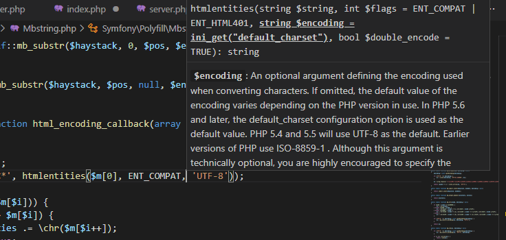
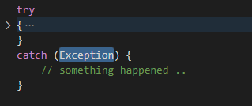
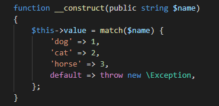

# PHP 8 in Visual Studio Code

PHP 8 represents a big milestone for developers, frameworks, and content management systems like WordPress. It introduces several new language constructs, that are not backward compatible with previous versions of PHP, it deprecates some functions, and there are some new eventual issues you should be aware of.

<!-- more -->

---

### The Environment

When developing with VS Code, you have to install **PHP** and **Xdebug** by yourself. In case you are running *Windows* and *Microsoft Visual Studio*, there is [our One-Click installer for PHP](https://blog.devsense.com/2020/installing-php-8-one-click).

To specify which PHP version should be used by the Visual Studio Code editor, change the VS Code's setting `"php.executablePath"` to point to the binaries. On Windows, it might be something like:

```json
{
  "php.executablePath": "C:/Program Files (x86)/IIS Express/PHP/v8.0/php.exe",
}
```

When opening a .php file, you will see several notifications about your PHP version. In the output window and the status bar.


### Named Arguments

*Named arguments* is a new PHP 8 feature allowing to specify the name of parameter before provided the value. It allows to skip optional parameters, makes the code more readable, and also it works great with argument unpacking and `call_user_func_array()` function.



In Visual Studio Code, it is well understood by code completion, tool-tips, and code analysis as well. Misspelled arguments are underlined, since it would cause a fatal error in run time, type mismatches are checked as well. In case, user doesn't have PHP 8, any use of named arguments is underlined as well, since it is considered a syntax error on PHP 7.4 or older.


Code completion provides available arguments including the detailed tool-tip information with type, default value, and description.


### Attributes

Since PHP 8, instead of using PHP documentary comments (PHPDoc) developers can annotate functions, classes, interfaces, traits, properties, constants, and parameters with attributes. The advantage is a cleaner way of annotating things and the direct support in PHP reflection. All the reflection class get `->getAttributes()` method which returns an array of `ReflectionAttribute` instances. 

Following depicts the code completion of the attribute `"MyAttribute"` and then it's arguments `$name` and `$value`.


```php
<?php

$attributes = (new ReflectionClass(Grapes::class))->getAttributes();

// or only get attributes with given name
$attributes = (new ReflectionClass(Grapes::class))->getAttributes("MyAttribute");

foreach ($attributes as $myattr) {
    print_r( $myattr->getArguments() ); // get original arguments
    print_r( $myattr->newInstance() ); // instantiate \MyAttribute class
}

```

### Catch, Throw, Null-Safe operator, Match, ..

There are a few nice syntactic sugar enhancements, that might make your code smaller and more readable.

- **catch** can be written without the catch variable



- **throw** is an expression. Usually you can make use of it as a part of conditions.
- **match** construct is like `switch` but as an expression.
- **constructor properties** allows to define a constructor parameter that at the same time defines a class property with the same name initialized implicitly with given value.



- **null-safe** operator **`?->`** allows to avoid null checking in expression chains. The operator respects short circuit evaluation rules, and it's especially useful for longer expression chains.


### The Editor

The Visual Studio Code editor with PHP Tools respects and helps with the new PHP 8 features, including the new Xdebug 3 debugging extension support and other language constructs like the new **union** type hints and checking for compatibility if you haven't switched to PHP 8 yet and still using the version 7.4. Our integration is getting more updates soon, always keeping up to date with the latest standards.
