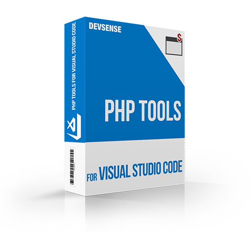
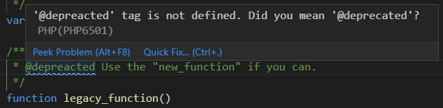
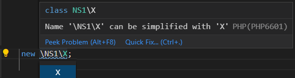
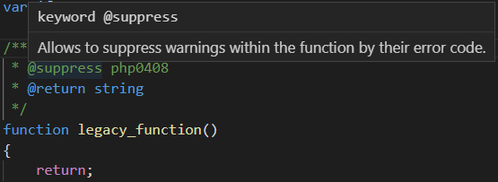
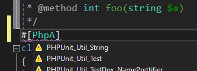

# PHP Tools for VS Code (November 2020)

We are keeping updating PHP Tools for VS Code. Scroll down and check out new features and improvements, we have added for the VS Code development platform.

<!-- more -->

New PHP 8 attribute syntax, more code suggestions, more PHPDoc annotations, suppressing warnings, more quick code fixes, and improved code analysis; those are the highlights of the recent updates.

---

## Code Suggestions

New quick fixes and name-checks lets you simplify your code in case it is possible. This takes into account the existing type aliases and namespaces.

Eventually, there are common typos in PHPDoc which are usually ignored by the IDE, and as a result, you are not benefiting from it at all. PHPTools recognize the common typos we've seen in various open-source projects, and lets you to fix them within a simple quick fix.
 

 
##PHPDoc annotations

The recent updates recognize a less common PHPDoc annotations for array types, such as `bool[string]` or `array<string>` or similar, sometimes used by various projects.

Additionally, it is now possible to suppress specified warnings in your code; for instance, the code above does not return a string as suggested in the PHPDoc - you can now suppress it so no warning will be generated for it.

## PHP 8 Attributes

The new version of PHP is coming. In case you're about to its new features, we got it covered. Attributes are supported by code completion, navigation, and code analysis. 
