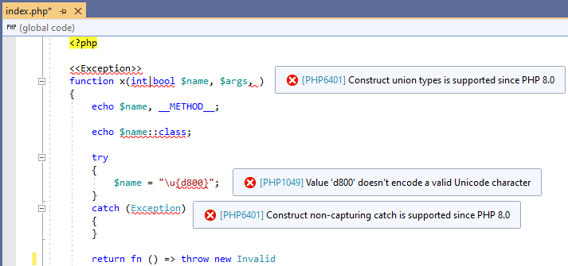
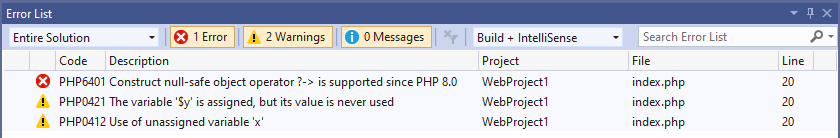
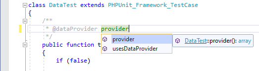
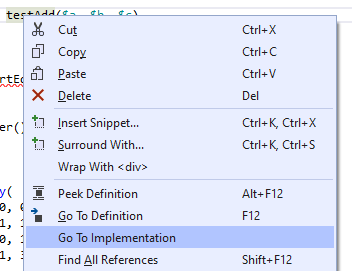

# PHP Tools Updates (September 2020)

We are happy to announce the public availability of updated PHP Tools for Visual Studio. The release brings features and enhancements for developing in PHP using Microsoft Visual Studio.

<!-- more -->

---

## PHP 8.0 Support

The editor supports the entire (so-far known) PHP 8.0 syntax, including `match` expression, null-safe operator `?->`, throw expression, constructor properties, `catch` without a variable, etc. The IntelliSense and code diagnostics are fully aware of PHP 8.0 and will help you to take advantage of the new features in the future. In case, you don't have a beta release of PHP on your PC yet, the editor will report the new constructs as unsupported.

## Visual Studio 2019 Diagnostics

Since the Visual Studio 2019, the Error List shows all the problems across the entire project. Although, it might get overwhelming. Either some of the issues might be known and ignored, or they might be caused by a package you use and you can't fix it anyway. Sometimes, developers want the exact opposite - all the informational diagnostics to be reported strictly as errors, for example within your test files or in a crucial part of the code base.

Now all the diagnostics can be filtered and their severity configured using the `.editorconfig` file. Read more about the configuration at https://docs.devsense.com/en/vs/code%20validation/configuration.

## @dataProvider phpDoc tag

Tests are crucial part of the project development. The PHP editor will now analyze and provide IntelliSense to `@dataProvider` tags used by PHPUnit.The feature provides tool tips, reports non-existing data provider function, or completes the data provider name for you.

## Go To Implementation (VS 2019)

Since the Visual Studio 2019, you can jump to the list of implementations of a function, interface or a class. This is a useful command allowing to list all the overrides and extended classes with from the editor.

## More features
There are tons of new features added recently. The interesting ones are:

- browsing and debugging PHAR archives
- PCRE patterns validation
- new SSH, FTSP, and SFTP protocols supported by project publish
- support for styles in ".editorconfig" file
- improvements to code analysis and type analysis
- improved IntelliSense - e.g. after "use" in namespaces and in traits
- all the PHP 7.4 and PHP 8.0 features in the PHP editor supported
- code diagnostics for magic functions
- full support for phpstorm meta file

## Bug fixes and more enhancements

The latest updates fix hundreds of issues, improve stability and performance. We strongly encourage to check out the changelog at devsense.com/download, and update your PHP Tools to the latest version.