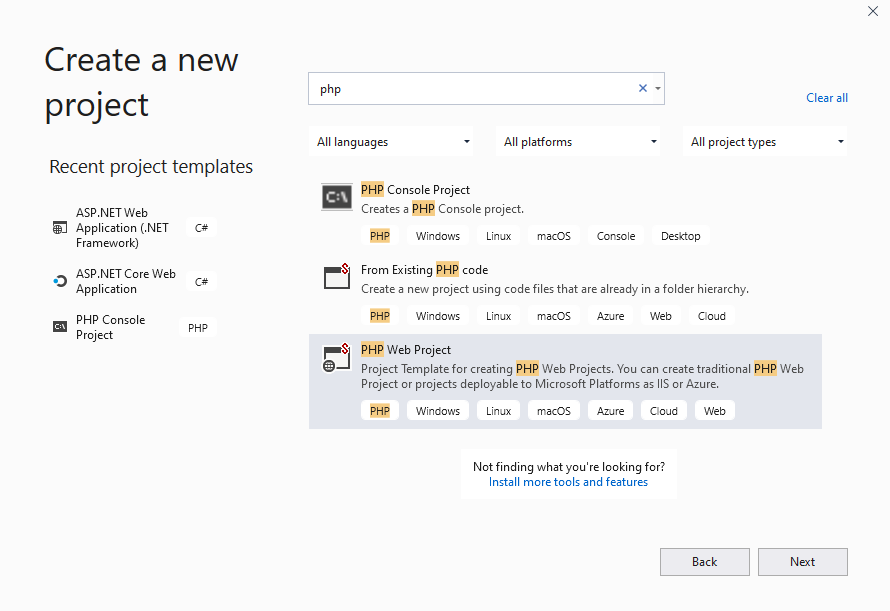
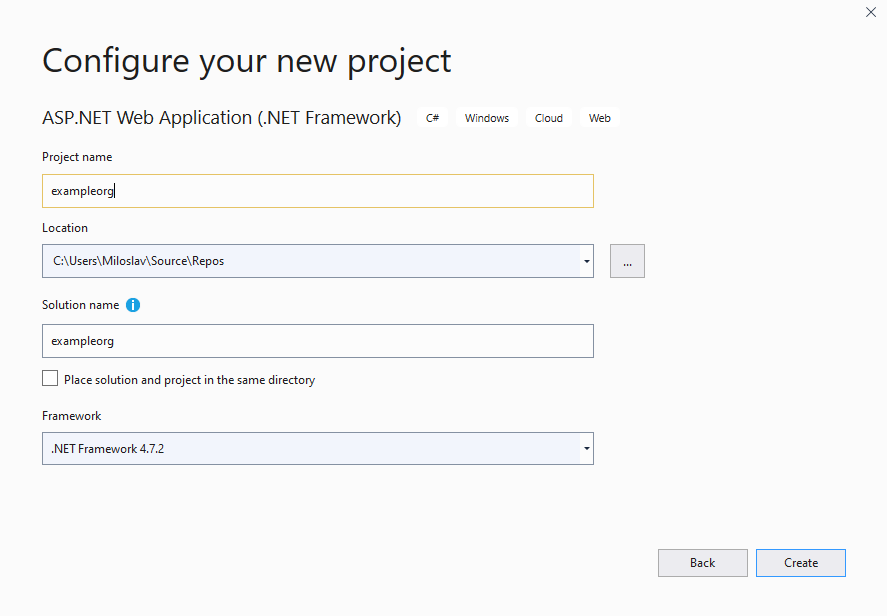
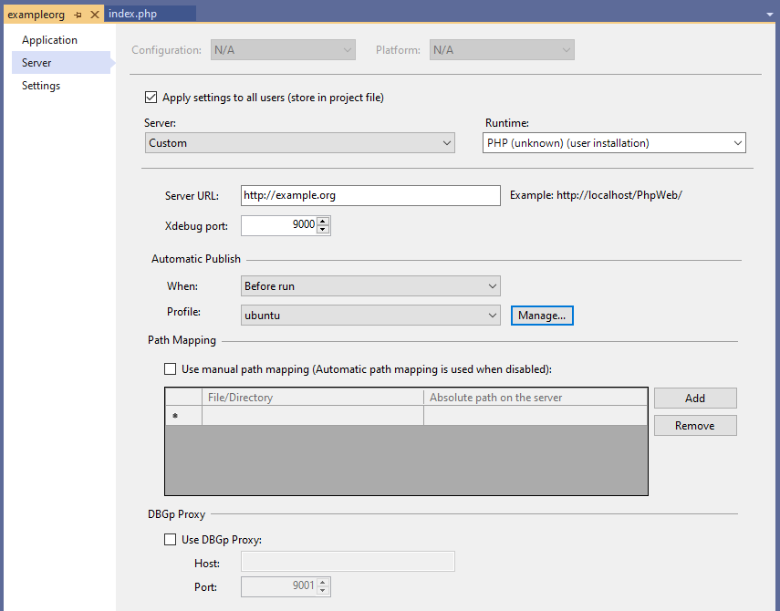
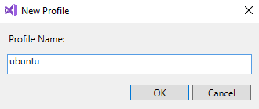
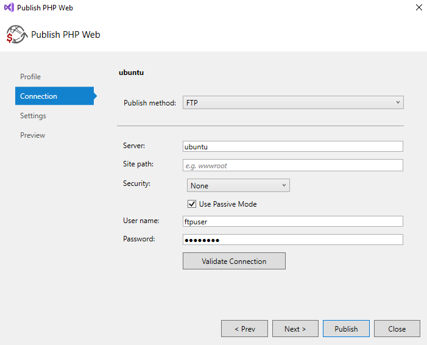
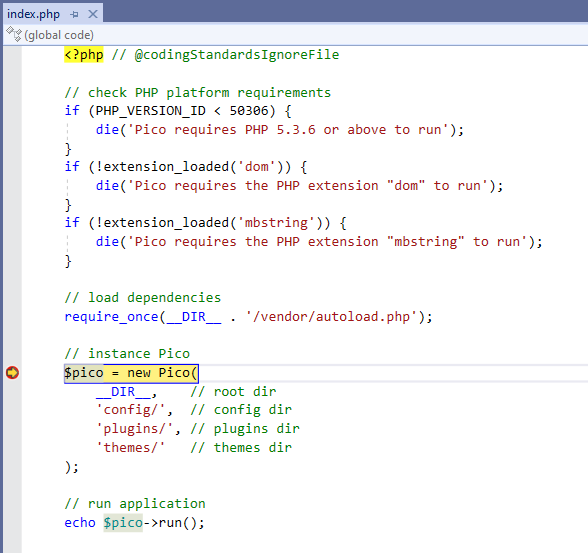

# How to setup PHP remote debugging


In this tutorial I'm going to demonstrate how to setup remote debugging in PHP Tools for Visual Studio. The remote system in this example is running on **Ubuntu**, but it can be any Linux or Windows system.

<!-- more -->

## Configure remote system (Ubuntu)

This is actually the hardest part, but if you have your remote system configured properly you can skip this one.

### Install Apache and PHP

1. First you will need to install a web server and **PHP**. I'm going to install **Apache**, but feel free to install the web server of your preference.
 
 ```bash
 sudo apt-get update
 sudo apt-get install apache2
 sudo apt-get install php
 sudo apt-get install libapache2-mod-php7.0
 ```
 
2. Get **Xdebug**

 ```bash
 sudo apt-get install php-xdebug
 ```
 
3. Turn **Xdebug** on. Open `php.ini`. I will use **nano** to edit text files in this tutorial, but feel free to use editor of your choice.
 
 ```bash
 sudo nano /etc/php/7.0/apache2/php.ini
 ```
 
 Append these lines to the end of the file:
 
 ```ini
 [Xdebug]
 zend_extension=xdebug.so
 xdebug.remote_enable=1
 xdebug.remote_host=192.168.100.9
 xdebug.remote_port=9000
 ```

 You will need to alter `remote_host` option in this snippet. Change it to the IP address of the machine with Visual Studio. In my case IP address was `192.168.100.9`.

4. For the sample project from this tutorial you are going to need these PHP extensions.

 ```bash
 sudo apt-get install php-xml
 sudo apt-get install php-mbstring
 ```

### Create a site on Apache

1. Create directory

 ```bash
 sudo mkdir /var/www/example.org
 ```

2. Create a site on **Apache**.

 ```bash
 sudo cp /etc/apache2/sites-available/000-default.conf /etc/apache2/sites-available/example.org.conf
 sudo nano /etc/apache2/sites-available/example.org.conf
 ```

3. The newly created file will look something like this (I've removed the comments so it's shorter):

 ```apache
 <VirtualHost *:80>
  ServerAdmin webmaster@localhost
  DocumentRoot /var/www/html
  ErrorLog ${APACHE_LOG_DIR}/error.log
  CustomLog ${APACHE_LOG_DIR}/access.log combined
 </VirtualHost>
 ```

4. For this example I've chosen the site name `example.org`, so change the configuration file to:
 
 ```apache
 <VirtualHost *:80>
  ServerAdmin admin@example.org
  ServerName example.org
  ServerAlias www.example.org
  DocumentRoot /var/www/example.org
  ErrorLog ${APACHE_LOG_DIR}/error.log
  CustomLog ${APACHE_LOG_DIR}/access.log combined
 </VirtualHost>
 ```

5. Enable site

 ```bash
sudo a2ensite example.org
 ```

6. Restart **Apache**
 
 ```bash
 sudo /etc/init.d/apache2 restart
 ```

### Install FTP server

Now you have a site, but you will also need a way to get the your php from development machine to the server. One option is to setup FTP server. I'm going to install **Vsftpd**; an FTP daemon available in **Ubuntu**. It is easy to install, set up, and maintain. 

1. Run the following command:
 
 ```bash
sudo apt install vsftpd
 ```

2. Start and enable the service with the commands:

 ```bash
sudo systemctl start vsftpd
sudo systemctl enable vsftpd
 ```

#### Create FTP user

Create a user for the FTP service. This could be considered an account for generic FTP usage. You can always create more, and anyone with a user account on the server can log via FTP. 

1. The user will be called `ftpuser` and is created with the command:

 ```bash
sudo useradd -m ftpuser
```

2. Set the user's password with the command:

 ```bash
sudo passwd ftpuser
```

3. Setup previously created directory as home directory for `ftpuser`

 ```bash
sudo usermod -d /var/var/www/example.org ftpuser
```

4. Add permissions

 ```bash
sudo chown ftpuser /var/www/example.org
sudo chmod -R 755 /var/www/example.org
```

#### Configure VSFTP

1. Create a brand new configuration file. Before you do that, let's save the original with the command:

 ```bash
sudo mv /etc/vsftpd.conf /etc/vsftpd.conf.orig
```

2. Create the new file with the command:

 ```bash
sudo nano /etc/vsftpd.conf
```

3. Place the following to the `vsftpd.conf`:

 ```apache
listen=NO
listen_ipv6=YES
anonymous_enable=NO
local_enable=YES
write_enable=YES
local_umask=022
dirmessage_enable=YES
use_localtime=YES
xferlog_enable=YES
connect_from_port_20=YES
chroot_local_user=YES
secure_chroot_dir=/var/run/vsftpd/empty
pam_service_name=vsftpd
rsa_cert_file=/etc/ssl/certs/ssl-cert-snakeoil.pem
rsa_private_key_file=/etc/ssl/private/ssl-cert-snakeoil.key
ssl_enable=NO
pasv_enable=Yes
pasv_min_port=10000
pasv_max_port=10100
allow_writeable_chroot=YES
```

4. Restart the FTP server

 ```bash
sudo service vsftpd restart
```

## Configure development system

Now, when the remote system is fully configured you can setup a development environment, which should be considerably less work.

To be able to access `example.org` from your developement machine you have to modify the hosts file located at `C:\Windows\System32\drivers\etc\hosts`. Append the following line to the end of a file (modify IP adress to match your remote system).

 ```bash
 192.168.100.17 example.org
 ```

### Create a PHP project

1. If you happen to have **PHP Tools for Visual Studio** version `1.27 or higher` you can use the **New project** dialog.

 Just click `File | New | Project`, type **php** to the search bar and select **PHP Web Project**. 

 

2. Fill the location and the name.

 

3. Select **Simple CMS Project**, just to try out something a little more complex than the "Hello World" script.

 

4. If you don't have any **PHP** installation on **Windows**, **PHP Tools** will ask you if you'd like to install it, you can just click **Yes**.

 Then, you will get asked if you want to download composer packages. Click **Yes**.

### Configuring project
 
1. In **Visual Studio** your PHP Web Project has to be instructed about the web server setting in **Ubuntu**. Just right click on project node in the **Solution Explorer**, click **Properties**.

 

2. For debugging to work properly on remote machine **PHP Tools for Visual Studio** need to know how to map paths from and to remote system. In this case path mapping is simple, so we can keep automatic path mapping and let **PHP Tools** to figure it out. But keep in mind when you will work with more complex projects path mapping will have to be explicitly defined, otherwise debugging will not work properly.

### Deployment

Since FTP server is already configured on remote system, you just need to configure publishing in Visual Studio.

1. While you are in project properties, Server tab, click on **Manage** in **Automatic Publish** section. And name a new profile.

 

2. Then fill in FTP server address and user credentials. Use `ftpuser` created earlier in the tutorial

  
 
3. Click **Validate Connection** to check if you are able to connect to the remote server.

4. Close the dialog and now you can select publish trigger when publish will occur. I've selected **Before run**, but feel free to select other option.

### Debug

Now you should be able to debug remote PHP application in your Visual Studio. Just put a breakpoint to the location of your interest and press <kbd>F5</kbd>. 

 

When you check **Locals** pane you can see that you are really debugging **Ubuntu** system.

 

## That's it

Please let me know in the comments below if this was easy to follow or if you'd have any question.
