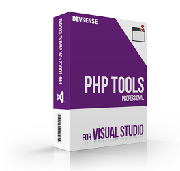
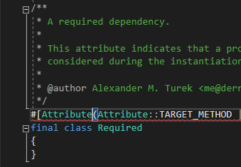
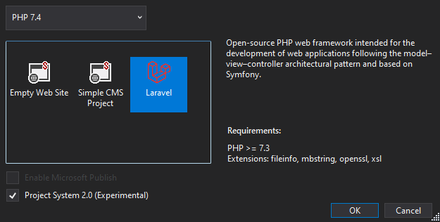
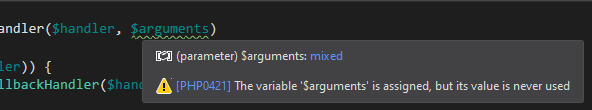
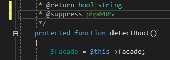
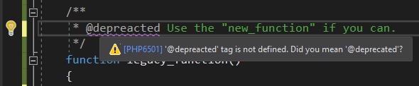
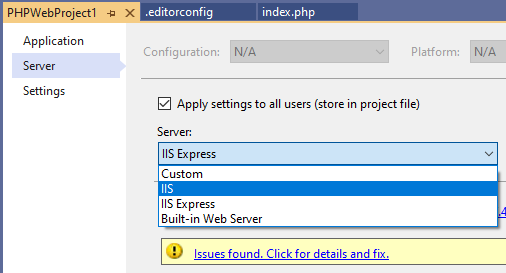
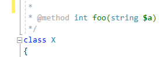

# Updates for Visual Studio (November 2020)

The latest update of PHP Tools brings a lot of improvements and fixes for PHP in Visual Studio since 2010 up to the latest Visual Studio 2019. We're keen to show you a few of them.

<!-- more -->

---

## New PHP 8 Attribute Syntax

As the final PHP 8 release is getting closer, it seems we know the final syntax as well. During the alpha versions there were various RFCs with various syntaxes. The final one is the hash with square brackets, as on the image above. PHP Tools respects it, provides tool tips, IntelliSense, and compatibility check in case you use PHP < 8.0.

## Laravel Project

There are a lot of improvements to either existing Laravel projects, or in case you are about to create a new one. The PHP Web Project wizard now provides a new project template - Laravel.

The new template creates an empty Laravel project, downloads and installs a selected version of PHP in case you don't have it, installs the appropriate version of Xdebug debugging extension, adds the Laravel composer package and the IDE helper package, and setups the project to be ready to run with the simple press of `F5` key.

## Improved Code Analysis

Several more code analysis rules were added including a check for unused parameters and properties initializers type mismatch.

## Suppressing Warnings

You can newly annotate a function or a class with `@suppress` PHPDoc tag. This tells the editor to ignore specified warnings. The allowed PHPDoc tags are `@suppress` or `@SuppressWarnings` followed by the error code.

Additionally, there is the new `.editorconfig` file support that allows specifying ignored error codes globally.
 
## Code Suggestions

The editor checks for common typos and provides quick-fixes for them. This mainly includes common PHPDoc tags typos. This helps to keep code well organized and helps the editor to better understand your code.

Additionally, the editor newly checks for type names in the context of its namespace context. In case you can make use of an existing use statement, it provides you with a suggestion.
 
## IIS Support

Projects can be now configured to run on Internet Information Services (IIS). The virtual directory of choice will be configured automatically, and PHP installed and configured.

## Other Enhancements

Newly, the `@method` tags are correctly interpreted, fully colored, including IntelliSense.

Additionally, the editor now understands Doctrine annotations, we have improved overall performance, fixed stability issues on Visual Studio 2012, and added new PHPDoc annotations for array types.
