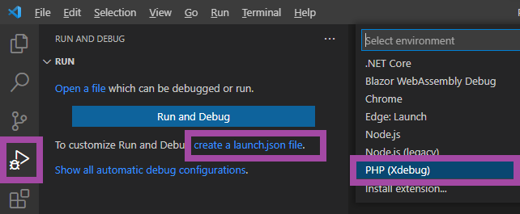
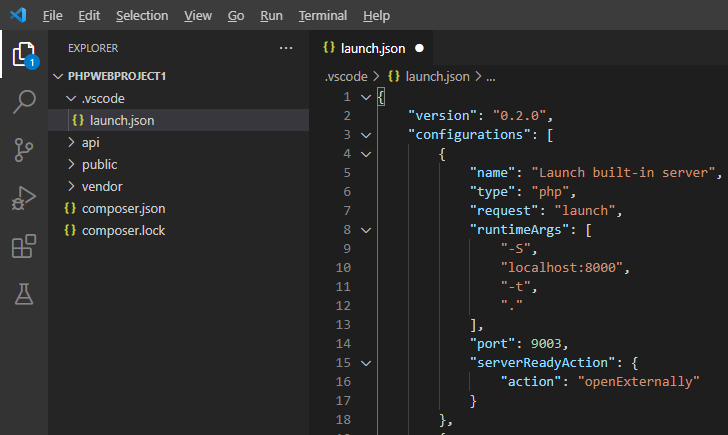
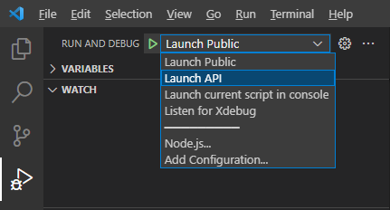
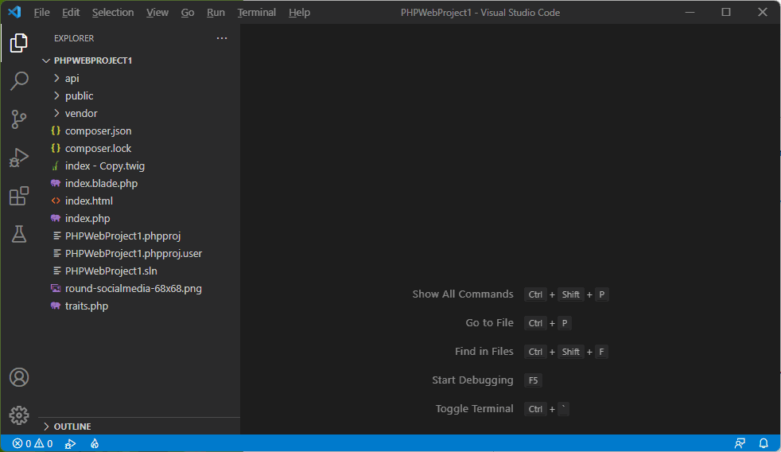

# Compound Launch and Debug in VS Code


Very often a PHP project consists of several separately hosted applications, such as a public website and some API. In case developer wants to run and debug his set of applications locally, there is a very useful feature in VS Code called **compound launch**.

<!-- more -->

---

## The Problem

For the purposes of this tutorial, we have two PHP applications. One is an imaginary frontend, in a subfolder **"./public"**. The second one is a backend API in a subfolder **"./api"**. Frontend needs API, and the developer needs to debug both of them at the same time. Both the applications are supposed to be hosted on a different URL.

Usually there has to be a web server configured to serve both of the applications. Note, that in order to debug both applications at the same time, it would be necessary to setup DBGp Proxy or to setup Xdebug outcoming port differently for both of the applications. Then the IDE needs to be configured in the same way to properly attach to the running server.

But what if we'd like to not configure the web server, simplify things a bit, and take advantage of the IDE and PHP's built-in web server (also called development server)? All the necessary **configuration would be within the VS Code workspace**, and developer would start and stop the project from within his development environment.

## `launch.json`

VS Code is well equipped for launching two or more launch configurations at once. But does it work with PHP and its debugging extension?

Open a folder or a workspace with our two applications in VS Code first:


We either already have `.vscode/launch.json` file, or we have to create a default one for PHP.



Let's open the default `.vscode/launch.json`  file. This file tells VS Code what's supposed to be started upon running the project (`F5`). it also allows to define more than one configuration. In the screenshot below there is the default `Launch built-in server` configuration.



The default `Launch built-in server` starts a development web server on `localhost:8000`, listening for Xdebug on `9003`, assuming the web root is at "`.`" which is the root of our workspace. **This is not what we want.**

> *`.vscode/launch.json` with the default launch configuration:*

```json
{
    "version": "0.2.0",
    "configurations": [
        {
            "name": "Launch built-in server",
            "type": "php",
            "request": "launch",
            "runtimeArgs": [ "-S", "localhost:8000", "-t", "." ],
            "port": 9003
        }
}
```

Instead, we want to define two development servers! - **`Launch Public`** and **`Launch API`**.

> *`.vscode/launch.json` with two launch configurations:*

```json
{
    "version": "0.2.0",
    "configurations": [
        {
            "name": "Launch Public",
            "type": "php",
            "request": "launch",
            "runtimeArgs": [ "-S", "localhost:8000", "-t", "./public" ],
        },
        {
            "name": "Launch API",
            "type": "php",
            "request": "launch",
            "runtimeArgs": [ "-S", "localhost:8002", "-t", "./api" ],
        }
}
```

### Ports

Notice, we have omitted the `"port"` setting. This value forces VSCode to listen on incoming Xdebug (or DBGp) connection. Since we have two configurations run simultaneously, we can't listen on the same port twice. We can either specify two different ports, or omit the setting completely, so PHP Tools will find an available port automatically.

> Note: Another set of ports is the `8000` and `8002`; those are web server ports and has to be specified. In case we have our own web server (such as Apache, IIS, a remote server, or a docker container), we would use a different configuration "type". Although, then we don't need two configurations at all. Instead we would use `"Listen for Xdebug"` configuration which is already there in the default `launch.json` file.

### Compound Launch

At this point, there are two configurations which can be run separately:



Thanks to the **automatic port setting** they will work together at the same time. The final step is to define a single launch configuration that will run and stop both of the servers with debugging upon pressing `F5` (or upon *Run* command).

This will be the compound launch called `"Public + API"`, which runs both of the servers with debugging, and stops both of them when we terminate the debugging session:


> *compound launch configuration for two PHP development servers:*

```json
    "compounds": [
        {
            "name": "Public + API",
            "configurations": ["Launch Public", "Launch API"],
            "stopAll": true
        }
    ],
```

## Recap

This is how it looks like if we put it all together:

- Define two launch configurations "Launch Public" and "Launch API"
- Change the directory, and the public port numbers to differ.
- Define compound launch "Public + API"
- Start the debugging, and make requests.
- The log for both servers is available in VS Code Debug Output.



## More Resources

- [Debugging In VSCode](https://code.visualstudio.com/docs/editor/debugging)
- [Compound launch configurations](https://code.visualstudio.com/docs/editor/debugging#_compound-launch-configurations)
- [PHP Launch Configurations](https://docs.devsense.com/en/vscode/debug/launch-json)
