# Installing and configuring XAMPP for PHP development

XAMPP is a cross-platform Apache HTTP server distribution containing MariaDB (fork of MySQL) database, PHP, and Perl. The word "XAMPP" is an acronym and it seems there is no official explaning of if, but we can safely assume that "X" stands for "cross", meaning "cross-platform", A would be Apache, M is MariaDB. While first P would be short for PHP and second P for Pearl or reversed?

<!-- more -->

## Getting the XAMPP installer

From the [Apache friends website](https://www.apachefriends.org), download the package that matches your platform. For this tutorial we are going to use Windows and PHP 8.0. https://www.apachefriends.org/download.html

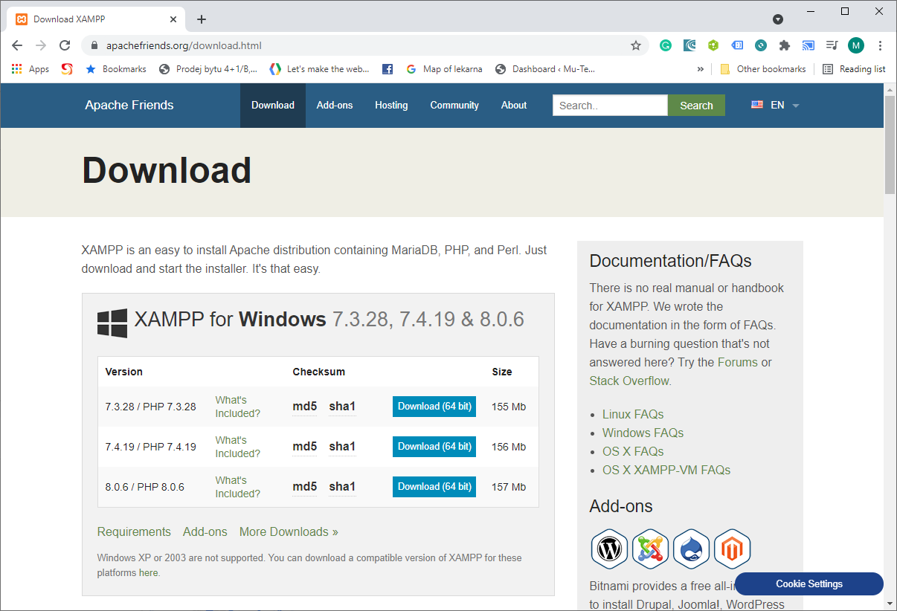

## Installing the XAMPP

Once you've download the installar, run it. If you have UAC enabled enabled XAMPP installer will recommend you not to install it into the Program Files folder. Acknowledge by clicking **OK**

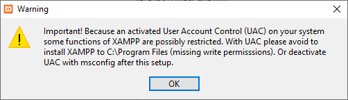

Select the components in which you are insterested in. Usually it's sufficient to install only Apache, MySQL and PHP. But feel free to install whatever you are planning to use.

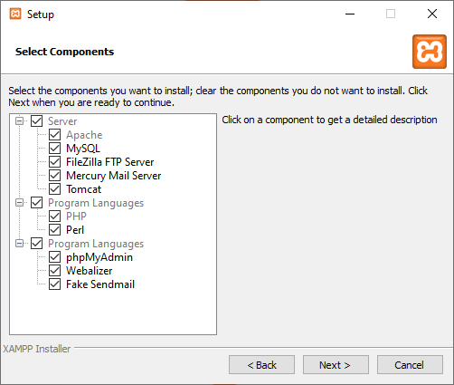

Choose the directory where the XAMPP will install. For the rest of the tutorial I'm going to assume you've chosen the default `c:\xampp`.

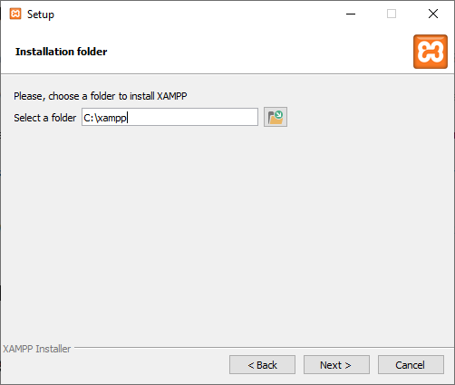

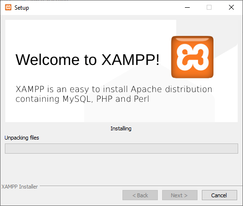

After the installer did the job, click **Finish** to launch XAMPP control panel.

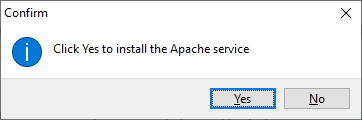

## Running the servers

While in XAMPP control panel, you can perform several tasks such as running or stopping the services as Apache, MySQL, etc. By default Apache should start immediately, but in my case it didn't, because my port 80 was blocked. 

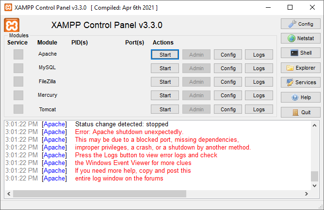

I knew I had IIS running, so I stopped it. Then I returned to XAMPP Control panel and clicked **Start**. This time I was prompted by firewall to allow Apache. Click **Allow access**

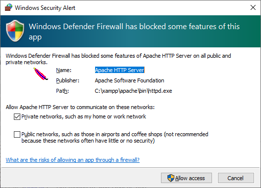

The Apache is now running.

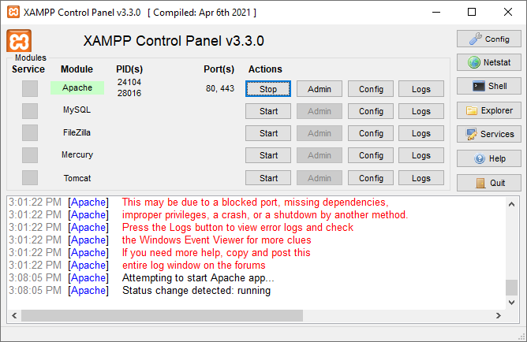

## Running the servers as Windows Service

By default none of these servers are running as Windows Service. If you'd wish them to run as service (e.g. because you want them to start immediately when Windows will start). Open XAMPP Control panel as administrator, click on **Stop** to stop the service and click on **X** next to the service name.

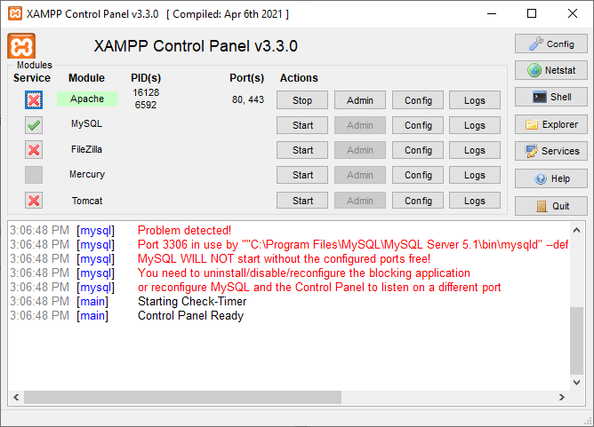

Are you sure? Click **Yes**


Now, the server is installed as Windows Service. But you can always start/stop it from XAMPP Control Panel, or uninstall it as Windows Service by clicking on green check box next to the server.

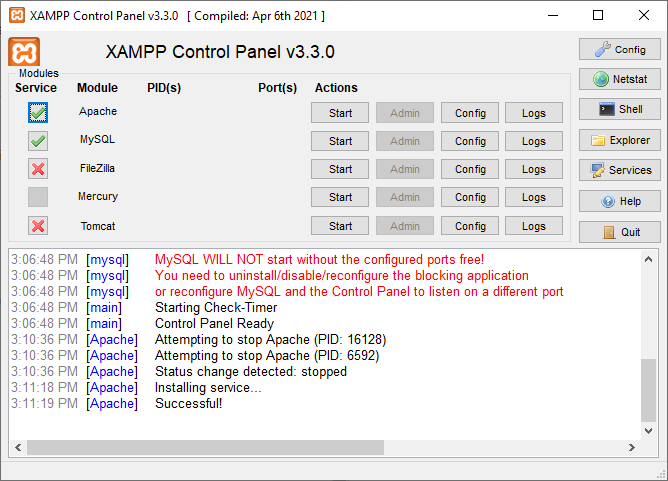

## Install Xdebug

You are almost ready now, but to be able to debug your PHP code you will need [Xdebug](https://xdebug.org/). By default XAMPP doesn't provide PHP with Xdebug extension, so you will need to download it yourself. To find out which version you need, go to the XAMPP Control Panel and click on **Shell** button.

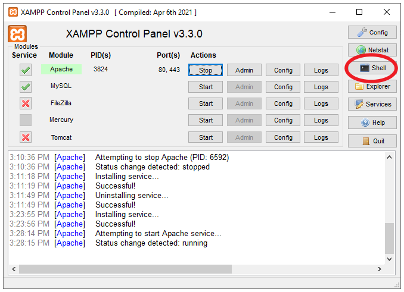

Type `php --version`:

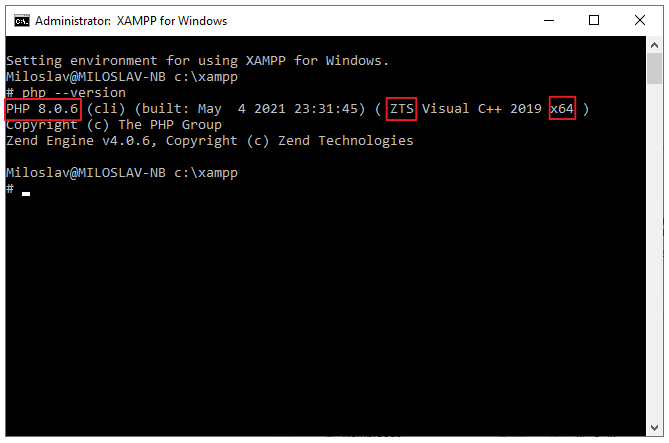

I highlighted PHP version, Architecture(32 bit or 64 bit) and Thread safety (TS). You will use these three variables to get the correct version of Xdebug. Navigate to [https://xdebug.org/download](https://xdebug.org/download) and download the correct version. In my case it's `PHP 8.0 VS16 TS (64 bit)`

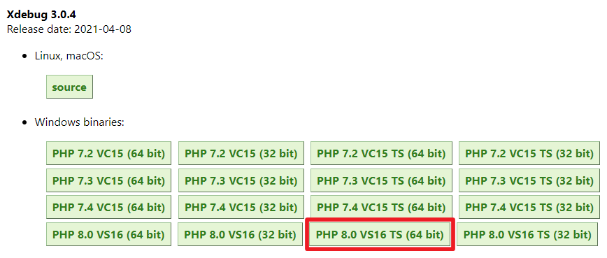

Download the extension, copy it to `c:\xampp\php\ext\` and rename it to `php_xdebug.dll`. Then open PHP Configuration file at `c:\xampp\php\php.ini`, scroll all the way down and copy the following snippet and save the file.

```ini
[XDebug]
zend_extension = "c:\xampp\php\ext\php_xdebug.dll"
xdebug.mode=debug
xdebug.client_host = 127.0.0.1
xdebug.client_port = 9003
xdebug.start_with_request=trigger
```

> **Note** This snippet is for Xdebug 3.0 and higher; If you need Xdebug 2.0 it would be different.

In the XAMPP Control Panel, restart the Apache by clicking **Stop** and **Start**.

You can verify that Xdebug is properly installed by running `php --version` again. You should see the similar output:


## Integrating XAMPP with IDE

You're almost all set to start developing PHP projects on XAMPP, but to be able to do it efficiently you will need some sort of IDE. In the following paragraphs I will present how to start using XAMPP with both Visual Studio and Visual Studio Code. So please feel free to skip directly to the IDE you are intestered in.

### Visual Studio

I'm going to assume you have Visual Studio and [PHP Tools for Visual Studio](https://marketplace.visualstudio.com/items?itemName=DEVSENSE.PHPToolsforVisualStudio2019) both installed. The following text shows the screenshots from Visual Studio 2019, but it shouldn't matter, PHP Tools are available since Visual Studio 2010. You can start the instance of VS and select **Create a new project**.

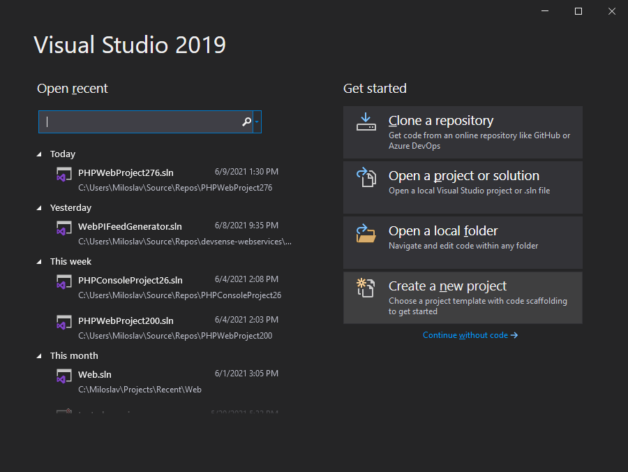

Select PHP in the language filter and click on `PHP Web Project`, hit **Next**:

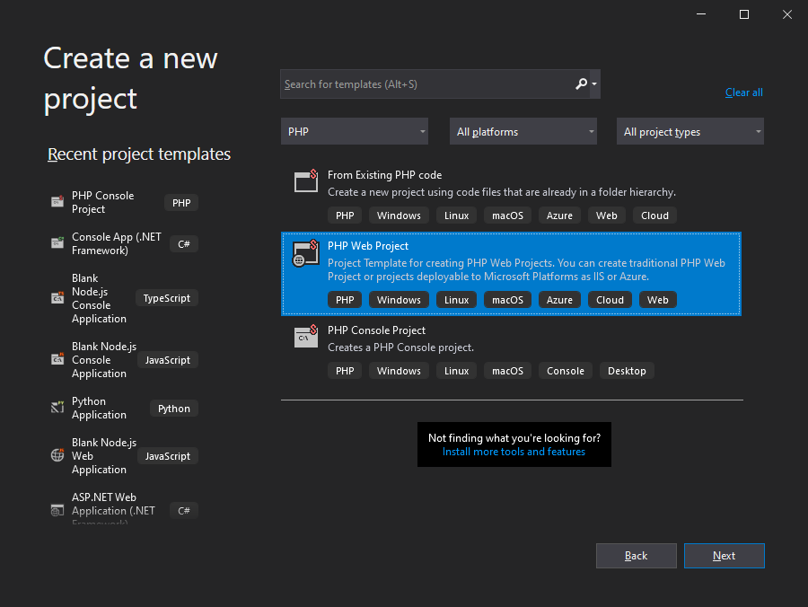

Name the project, as a location fill `c:\xampp\htdocs` and hit **Create**

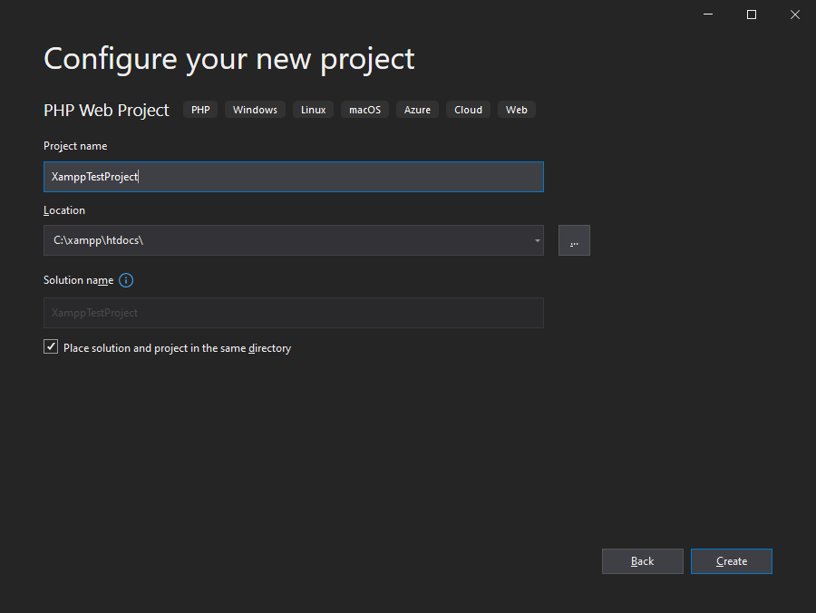

Select the template, e.g. Empty Web Site and enable Common Project System. It's a new type of project system PHP Tools provide since Visual Studio 2019, it's lacking few features, but still it's much better than the old one. Hit **OK**.

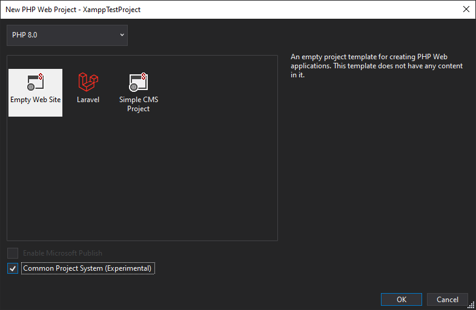

Once your new PHP project is created, go to the project properties. Right click on project node in the **Solution Explorer** and select **Project Properties** (or select the project node in the **Solution Explorer** and press <kbd>Shift+F4</kbd>). In the **Project Properties**, choose **Server** tab.

Change the Server to **Custom** and fill in server URL. In our case it's going to be http://localhost/XampTestProject . Xdebug port should be `9003` which is the default since Xdebug 3. Close the **Project Properties** tab and save the project.

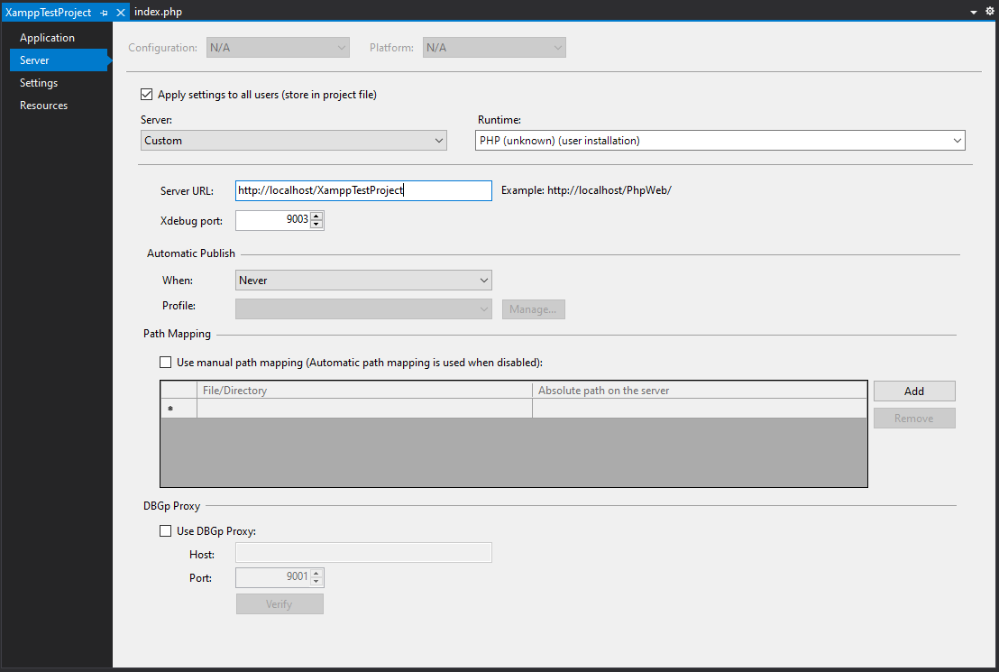

Now back in the project, press <kbd>F10</kbd>, the debug session should start and the debugger break on the first statement of the script. 

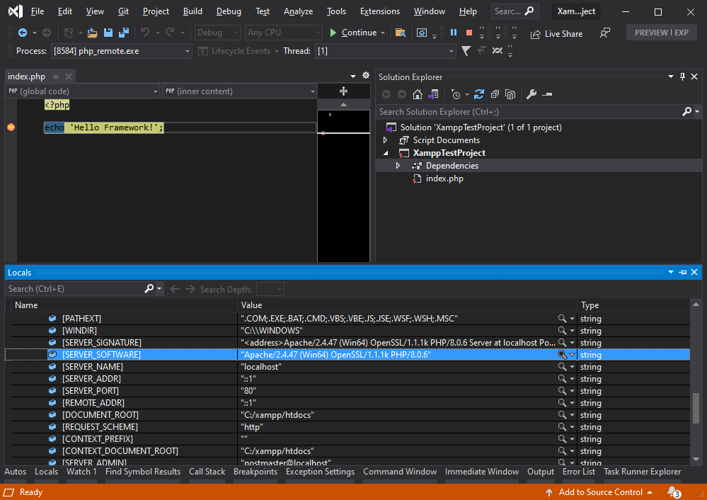

Congrats! You are all setup to develop on XAMPP with Visual Studio.

### Visual Studio Code

To follow along you are going to need Visual Studio Code and [PHP Tools for Visual Studio Code](https://marketplace.visualstudio.com/items?itemName=DEVSENSE.phptools-vscode).

Open VS Code, go to File menu and select **Open Folder**.

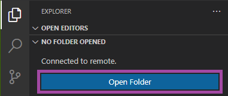

In the dialog open `c:\htdocs\` and click **New Folder**. Let's name it `testproject` and hit **Select Folder**

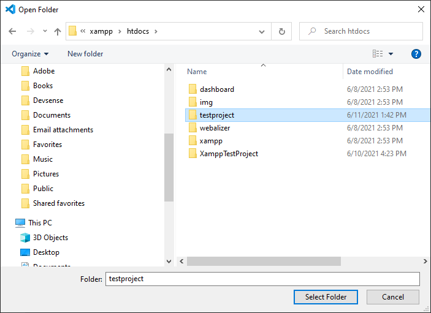

Once the folder is opened. Create `index.php` file and put some code there and save it e.g.

```php
<?php

echo "Hello from XAMPP";

```

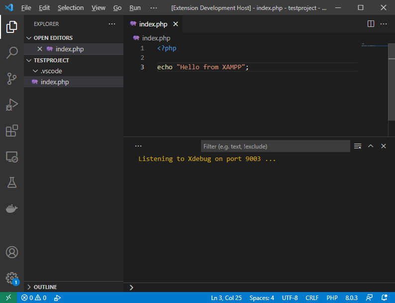

To run or debug this project, select **Run and Debug** on the start view ( or hit <kbd>Ctrl + Shift + D</kbd>). Then click on `create launch.json file` to create launch configuration file, which will be placed to `.vscode` folder.

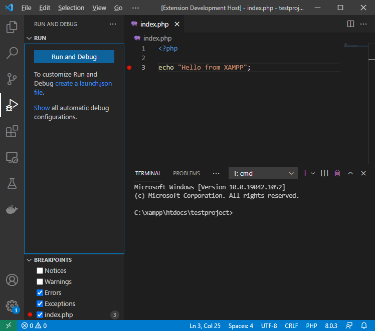

By default `launch.json` will have 3 configurations. In the launch configuration selector choose the one named `Listen for Xdebug`.

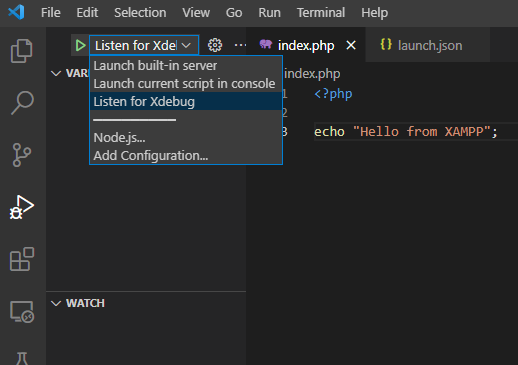

To initiate debugging session which will break on the first statement, press <kbd>F10</kbd> (or <kbd>F5</kbd> to break on the first breakpoint). Open your favorite browser and type `http://localhost/testproject/?XDEBUG_SESSION=1`

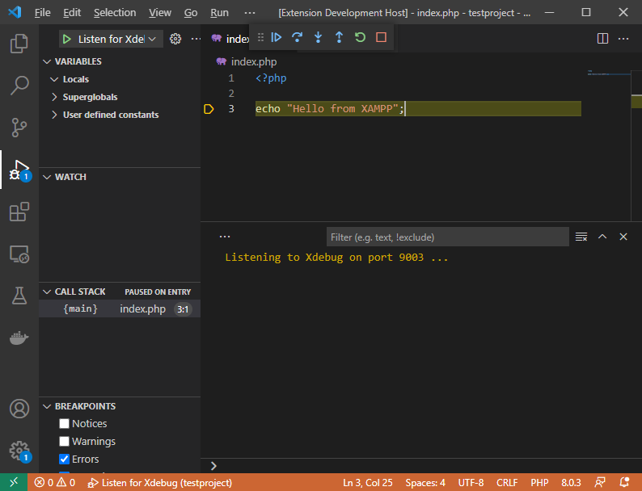

You're setup now and should be able to develop more useful programs than our little sample script.

## Conclusion

XAMPP is a popular choice for PHP developers. In this tutorial I've presented how to install and configure it for PHP development in both Visual Studio and Visual Studio Code. Please let us know If you followed this tutorial and you find some information is missing, if you've struggled with something which wasn't mentioned here or if we could just improve anything.

Happy Coding!

