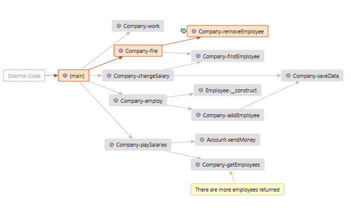

# Debug PHP visually with Code Maps

> **Important!** You to have Visual Studio Enterprise for Code Maps to work.

<!-- more -->

When you receive an email that something doesn't work, you can either delete the email and pretend you didn't get it. Or - if you are brave enough - you'll ask for more information. If you got the message from your colleague, you might even ask for a call stack. Here it is:

```php
index.php!Account->sendMoney() Line 22	PHP
index.php!Company->paySalaries() Line 84	PHP
index.php!{main} Line 110	PHP
```

It also came with an explanation that the company has paid too much on salaries and it's weird. Fix it!

You got the call stack, but you cannot see the whole picture. You only see one path through the program. Don't get me wrong, it might be enough; especially if you know the application. But sometimes to understand where the problem is, you need to know more.

So you start the debugger and you'll try to realize what's happening. I'll show you one tool from Visual Studio that might help you to do that: **Code Maps**.

## Map the call stack

1. Place a breakpoint <kbd>F9</kbd> and start the debugging <kbd>F5</kbd>


2. Press <kbd>Ctrl + \</kbd> and <kbd>Ctrl + L</kbd> or go to `Debug |  Show call stack on Code Map`. If you can't find it, you do not have Visual Studio Enterprise.


4. You'll get a new editor window with a Code Map of your current call stack.


3. When you continue debugging. Either with breakpoints or stepping through the code (<kbd>F10</kbd> Step-Over or <kbd>F11</kbd> Step-Into if you are more curious) the Code Map automatically updates and adds methods which are being called. You can always add a comment to the picture: Click on a node which you want to comment and click on Comment button.


4. After PHP request ends, Code Map survives and any subsequent PHP requests will expand it further.  So after a countless steps the Code Map has expanded considerably. 



5. When you examine the previous picture you can probably spot the bug even without any other information. Both `employ` and `changeSalary` call `SaveData`, but `fire` method doesn't. 

  We didn't save the data after removing the employee. That resulted in company paying more on salaries when `getEmployees` method returned person which has been fired.

You probably think this is a simple example and far from the real world scenario. You are right, but I wanted to show that picture can reveal a lot of information at once and you can even spot a bug there. To create the picture with Code Maps will not require too much effort.

## Final words

This was a very narrow presentation of Visual Studio Code Maps, which we only provide in PHP Tools for Visual Studio as an experimental feature. This means it's not complete and we only support small subset of features that Code Maps offer. That said, we would like to know if this is something you might be interested in and we should support it fully. Let us know.
