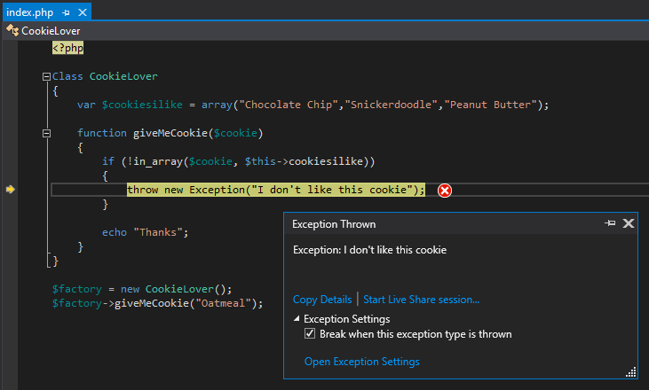
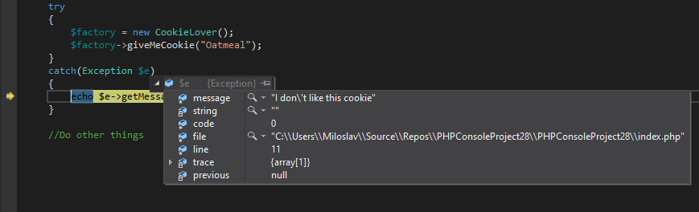
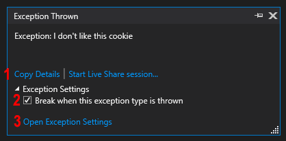

# Debugging PHP Errors and Exceptions

In PHP there are two ways how unexpected state of the program are handled. First one is the traditional procedural approach - **errors**, which also includes notices and warnings. 

<!-- more -->

Second approach are **exceptions**, which is a modern way how to handle unexpected program states in object oriented programming.

Both of these approaches are handled by the PHP Debugger in Visual Studio in unified way. Let's just briefly look at both of these cases and then how they can be debugged.

## PHP Errors

As mentioned there are 3 main types of errors: 
 - Notices
 - Warnings
 - Errors 

We can think about first two as a kind of debug output. The last one will also usually terminate the script execution, e.g. parse error. 

When PHP error, warning or notice happens, it gets logged to **PHP Error Log** or it's displayed directly in the browser. 

### Display errors

There are couple of ways how to handle errors in PHP. One of which is this piece of code, which I've seen quite often:

```php
error_reporting(E_ALL);
ini_set("display_errors", 1);
```

The first line instructs PHP to log every error,warning or notice (`error_reporting(E_ALL)`) and display it in PHP's output. It works, but I personally don't like this, since you can easily forget this kind of code. And I really wouldn't like to have this on production server.

### PHP error Log

I prefer to use the the error log file, which can be setup in `php.ini` with `error_log` directive. Then you would be monitoring the log file for presence of unwanted errors. One easy way how to continously monitor the log in Visual Studio is to open `View | Output` and select `PHP Error Log`


> **Note** PHP Error Log will work even if you are debugging or not

### Debug errors

The most preferable option is to instruct PHP debugger to break when error occurs. Open **Exception Settings**, which you can find at `Debug | Windows | Exception Settings` and check `Notice`, `Error` or `Warning`.  When php code execution will be interupted with any of these, the debugger will break and you will be able to inspect the state of the program in the same fashion as with the **PHP exceptions**

> **Note** PHP debugger will break always when fatal error happens and the script execution cannot continue.

### set_error_handler()

[set_exception_handler()](https://www.php.net/manual/en/function.set-error-handler.php) sets a function that gets called when error happens. Then it's up to you how you would handle the error. You can log it, display it, etc. 

```php
function errorHandler($errno, $errstr, $errfile, $errline) {
  // do stuff
}

// Set user-defined error handler function
set_error_handler("errorHandler");
```

Just make sure you don't use `set_error_handler` when debugging with `Xdebug`. They just don't like each other. You could make it work by calling xdebug api functions in your handler, but let's not go there in this post :-)

## Error as an exception

As of PHP 7, errors are mostly reported by throwing an exception. They added a class `Error` which implements a `Throwable` interface and can be caught. This is same as `Exception` class.

There are still traditional errors(and notices and warnings) present as explained above, but some of those have been transformed to inherit from `Error` class:

```nohighlight
Throwable
    |- Error
        |- ArithmeticError
            |- DivisionByZeroError
        |- AssertionError
        |- CompileError
            |- ParseError
        |- TypeError
            |- ArgumentCountError 
        |- ValueError
        |- UnhandledMatchError
    |- Exception
        |- ...
```

This means that you can handle these by catching `Error`, or you can catch `Throwable` class, which would allow you to handle exceptions as well.

This also means that if your code relies on using [set_exception_handler()](https://www.php.net/manual/en/function.set-error-handler.php) it might not work anymore, since the errors listed above will not go through this handler.


## PHP Exception

When PHP exception is thrown, the execution of the program is halted and call stack is unwind until appropriate `catch` clause is found. The catch needs to match with the exception type or its predecessor type. 

Here is the example without `try/catch`:

```php
<?php

Class CookieLover
{
    var $cookiesilike = array("Chocolate Chip","Snickerdoodle","Peanut Butter");

    function giveMeCookie($cookie)
    {
        if (!in_array($cookie, $this->cookiesilike))
        {
            throw new Exception("I don't like this cookie");
        }

        echo "Thanks";
    }
}

$factory = new CookieLover();
$factory->giveMeCookie("Oatmeal");

```

The exception is thrown when `giveMeCookie` method is called with a an argument that is not present in `cookiesilike` array.



### Handling the exception

In above sample, there wasn’t any` try/catch` statement which would handle the exception. The call stack gets unwind all the way to the PHP Runtime and exception becomes **unhandled**, which will terminate the program.

If exception is thrown within `try/catch` clause, which includes inner methods, the program will not terminate and execution will continue in catch clause, where you can handle the exception. 



>	**Note:** As of PHP 8, `throw` is an expression, not just a statement. That means you don’t need to place it on separate line and it can be part of more complex expression.

## Break on exception

If Visual Studio breaks when exception is thrown depends on the **Exception Settings** which you can find at `Debug | Windows | Exception Settings` .


You can check whole **PHP Exceptions** category and the debugger will break on each thrown exception. 



When debugger breaks when exception is throw you can [inspect the program](https://docs.devsense.com/en/vs/debugging/inspecting-data) in the same fashion as when debugger is broken on the breakpoint. The difference is you are now presented with the exception handler dialog which shows you information about the exception and some options you can do with it:

1.	**Copy-details** copies Exception Type, Message and call stack to the clipboard
2.	You can uncheck **Break when this exception type is thrown** and the debugger will not break the next time this type of exception is thrown. 
3.	Opens Exception Settings dialog

Visual Studio will always break on **unhanded exceptions**. But since this happens when whole call stack is unwind you will not be able to inspect the program in similar way as when the exception is first thrown. When that happens, go to **Exception Settings** and make sure this exception type is checked. So the next time you will have chance to explore why that happened.

## Conclusion

Errors or exceptions (or errors which are exceptions) can be handled in the code in many ways, but debugged in one unified way. That should simplify finding and fixing the issues. So, the next time you are experiencing some unexpected behavior, go to **Exception Settings** and check the whole **PHP Exceptions** category. It’s likely there might be some exception you are not aware of, ready to be fixed.
