# How to install Laravel in Visual Studio

In this blog post I would like to demonstrate how to install **Laravel** in Visual Studio. I will use new project wizard which we have in PHP Tools for Visual Studio. 

<!-- more -->

Our goal here was to make this experience as simple as possible. The **Laravel** framework has certain requirements that you should install and configure first. But instead of googling the tutorial (like this one ;-) ). You should be able achive all of that just with few clicks directly in Visual Studio.

## Creating Laravel Project

### 1. Click Create a new project

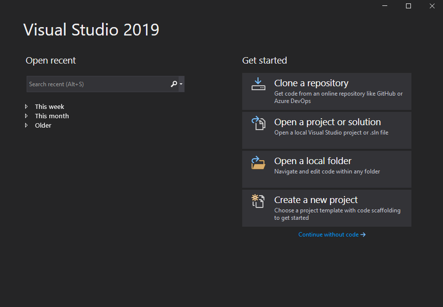

### 2. Select PHP and choose PHP Web Project

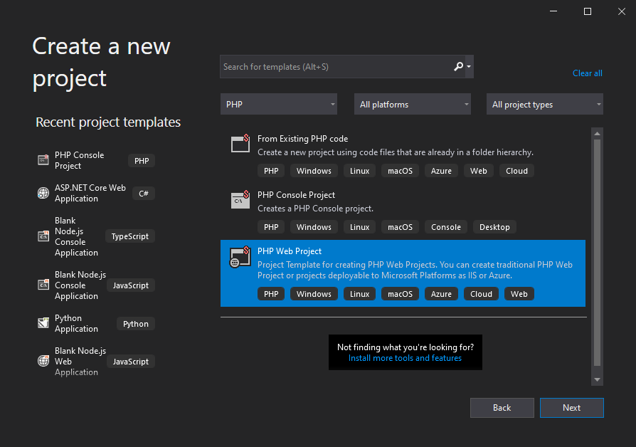

### 3. Name the project

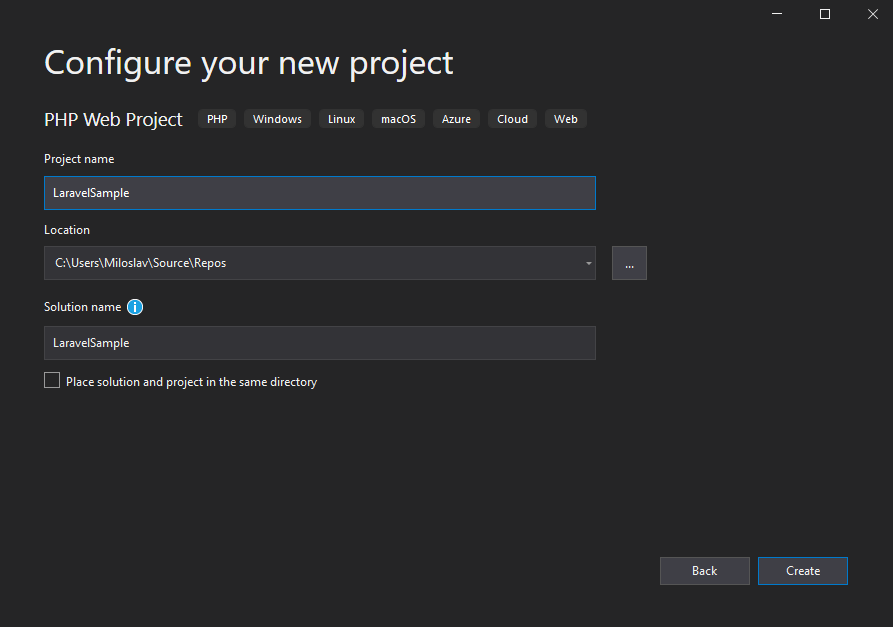

### 4. Select Laravel template

I've **PHP 8.0** for this project, which I don't yet have on my machine (Of course I do and you should too, but I just deleted it for this demo :-) ). I've checked **Common Project System** (VS 2019 only!), because it's much better than previous project system we've used since VS2010, even in it's current experimental state.

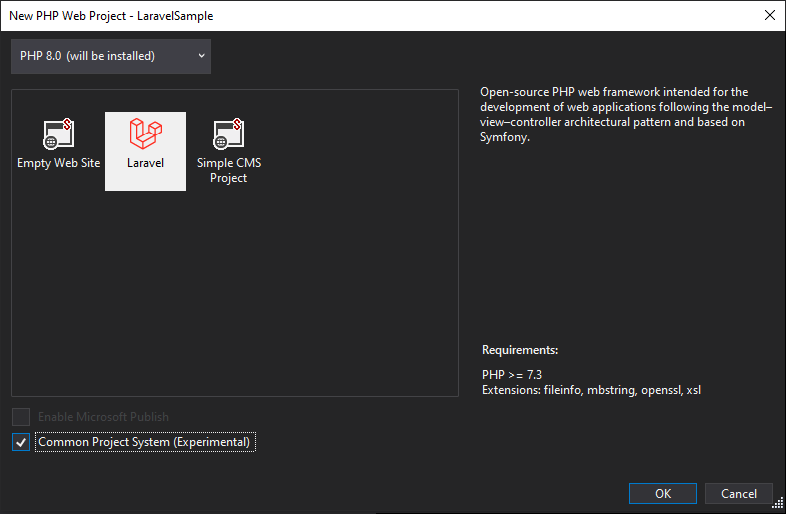

### 5. Wait

**UAC** will asks for permissions to continue. Accept and then wait so PHP Tools will do the work like downloading/updating Composer, installing **PHP**, configuring **Xdebug**, enabling required extensions, ...

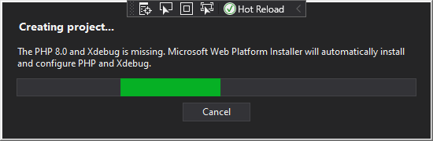

... wait some more

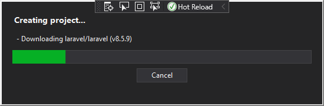

### 6. Laravel is installed

The **Laravel** is installed and configured at this point with all the requisities. You don't need to configure **PHP** project or install Laravel intellisense composer package ( [laravel-ide-helper](github.com/barryvdh/laravel-ide-helper) it helps the **Intellisense** engine to provide better code completion for **Laravel**) this is done transparently.

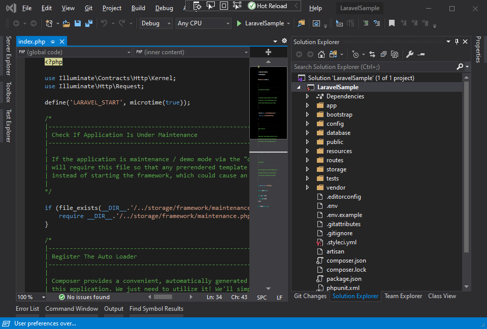

To verify if it's really installed, just press <kbr>F5</kbd>. You should see this page.

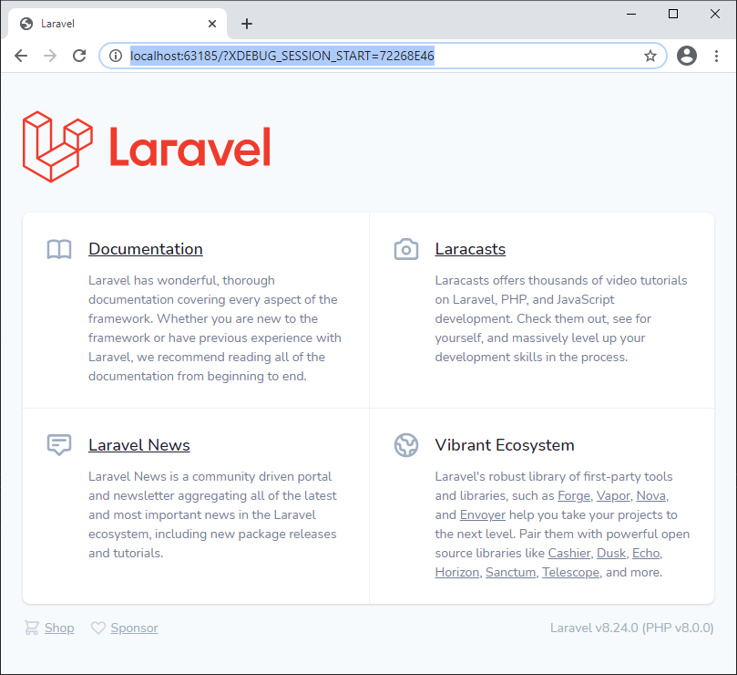

## Adding Laravel plugins

Once **Laravel** is installed, you may want to install one of many plugins. There are plugins that will provide you with great looking admin section, role based security, ecommerce features, etc. There is really a lot to choose from.

You can install any of those plugins directly within Visual Studio. Right click on **Dependencies** node in the **Solution Explorer** and select **Install new composer package...**

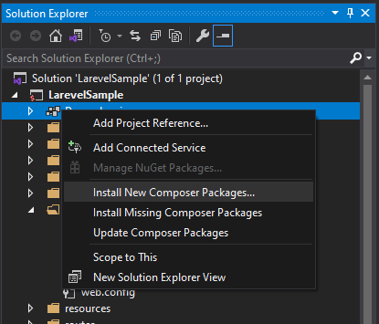

Let's search for one that would take care of role based security. Type `laravel permission` and click **Install Package**. You can close this dialog now, it will install on the background. 

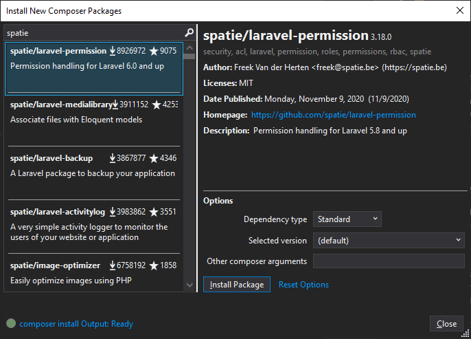

You will know it's installed from the status bar or when Composer Output pane shows it's completed with exit code 0.

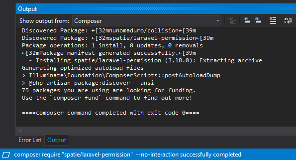

## Conclusion

We've tried to make this experience as straight forward as possible. The **Laravel** is first complex framework template we have added to the new project wizard, but we are definitely going to add more of them. Please let us know how it worked for you or what other framework we should add next.