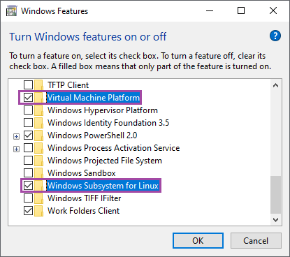
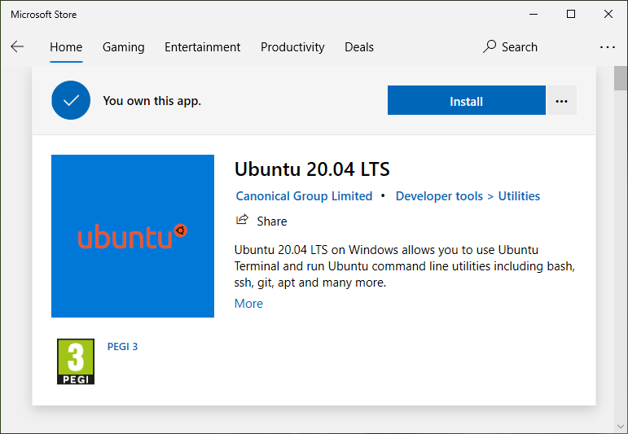
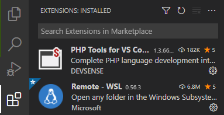
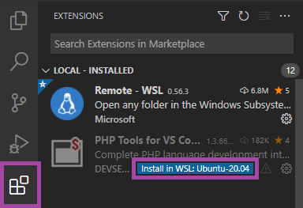

# Laravel on WSL and VS Code


**Visual Studio Code** and **Windows Subsystem for Linux** (WSL): those represent a great couple for developing a PHP application such as **Laravel** inside a virtual Linux environment. This tutorial describes installation of WSL (version 2) on Windows 10, setting up PHP with debugging capabilities in there, creating a Laravel project, and getting your VS Code ready to debug the PHP project in WSL.

<!-- more -->

## Windows Subsystem for Linux

> For the complete documentation of WSL, visit [docs.microsoft.com](https://docs.microsoft.com/en-us/windows/wsl/install-win10).

Before you begin, ensure your computer has a **CPU Virtualization** support enabled in your **BIOS**. Sometimes it is disabled by default.

### Enabling WSL

Make sure you have installed the following Windows Features:

- **Virtual Machine Platform**
- **Windows Subsystem for Linux**



You can install them either from the `Turn Windows features on or off` control panel (as depicted on the screenshot above), or using the following PowerShell (opened as Administrator) commands:

```ps
dism.exe /online /enable-feature /featurename:Microsoft-Windows-Subsystem-Linux /all /norestart
dism.exe /online /enable-feature /featurename:VirtualMachinePlatform /all /norestart
```

After installing the features, **restart your computer**.

### WSL 2

Now download and install the **WSL 2 update package** using  the installer at [WSL2 update for x64 machines](https://wslstorestorage.blob.core.windows.net/wslblob/wsl_update_x64.msi).

And finally, open PowerShell and **set your WSL version to 2** by default:

**`wsl --set-default-version 2`**

Using WSL version 2 may be optional, but I've encountered a few issues with just WSL 1.

### Installing Ubuntu on WSL



Ubuntu itself is installed from the Microsoft Store app. Open Microsoft Store, search for [Ubuntu](https://www.microsoft.com/store/apps/9n6svws3rx71), and click **Get** and **Install**.

---

After installing the container, **Launch** the application. A new terminal window will appear, finishing initialization and waiting for you to fill in a new user name and password.

```
Installing, this may take a few minutes...
Please create a default UNIX user account. The username does not need to match your Windows username.
For more information visit: https://aka.ms/wslusers
Enter new UNIX username:
New password:
Retype new password:

Installation successful!
```

## Prepare your VS Code

Visual Studio Code is a powerful editor for developers. One of its features is that you can develop projects on a remote machine (in our case in a WSL container). To develop PHP code on WSL, install at least those two extensions:



- [Remote - WSL](https://marketplace.visualstudio.com/items?itemName=ms-vscode-remote.remote-wsl), extension ID: `ms-vscode-remote.remote-wsl`
- [PHP Tools for VS Code](https://marketplace.visualstudio.com/items?itemName=DEVSENSE.phptools-vscode), extension ID: `devsense.phptools-vscode`

### Open Ubuntu in WSL

Now you have VSCode, WSL, and Ubuntu installed and ready. Connect the VSCode to the your Ubuntu container. Press `F1` to bring the command palette, and run the command **`Remote-WSL: New WSL Windows using Distro...`**,


Choose the Ubuntu from the list, and confirm.


A new VSCode window will open. From now on, the VSCode workspace is actually your user folder in the virtual environment, and all the commands and all the code run in Linux. To complete the setup of VSCode on Ubuntu, **explicitly install VSCode extensions in WSL**:



### Open Terminal


The last step is to open VSCode terminal (`` Ctrl+` ``) and start typing commands ...

## Install PHP+Xdebug

In the terminal window, enter the following two commands - to update the apt cache and install PHP with a set of extensions, including Xdebug!

**`sudo apt-get update`**

**`sudo apt-get install -y git php7.4 php7.4-curl php7.4-xml php7.4-zip php7.4-mbstring php7.4-gd php7.4-sqlite3 php7.4-mysql php7.4-xdebug`**

You can verify the installation by running the PHP command `php -version`:


## Install Composer

To create a new Laravel project, it will be useful to have Composer tool installed globally. Follow the official instructions to download and install the tool in your Ubuntu container, and move the tool to global path:

```
php -r "copy('https://getcomposer.org/installer', 'composer-setup.php');"
php composer-setup.php
php -r "unlink('composer-setup.php');"
sudo mv composer.phar /usr/local/bin/composer
```

## The Laravel Project

Now we are ready to create some PHP, edit it, run and debug the code, etc. In this part, we'll create a new default **Laravel project using Composer**.

**`composer create-project laravel/laravel example-app`**

---

This command effectively creates a sub-folder `example-app` containing the entire Laravel and a default empty project in it. You might notice, VSCode has still no folder opened. Click **Open Folder** and choose `example-app` from the list.


Now you're working inside the container's `example-app` folder, PHP Tools extension activates for the first time, downloads an additional dependencies, and you're ready to setup run & debug.


### Ignore `vendor` problems (Optional)

You'll get reported several *problems* in `vendor` sub-folder as there are known typos and mismatches in original PHPDoc comments. Go to VSCode's `settings.json` file (File / Preferences / Settings, search for `php problems`, and click `Edit in settings.json`). Copy the following json in there:

```json
{
  "php.problems.exclude":	{
	  "vendor": true
  }
}
```

## Run & Debug

PHP Tools will serve as a built-in server, debugger, and editor, all in one. Create launch configuration for the Laravel as described below, and run the project.

### launch.json


In order to run and debug the project, create `launch.json` configuration first, as on the picture above. Go to **Run and Debug** tab, click **Create launch.json file**, and choose **PHP (Xdebug)**.


In the newly create file, change argument **`"."`** to **`"public"`**, as Laravel expects the root of the server to be the `./public` sub-folder. *Optionally*, you can change the web server port number in here as well (change `localhost:8000`).

### `F5`

Press **`F5`** (Run / Start Debugging) to start the built-in web server and initiate debug. You'll get welcomed by a first (handled) exception which is normal. The debugger is just set, by default, to break on any error or exception, even it is handled.


Uncheck **`Everything`**, and check **`Errors`** only if you wish.

---