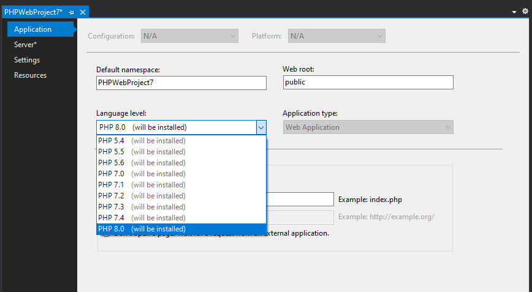
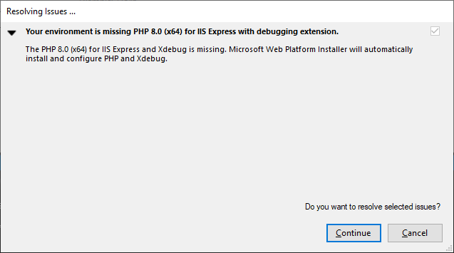
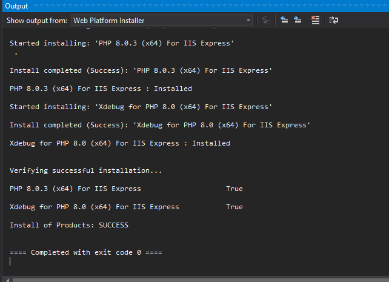
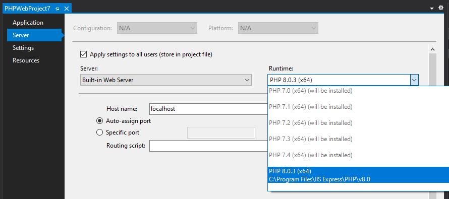
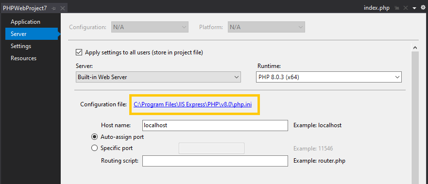
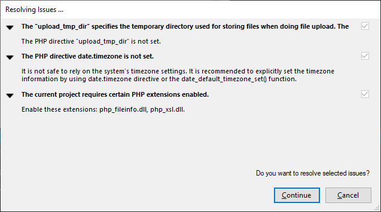
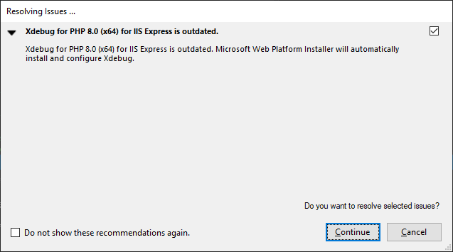
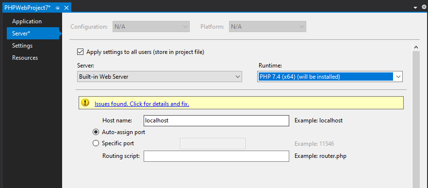
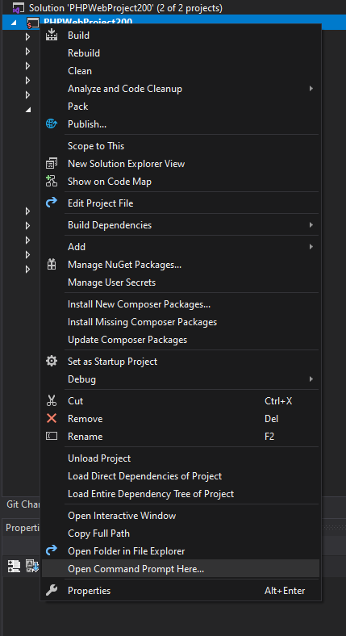
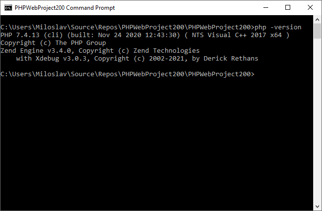

# Managing multiple PHP versions on Windows with Visual Studio

There are several reasons why to have multiple PHP installations locally. You might have one old project that requires PHP 5.6 (already end of line since January 1st 2019), the other project in PHP 7.1 and one more project in PHP 7.4 which you are upgrading to PHP 8.0.

<!-- more -->

Fortunately with **PHP Tools for Visual Studio** it’s quite easy to install and switch between PHP versions. 
The idea is to define requirements you have in the project and it’s up to the PHP Tools to fulfill those requirements.

## Installing new PHP version

In the project properties, in the **Application** tab you can define what language level (version) you are interested in. Then run the project (<kbd>F5</kbd>) PHP Tools will verify if there is an available environment that fulfills this requirement on your machine. 

 
If there is PHP runtime you want, like in my case, you will be prompted with the dialog asking you to let it install required products. Click to **Continue** and PHP will be installed.

If you want be more specific about the environment you want to develop your project in, go to the **Server** tab. In this tab you can specific PHP runtime. Even though you’ve specified **Language level** in the **Application** tab, there might be more PHP installations that fits; you can select the one you want here. 

> **Note** Since `1.51.13160` x64bit PHP distributions are installed by default on 64bit Operating system.

In this configuration tab, you can also specify what server you want to use for development. Currently you can select from these servers:
-**PHP Build-in server**
As of PHP 5.4. there is build-in server in the PHP itself. In most cases it will be enough, but keep in mind there it’s just single-threaded web server, which doesn’t support .htaccess or any rewrite module out of the box. You can find more information at https://www.php.net/manual/en/features.commandline.webserver.php
-	**IIS Express**
Lightweight, self-contained version of **IIS** optimized for developers. This should suffice for most of your developer needs. But if you plan to run the project on Apache in the production, use Custom server option.
-	**IIS**
If you need full-featured **IIS** web server
-	**Custom**
When you cannot select from previous options or you want to run/debug the project on remote server, this is the option.

## Configuring PHP

When PHP is installed by PHP Tools it has already been configured. But in case you’d like to change it you can find current `php.ini` file in the Project properties, **Server** tab.

In case there is a known issue present in your configuration you will be notified when you run the project and you can let PHP Tools to fix those.

## Updating PHP or Xdebug

Tech world is constantly evolving, every day there is a new update for something, new fix, improvement, or optimization… PHP is no different.
When an update for PHP version defined for your project gets available, PHP Tools will notify. Following picture shows dialog that notified me when new Xdebug got available. Clicking **Continue** will install and configure it.

This process will keep your current configuration intact. But in case of **Xdebug** it will transform the configuration when you are updating from Xdebug `2.x` to `3.x` since the configuration options has changed. If you would like to know more details there is an upgrade guide here https://xdebug.org/docs/upgrade_guide

## Change to different PHP Version

If you need to switch your project to different PHP version, go to Server tab and select which Runtime you want to use. It can be already installed(e.g. you already have your own PHP installation) or it might be PHP version that’s not present and will be installed and configured by PHP Tools. Same can be done in the **Application** tab, **Language Level**, but I mostly do it here since I can exactly see which particular runtime and server it’s going to be used.

Btw. all these configurations are per-project, so it will not influence any other projects you have.
Once you’ve switched to the new PHP version, PHP Tools might notify you there are some configuration issues that needs to be solved. Either click on the link in the yellow box and let PHP Tools solve them now, or it will be solved when you run the project. Up to you.

Since I’ve switched the project from PHP 8.0. to PHP 7.4. I get an error message that I use a syntax which is only supported since PHP 8.0. I can fix this now before finding it later when running the code (or I might never find out if I will not run this particular piece of code during runtime), which makes the transition easier.

## Open Command Prompt

Sometimes it's required to open up the command prompt from current folder and type those commands. In the **Solution Explorer**, right click on the project node, or any folder and select **Open Command Prompt From Here..**. The command line will open with php set to the one you have active in your project.

## Conclusion

Managing multiple PHP version can be a pain, but it doesn’t have to be. We’ve tried to shape whole experience into the few clicks in the project properties. Please let us know if you find this helpful, or if there is something else we can look into.

