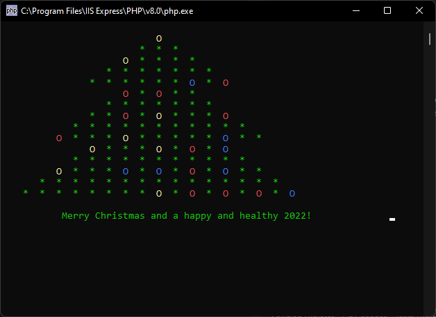
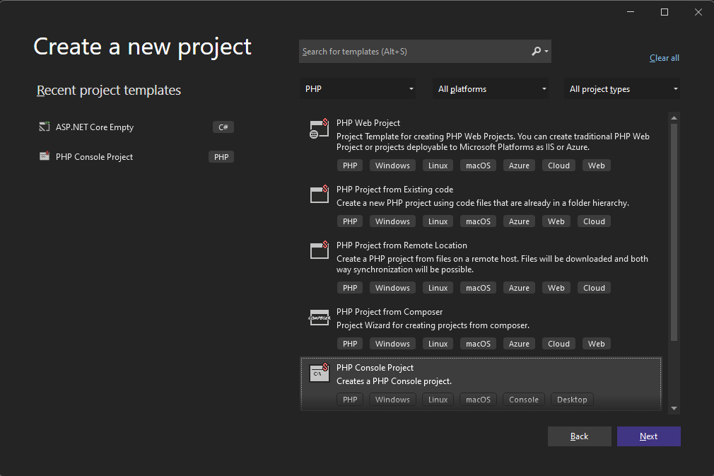
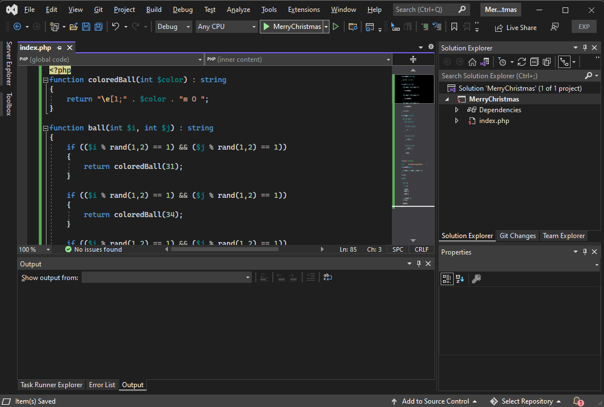

# Merry Christmas and Happy New Year 2022



I received an mail from one developer using our tools - Mr. Bert Degenhart Drenth from Netherland, which I wanted to share with the rest. It's a Christmas wish in the form of PHP console program :-)

<!-- more -->

To run it, create a new PHP console project.



Copy the following script: (I'm attaching it completely unaltered with the kind permission of the author :-))

```php
<?php
function coloredBall(int $color) : string
{
    return "\e[1;" . $color . "m O ";
}

function ball(int $i, int $j) : string
{
    if (($i % rand(1,2) == 1) && ($j % rand(1,2) == 1))
    {
        return coloredBall(31);
    }

    if (($i % rand(1,2) == 1) && ($j % rand(1,2) == 1))
    {
        return coloredBall(34);
    }

    if (($i % rand(1,2) == 1) && ($j % rand(1,2) == 1))
    {
        return coloredBall(33);
    }

    return "\e[1;32m * ";
}

function triangle(int $from, int $to)
{
    for ($i = 0; $i < 10; $i++)
    {
        if ($i >= $from && $i <= $to)
        {
            // left spacing
            for ($j = 10 - $i; $j > 0; $j--)
            {
                echo "   ";
            }

            // left side of the tree
            for ($j = 1; $j <= $i; $j++)
            {
                echo ball($i, $j);
            }

            // right side of the tree
            for ($j = 2; $j <= $i; $j++)
            {
                echo ball($i, $j);
            }

            echo PHP_EOL;
        }
    }
}

echo "\e[1;32m"; // set text to green

$wish = "             Merry Christmas and a happy and healthy 2022!            ";

function textScroll(string $text)
{
    return substr($text, -1) . substr($text, 0, strlen($text) - 1);
}

echo "\e[?25l";
$count = 10;
while (true)
{
    $count--;
    if ($count == 0)
    {
        $count = 10;
        echo "\e[H";
        echo PHP_EOL;
        triangle(1, 5);
        triangle(3, 7);
        triangle(5, 9);
    }
    echo "\e[1;32m";
    $wish = textScroll($wish);
    echo "\e[18;1H";
    echo $wish;
    usleep(100000);
}
?>
```



Then hit <kbd>Ctrl+F5</kbd>, you should see the animated wish:


Merry Christmas and Happy Coding in 2022!