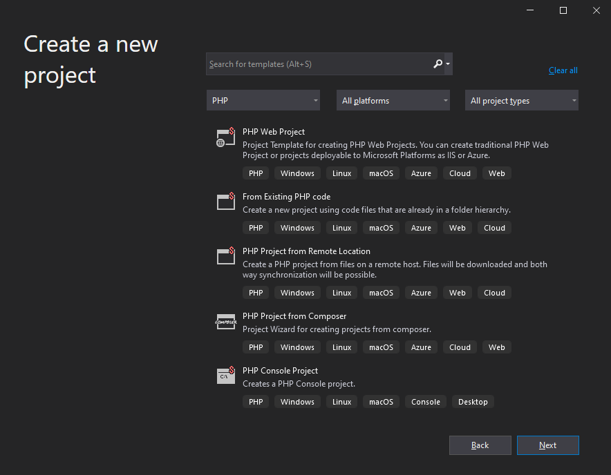
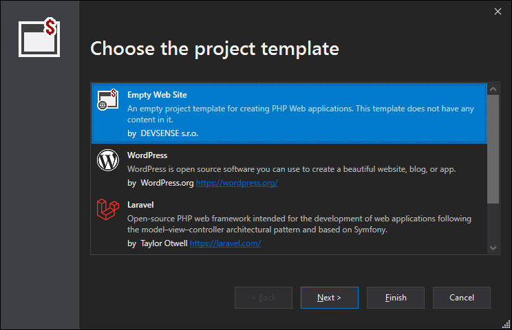
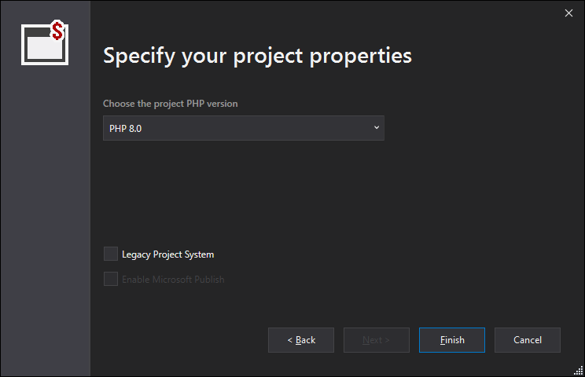
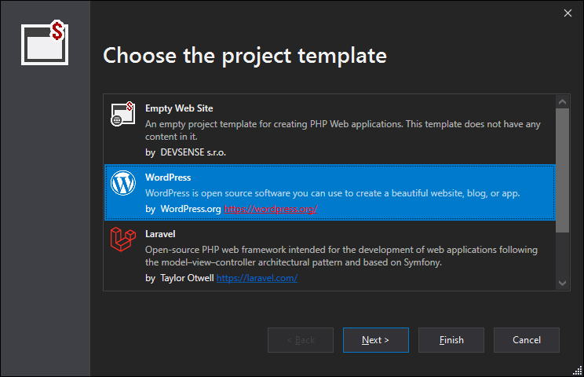
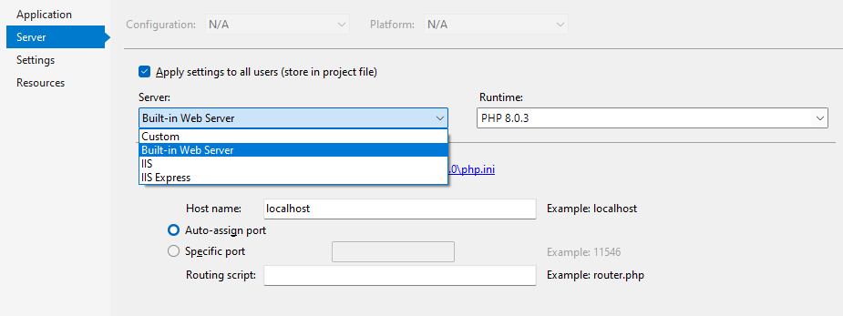
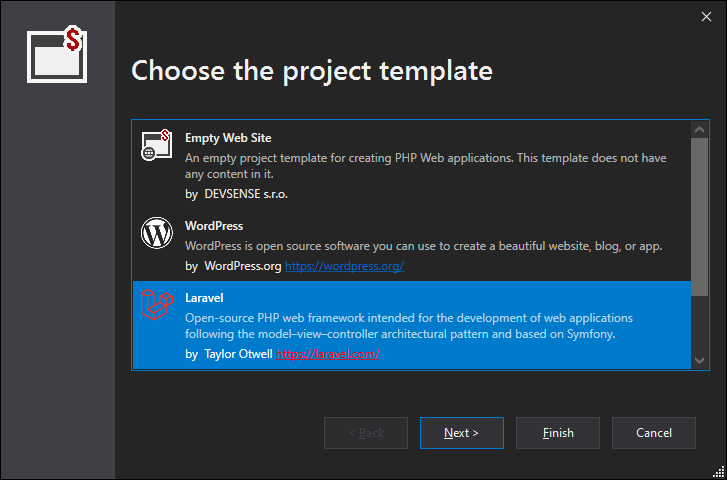
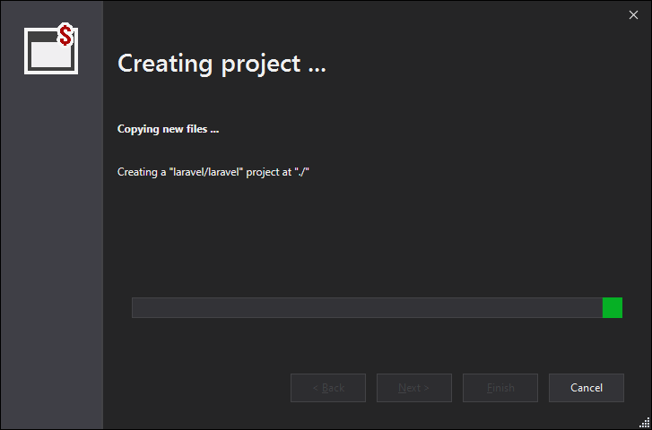

# New Project Wizards

Working on a PHP project in Visual Studio may start in two ways; either opening a folder (`File` | `Open` | `Folder`), or creating a regular Visual Studio project (`File` | `New` | `Project`). Although both approaches work, we're recommending the seconds option, since it provides much more features and the full blown Visual Studio experience. Let's take a look on the New Project Wizards.

<!-- more -->

## Choosing the Right Project Type

There are a lot of project templates, which are pretty much self describing. First, there are two kinds of projects - a **Web Site** and a **Console**. Usually people are creating a Web Site in PHP.

Then you're either creating an empty project from scratch, or a new project based on a template, or just want to start a Visual Studio project somewhere in an existing location - either local or remote.

## New Project

The first project template allows to create a new project from scratch. After choosing the `PHP Web Project` template, the project creation wizard opens.

Choose **Empty Web Site**, and follow the wizard steps to finish the project creation. This project template creates a standard project with a single initial file, ready to run. Note, that PHP and debugging is initialized automatically, and by default upon starting the newly created project, the **built-in web server** is started.

The next step lets you to select the desired PHP version, and whether to create a *legacy project type*. This option allows to create a project that is compatible with Visual Studio 2017 and older, including Visual Studio 2010. Note, that if there is any already installed PHP on the system, it is chosen by default. Otherwise, PHP will be installed and configured for you.

For more details, please see [the New Project documentation page](https://docs.devsense.com/vs/project/new-project).

### New WordPress Web

The same wizard allows to create a new WordPress web site, ready to run. The WordPress sources are always downloaded from the official wordpress.org host, and it is always a latest version. It's not worth installing an older version, since it is always recommended to update to the newest anyways.

Expect that about 20MB of data will be downloaded from Internet. Without the Internet connection, the wizard won't finish.

> Upon creating the WordPress project, you may need to specify the web server host, or at least the *localhost* port number. WordPress will create its configuration upon first run, and will expect the domain (including the port number) won't change (the domain name will be stored into the database). The next steps are fully up to you; the recommended approach is to choose **IIS** or **IIS Express** host in the project properties (above), whilst specifying exact host name and port number, so it won't change, and will be always the same every time you run the project. After deployment to a remote host, expect to set `WP_HOME` and `WP_SITEURL` constants explicitly. Read more at https://wordpress.org/support/article/changing-the-site-url/.

### New Laravel Web

Another prepared template is the Laravel project. This is actually a shortcut for the new project from composer project named `laravel/laravel`.

The wizard will check the PHP satisfies the *Laravel* project requirements, and will download all the required components.

### New Pico CMS

A neat option is a simple CMS website, consisting only of a few source files, configuration, no database, and content in Markdown files. This makes use of [Pico CMS](https://picocms.org/). This kind of project is suitable for small yet powerfull websites, where you suppose to write all the content in Markdown files, and additionally add extensions that may dynamically modify the rendered content. Pico CMS provides simple CMS solution with powerful extensibility options.

## Project from Composer

A vast array of project templates are available as composer packages. Once you know which one you need, you can create projects right from Visual Studio; choose **PHP Project from Composer**, and follow the steps. The interactive text box will search and provide additional package information.

The next step allows to specify the PHP version, and creates the new project; Nothing else has to be done - if there is not PHP executable, it is first downloaded and installed, debugging extension configured, required extensions enabled, composer project downloaded and created. Additional configuration may be fixed for you as well.

https://docs.devsense.com/vs/project/new-project-composer

## Project from Remote Host

A common problem is working with an existing code on a remote server. PHP Tools provides the complete solution while giving the full featured IntelliSense, code analysis, and both way synchronization with the remote host. The **PHP Project from Remote Location** project template guides through the process.  This wizard will:

- let you choose the **remote host** (the protocol FTP, SFTP, .. the host name, and required credentials). You can specify more than one remote profile; they will be stored within the project so they can be used later for deployments.
- specify the optional **Public URL**; this will allow running the project remote on the specified URL.

Upon confirming, the files will be downloaded locally, and both way synchronization initialized. Optionally, you can either run the project from the locally copied files, or remotely using the *Public URL*. For further synchronization of the project files, either enable **Publish on Save** in Project Properties, or use the [**Remote Explorer**](https://docs.devsense.com/vs/project/remote-explorer).

https://docs.devsense.com/vs/project/new-project-remote

### Working with Remote without Downloading Locally?

In case you don't want to download all the files locally; you just need to edit a few words on the remote host and debug the project remotely - follow these steps. Basically we're going to create an empty local project with a remote profile.

- Create an **Empty PHP Project**.
- Go to **Project Properties**, tab **Server**, choose **Custom**, and fill in the **Server URL**. Xdebug port allows debugging, ensure the server has properly Xdebug installed and configured, and is "broadcasting" on the selected port. Optionally, you may take advantage of Xdebug Proxy.
- At this point, debugging should work, press `F5` to verify the website opens and the debugger is attached.
- To modify the remote files, open the Remote Explorer in `View` | `Other Windows` | `Remote Explorer`, and create the remote profile pointing to the server.

- here take advantage of the Remote Browser to list the remote files, for editing the files conveniently, use **Pull to Project** context menu command, and edit the files locally. Then click **Upload Changes**.
- In order to conveniently debug through the remote code, do the same for the files you want to debug - use **Pull to Project** command in *Remote Browser* section to have the files locally.

## Project in Existing Folder

Frequently, there is already a PHP website created and running locally. In such case, Visual Studio just needs a project file, so it can open it, it can show the file tree, and allow to setup project properties such as debugging.

Choose `Project form Existing PHP Code` project template, and follow the steps. This will just create a project file, and opens it in Visual Studio.

https://docs.devsense.com/en/project/from-existing-code

## New Console Project

The last option is to create a simple **PHP Console Project**. The project will run a startup script specified in Project Properties in the regular Windows Command Prompt upon pressing `F5`.

