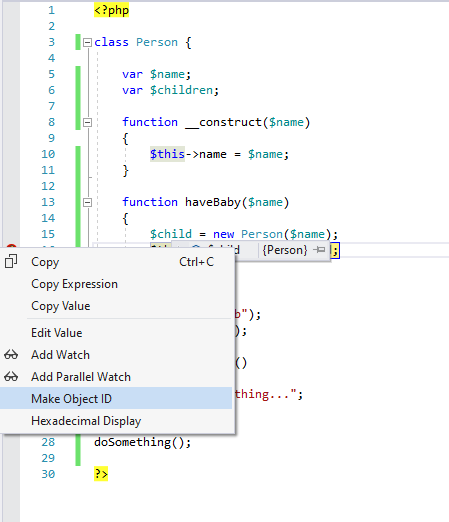
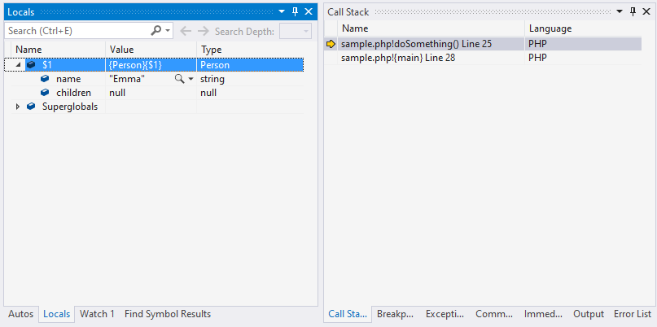

# Know what PHP objects are doing behind your back

The objects sometimes misbehave. You watch them closely when your are debugging and they behave as they should - they know you are watching. You are stepping through the code, sinking deeper into the methods. When you surface back and see your old objects again, they are different, their properties have changed. Something happened to them behind your back.

<!-- more -->

Luckily there is a tool that will allow you to have any object always at your sight - **Object ID**.

To demonstrate how to create and use **Object IDs** I will use following code:

```php
<?php

class Person {

    var $name;
    var $children;

    function __construct($name)
    {
        $this->name = $name;
    }

    function haveBaby($name)
    {
        $child = new Person($name);
        $this->children[] = $child;
    }
}

$me = new Person("Bob");
$me->haveBaby("Emma");

function doSomething()
{
    echo "doing something...";
}

doSomething();

?>

```

When you debug this code place a breakpoint to `haveBaby` method. When `$child` is created, hover over it and when you see the data inspection, right click on it and select `Make Object ID`. Now everywhere you go, you will be watching... this object.



Press `F11` couple of times to end up in `doSomething` function. You can still check how  `$child` is doing... and see if `$children` property remains `null`. 



Without **Object ID** you might find more difficult to know what's happening to the `$child`. But once you are confident you don't need to watch the `$child` all the time, right click on it and `Delete Object ID`.
